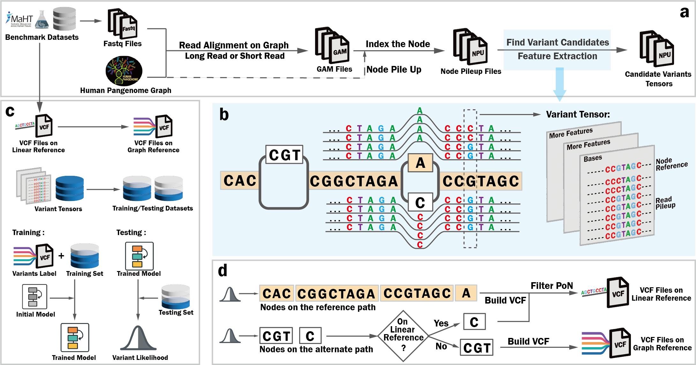

# Pansoma

Pansoma is a research pipeline for generating machine-learning-ready variant tensors from pangenome graph alignments. It takes sequencing reads aligned to a pangenome graph, extracts graph-node pileups around candidate variants, writes sharded NumPy tensors, labels them against truth sets when available, and provides bundled model training and inference code.

The project is organized so that reproducible pipeline entry points live in `scripts/`, reusable code lives in `src/`, model code lives in `machine_learning/`, and older exploratory scripts remain available under `experiments/legacy/`.



## How to use Pansoma
To use Pansoma, it follows two major stage: 1.Data preprocessing: Create Node Pile Up data. 2. Data Inference: Use the model we provided to inference.
We also provide a model training so that you can use your own data to train Pansoma to get your Pansoma model.
We provide a Docker that contains everything, running commands, and the step to step explanations.
###

## Repository Layout

```text
Pansoma/
├── configs/                    # Example YAML configs for graph resources and tensor runs
├── cpp/                        # C++ extension code and legacy C++ experiments
├── data/                       # Placeholder folders for local raw/interim/processed data
├── docker/                     # Docker build files
├── docs/                       # Pipeline, data format, and migration documentation
├── experiments/legacy/         # Preserved old scripts and research versions
├── machine_learning/pansoma_net/              # Bundled PyTorch model training and inference code
├── scripts/                    # Main command-line entry points
├── src/pangenome_ml_data_generation/
│   ├── alignment/              # GAM/alignment filtering helpers
│   ├── analysis/               # Statistics and normalization utilities
│   ├── graph/                  # Graph path, node, and coordinate helpers
│   ├── io/                     # Format-specific I/O helpers
│   ├── pileup/                 # Pileup/candidate extraction logic
│   ├── plotting/               # Figure and tensor visualization helpers
│   ├── tensors/                # Tensor builders and visualization
│   └── variants/               # VCF, truth-set, and AF utilities
└── tests/                      # Unit/integration test placeholders
```

Large files such as FASTQ, GAM, GBZ/GFA, VCF, BAM, `.dat/.idx`, and `.npy` shards should stay outside git. The `data/` tree is present as a local staging convention, not as a place to commit large artifacts.

## Installation

Create the data-generation environment:

```bash
conda env create -f environment.yml
conda activate pangenome-ml-data-generation
```

If the environment already exists, synchronize its dependencies with the
repository before continuing:

```bash
conda env update -n pangenome-ml-data-generation -f environment.yml
conda activate pangenome-ml-data-generation
```

Do not use the Conda `base` environment for Pansoma. Confirm that Python and
the legacy VG protobuf dependency come from the project environment:

```bash
which python
python -c "import google.protobuf; print(google.protobuf.__version__)"
```

The protobuf version must be `3.20.3`.

External command-line tools are also required for the full pipeline:

```text
vg
jq
bgzip/tabix, usually through htslib or pysam
```

Platform notes are in [docs/platform_support.md](docs/platform_support.md).
In short, Linux/HPC is the recommended target for full production runs, while
macOS is supported for development, Python utilities, and local extension
builds. The FASTQ-to-GAM stage on any platform requires `vg` plus matching
`.gbz`, `.min`, and `.dist` graph indexes. Long-read Giraffe mapping also
requires a matching `.zipcodes` index.

Build the C++ `fast_writer` extension before generating `.dat/.idx` files:

```bash
bash scripts/build_fast_writer.sh
```

`fast_writer` is platform- and Python-version-specific. Build it separately on
each Linux or macOS machine; compiled `.so` files are not stored in git. The
build script verifies the resulting import and prints its installed path.

Check a local machine:

```bash
python scripts/check_environment.py --ml
```

For a full production node where `vg` and other command-line tools must be
available:

```bash
python scripts/check_environment.py --strict-external --ml
```

The Conda environment includes the data-generation and model dependencies,
including PyTorch, torchvision, timm, and tqdm. It provides a portable CPU
installation. For CUDA-enabled training and inference, use the primary Docker
image or install the PyTorch build appropriate for the local CUDA runtime.

## Docker

The primary container runs the complete 5-channel workflow, including `vg`
alignment, GAM preprocessing, tensor generation, training, inference, and VCF
output:

```text
docker/Dockerfile
```

Build it from the repository root:

```bash
docker build --platform linux/amd64 -f docker/Dockerfile -t pansoma:latest .
```

Validate the runtime:

```bash
docker run --rm --gpus all pansoma:latest doctor
```

For WUSTL RIS/LSF, the image supports `/bin/bash` as the submitted command and
keeps all Python dependencies in `/opt/venv`. A complete interactive `bsub`
example and cluster checks are included in [docs/docker.md](docs/docker.md).

The image exposes two end-to-end commands:

```bash
docker run ... pansoma:latest train [inputs and training parameters]
docker run ... pansoma:latest infer [inputs, checkpoint, and output VCF]
```

FASTQ files are not sufficient by themselves: both commands also require
matching `.gbz`, `.min`, `.dist`, and GFA resources. Pansoma now generates the
GRCh38 coordinate map and chromosome node filters automatically and reuses
them through a graph-fingerprinted cache. Training additionally requires a
truth VCF in `.vcf` or `.vcf.gz` format; compression and Tabix indexing are
automatic. Inference requires a model checkpoint. Complete mount layouts and
commands are documented in [docs/docker.md](docs/docker.md).

The previous ML-only image remains at `docker/Dockerfile.ml` for legacy use.

## End-To-End Pipeline

Full command examples are in [docs/pipeline.md](docs/pipeline.md).

### 0. GBZ To GFA

If you have a GBZ graph but not its matching GFA, export one with `vg`:

```bash
vg convert -f --no-translation \
  /path/to/graph.gbz \
  > /path/to/graph.gfa
```

Run this once for each graph. `--no-translation` preserves the internal `vg`
node IDs so the GFA remains compatible with alignments produced against the
GBZ. See the official
[`vg giraffe` graph guidance](https://github.com/vgteam/vg/wiki/Giraffe-best-practices#graphs).

### 1. FASTQ To GAM

Align reads to the pangenome graph with `vg giraffe`.

Short reads (paired-end Illumina):

```bash
vg giraffe \
  -Z /path/to/graph.gbz \
  -m /path/to/graph.min \
  -d /path/to/graph.dist \
  -f /path/to/read_1.fq.gz \
  -f /path/to/read_2.fq.gz \
  -b default \
  -t 12 \
  -p \
  > /path/to/sample.gam
```

Long reads (single-end PacBio HiFi):

```bash
vg giraffe \
  -Z /path/to/graph.gbz \
  -m /path/to/graph.longread.withzip.min \
  -z /path/to/graph.longread.zipcodes \
  -d /path/to/graph.dist \
  -f /path/to/long_reads.fq.gz \
  -b hifi \
  -t 12 \
  -p \
  > /path/to/sample.gam
```

Use `-b hifi` for PacBio HiFi or `-b r10` for Oxford Nanopore R10. Long reads
use one FASTQ file and require long-read minimizer and zipcode indexes. See the
official [`vg giraffe` documentation](https://github.com/vgteam/vg/wiki/Giraffe-best-practices)
for additional options.

### 2. GAM To `.dat/.idx`

Find graph nodes that contain imperfect read alignments:

```bash
python -u scripts/find_unperfect_nodes.py sample.gam \
  --output sample.unperfect_nodes.pkl \
  --output_format pickle \
  --milestone 10000000 \
  --threads 12
```

Build the packed node-read store:

```bash
python -u scripts/build_dat_idx.py \
  sample.gam \
  sample.unperfect_nodes.pkl \
  sample.unperfect_nodes \
  --milestone 1000000 \
  --threads 12
```

This writes:

```text
sample.unperfect_nodes.dat
sample.unperfect_nodes.idx
```

### 3. Graph Node Mapping

This stage prepares two inputs for tensor generation:

1. **Per-chromosome node-filter text files** define which graph nodes belong
   to each chromosome. Tensor generation uses them to restrict processing to
   the selected chromosome instead of scanning every candidate node.
2. **A candidate-node JSON** connects the candidate node IDs in the sample
   `.idx` file to their graph sequences and, where available, their GRCh38
   coordinates. Tensor generation uses the sequence as the reference context,
   and truth labeling uses the coordinate to query the VCF.

#### 3.1 Build Chromosome Node Filters

Build the graph-component and GRCh38-path node sets for each chromosome:

```bash
cd /path/to/Pansoma

GBZ=/path/to/graph.gbz \
GFA=/path/to/graph.gfa \
OUTDIR=/path/to/chr_node_filters \
CHROMOSOMES="1 2 3 4 5 6 7 8 9 10 11 12 13 14 15 16 17 18 19 20 21 22" \
bash ./scripts/build_chr_node_filters.sh
```

`GBZ` and `GFA` are required and must describe the same graph. `OUTDIR`
contains one directory per chromosome plus `summary.tsv`. If `OUTDIR` is
omitted, output is written under
`tmp/chr_component_vs_GRCh38_summary` in the repository.

The files consumed later by `generate_testing_tensors.py --chr_nodes` are:

```text
/path/to/chr_node_filters/chr*/chr*.component.nodes.raw.txt
/path/to/chr_node_filters/chr*/chr*.GRCh38_path.nodes.raw.txt
```

The remaining comparison files and `summary.tsv` provide node-set statistics
that can be used to verify the graph resources.

#### 3.2 Build And Filter The GRCh38 Path JSON

Build a coordinate-aware JSON for the GRCh38 chromosome path:

```bash
python -u scripts/build_grch38_path_json.py graph.gfa '^W\tGRCh38\t0\tchr1' \
  -o chr1.GRCh38.nodes.json
```

This file contains each GRCh38-path node's ID, sequence, starting coordinate,
length, and orientation. Filter it to nodes present in the sample `.idx`:

```bash
python -u scripts/filter_node_json.py \
  chr1.GRCh38.nodes.json \
  sample.unperfect_nodes.idx \
  chr1.filtered.nodes.json
```

The output `chr1.filtered.nodes.json` retains the GRCh38 coordinates for the
sample candidate nodes and is used to enrich the final candidate-node JSON.

#### 3.3 Build The Candidate-Node JSON

Read all candidate node IDs from the sample `.idx`, retrieve their sequences
from the GFA, and copy GRCh38 coordinate fields from the filtered JSON when a
node is on the reference path:

```bash
python -u scripts/build_node_json.py \
  --gfa graph.gfa \
  --idx sample.unperfect_nodes.idx \
  --input_json chr1.filtered.nodes.json \
  --out candidate_nodes.json
```

The resulting `candidate_nodes.json` contains all candidate nodes from the
`.idx`. Reference-path nodes retain their GRCh38 coordinates, while graph-only
nodes retain their node IDs and sequences.

### 4. Tensor Generation And Labeling

Generate sharded variant-centered tensors:

```bash
python -u scripts/generate_testing_tensors.py \
  sample.unperfect_nodes.dat \
  sample.unperfect_nodes.idx \
  tensors_chr1 \
  candidate_nodes.json \
  --chr_nodes \
    /path/to/chr_node_filters/chr1/chr1.component.nodes.raw.txt \
    /path/to/chr_node_filters/chr1/chr1.GRCh38_path.nodes.raw.txt \
  --num_workers 8 \
  --variant_type snp \
  --view 0 \
  --min_af 0.08 \
  --shard_size 32768
```

Label tensors against a truth VCF:

```bash
python -u scripts/label_tensors.py \
  tensors_chr1/variant_summary.ndjson \
  candidate_nodes.json \
  truth.vcf.gz \
  --chr chr1 \
  --data-dir tensors_chr1
```

### 5. Model Training

The current Pansoma tensors contain five channels. Arrange labeled shards under
`train/` and `val/` before training:

```text
/path/to/training_dataset/
├── train/
│   ├── chr2_shard_00000_data.npy
│   └── chr2_shard_00000_labels.npy
└── val/
    ├── chr1_shard_00000_data.npy
    └── chr1_shard_00000_labels.npy
```

Run the 5-channel trainer directly from the repository root:

```bash
python -u machine_learning/pansoma_net/scripts/train_5channels_npy_pansoma.py \
  --data_paths /path/to/training_dataset \
  --output_path /path/to/output_model \
  --epochs 70 \
  --lr 0.0001 \
  --batch_size 32 \
  --num_workers 4 \
  --loss_type focal \
  --pos_weight 88 \
  --gamma 2.0
```

#### Optional 6-Channel Training

The legacy 6-channel model remains available for datasets that include the
population-AF channel. Do not use it with the 5-channel tensors generated by
the current Step 4 command.

```bash
python -u machine_learning/pansoma_net/scripts/train_6channels_npy_pansoma.py \
  /path/to/6channel_training_dataset \
  --output_path /path/to/output_6channel_model \
  --epochs 50 \
  --lr 0.0001 \
  --batch_size 32 \
  --num_workers 8 \
  --loss_type weighted_ce \
  --pos_weight 88
```

### 6. Model Inference

Run inference directly from the repository root:

```bash
python -u machine_learning/pansoma_net/scripts/test_5channels_npy_pansoma.py \
  --input_dir /path/to/tensor_shards \
  --ckpt /path/to/model.pth \
  --out_prefix /path/to/results/pansoma_sample \
  --input_mode shard \
  --map_json /path/to/candidate_nodes.json \
  --variant_summary /path/to/tensor_shards/variant_summary.ndjson \
  --batch_size 32 \
  --num_workers 4 \
  --device auto \
  --emit linear \
  --normalize
```

This writes `pansoma_sample.linear.vcf.gz` and its Tabix index
`pansoma_sample.linear.vcf.gz.tbi`. The checkpoint must be compatible with the
5-channel Pansoma model.

`--emit` controls which coordinate representations are written:

- `--emit linear` writes `<out_prefix>.linear.vcf.gz`. It contains candidates
  that can be converted from graph-node offsets to GRCh38 chromosome
  coordinates using `--map_json`. This is the standard output for downstream
  tools and the Step 7 PoN filter.
- `--emit graph` writes `<out_prefix>.graph.vcf.gz`. It contains only
  candidates that cannot be converted to linear coordinates. In this file,
  the VCF chromosome field is the graph node ID and the position is the offset
  within that node.
- `--emit all` writes `<out_prefix>.all.vcf.gz`. It contains every retained
  candidate in graph-node coordinates, including candidates that can and
  cannot be converted to GRCh38 coordinates.

Multiple outputs can be requested in one run:

```bash
--emit linear graph all
```

Each requested VCF is BGZF-compressed and receives a `.tbi` index. `linear` is
the default when `--emit` is omitted. Both `linear` and `graph` require
`--map_json`; `all` alone does not. Graph-coordinate VCFs should not be passed
to conventional GRCh38 tools or the PoN filter without coordinate conversion.

### 7. Panel Of Normals Filter

Download the four default GRCh38 PoNs once and create their Tabix indexes:

```bash
mkdir -p /path/to/pons
cd /path/to/pons

curl --fail --location --remote-name \
  https://www.bio8.cs.hku.hk/clairs-to/databases/gnomad.r2.1.af-ge-0.001.sites.vcf.gz
curl --fail --location --remote-name \
  https://www.bio8.cs.hku.hk/clairs-to/databases/dbsnp.b138.non-somatic.sites.vcf.gz
curl --fail --location --remote-name \
  https://www.bio8.cs.hku.hk/clairs-to/databases/1000g-pon.sites.vcf.gz
curl --fail --location --remote-name \
  https://www.bio8.cs.hku.hk/clairs-to/databases/CoLoRSdb.GRCh38.v1.1.0.deepvariant.glnexus.af-ge-0.001.vcf.gz

for pon in *.vcf.gz; do
  tabix -f -p vcf "${pon}"
done
```

Tag inference calls that occur in the PoNs:

```bash
python -u scripts/filter_panel_of_normals.py \
  /path/to/results/pansoma_sample.vcf.gz \
  /path/to/results/pansoma_sample.pon-tagged.vcf.gz \
  --pon \
    /path/to/pons/gnomad.r2.1.af-ge-0.001.sites.vcf.gz \
    /path/to/pons/dbsnp.b138.non-somatic.sites.vcf.gz \
    /path/to/pons/1000g-pon.sites.vcf.gz \
    /path/to/pons/CoLoRSdb.GRCh38.v1.1.0.deepvariant.glnexus.af-ge-0.001.vcf.gz
```

The output keeps every record and adds `FILTER=PanelOfNormals` plus a
`PANSOMA_PON` INFO field to each match. Add `--drop-matched` to omit those
records and produce a PoN-filtered call set instead. The script follows the
[ClairS-TO default PoN rules](https://github.com/HKU-BAL/ClairS-TO): PoN 1
(gnomAD) and PoN 2 (dbSNP) require exact position/REF/ALT matching, while PoN
3 (1000G) and PoN 4 (CoLoRSdb) require position matching. Input calls and all
four PoNs must use GRCh38 coordinates; both `chr1` and `1` contig naming are
recognized.

## Key Scripts

```text
scripts/find_unperfect_nodes.py            find nodes with imperfect reads
scripts/build_fast_writer.sh               build C++ writer extension
scripts/build_dat_idx.py                   GAM + node set -> .dat/.idx
scripts/build_chr_node_filters.sh          chromosome component/path node filters
scripts/build_grch38_path_json.py          GRCh38 path node JSON
scripts/filter_node_json.py                filter node JSON by idx/chrom/truth VCF
scripts/build_node_json.py                 candidate node JSON from idx + GFA
scripts/generate_testing_tensors.py        sharded tensor generation
scripts/label_tensors.py                   truth-VCF tensor labeling
scripts/filter_panel_of_normals.py         tag/remove calls found in default PoNs
scripts/classify_tensors.py                organize true/false tensor datasets
scripts/visualize_tensor.py                tensor visualization
scripts/pansoma_workflow.py                end-to-end Docker train/infer CLI
```

## Data Formats

See [docs/data_formats.md](docs/data_formats.md) for `.idx`, candidate-node JSON, and chromosome node-filter formats.

## Development Notes

- `experiments/legacy/` preserves older script versions for traceability.
- `docs/legacy_mapping.md` maps old script names to the new entry points.
- The current package modules under `src/` are seeded from proven scripts and are intended for progressive refactoring.

## License

See [LICENSE](LICENSE).
