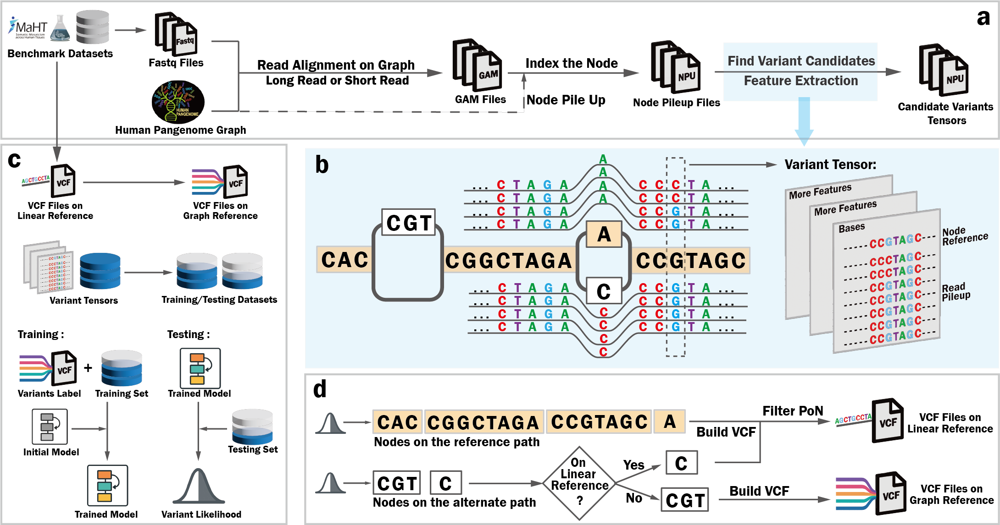

# Pansoma

Pansoma calls somatic variants from tumor-only sequencing reads aligned to a pangenome graph. The indexed-GAM
pipeline turns a sorted, indexed GAM into one `(8, 200, 101)` int8 tensor per candidate site, merges the tensors per
chromosome and labels them against truth sets. The models in `machine_learning/` train on these tensors and predict
from them.



## Repository layout

```text
Pansoma/
├── indexed_gam_pipeline_v4/         the tensor pipeline (README.md: every command and option, tensor format)
│   ├── tensor_postprocessing/       per-chromosome merge and truth labels
│   ├── tools/                       one-time graph preparation, audits, run comparison; tools/jobs/ Slurm jobs
│   └── tests/                       unit tests and goldens
├── machine_learning/
│   ├── pansoma_net_v2/              model for the indexed-gam-candidate tensors
│   └── pansoma_net/                 earlier model for the 5/6-channel .dat/.idx tensors
├── scripts/
│   ├── visualize_tensor.py          tensor shard -> PNG
│   ├── build_chr_node_filters.sh    per-chromosome component node lists (input of tools.graph_prep chr-index)
│   ├── filter_panel_of_normals.py   tag or drop calls found in the ClairS-TO default PoNs
│   └── use_vg.sh                    put vg v1.77.0 first on PATH on this cluster
├── tests/                           tests of scripts/visualize_tensor.py
├── analysis/                        analysis records: HG008 somatic miss analysis, label checks, label rules
└── figures/
```

Large files (FASTQ, GAM/GAI, GBZ/GFA, VCF, BAM, `.npy` shards) stay outside git.

## Workflow

### 1. Align reads to the graph and sort the GAM

On this cluster, `source scripts/use_vg.sh` first. It selects `/scratch/jshen/bin/vg_v1.77.0`.

Short reads (paired-end Illumina):

```bash
vg giraffe -Z graph.gbz -m graph.min -d graph.dist \
  -f read_1.fq.gz -f read_2.fq.gz -b default -t 12 -p > sample.gam
```

Long reads (PacBio HiFi: `-b hifi`; ONT R10: `-b r10`) need the long-read minimizer and zipcode indexes:

```bash
vg giraffe -Z graph.gbz -m graph.longread.withzip.min -z graph.longread.zipcodes -d graph.dist \
  -f long_reads.fq.gz -b hifi -t 12 -p > sample.gam
```

The pipeline reads a sorted GAM with its GAI index:

```bash
vg gamsort -t 12 -i sample.sorted.gam.gai sample.gam > sample.sorted.gam
```

See the [`vg giraffe` best practices](https://github.com/vgteam/vg/wiki/Giraffe-best-practices) for more options.

### 2. Prepare the graph (once per graph)

The graph index, the GRCh38 reference path and the chromosome block table are built with
`indexed_gam_pipeline_v4/tools` (v4 README, section 4). For HPRC v1.1 d9 they already exist under
`/scratch/jshen/data/pansoma_v2_tensors/graph_index`. For another graph:

```bash
vg convert -f --no-translation graph.gbz > graph.gfa          # a GFA with the GBZ's node IDs
GBZ=graph.gbz GFA=graph.gfa OUTDIR=chr_components bash scripts/build_chr_node_filters.sh
sbatch -J graph_prep -o graph_prep.log indexed_gam_pipeline_v4/tools/jobs/graph_prep.sh \
  OUTDIR graph.gfa GRAPH_INDEX GRCh38.fasta chr_components
```

### 3. Tensors and labels

`run discover` selects the target nodes. `orchestrate prepare` / `run` build a whole genome on one Slurm node, and
`finalize` merges the tensors per chromosome and writes the truth labels. The commands and the settings used for PacBio
HiFi, ONT-UL, Illumina and fiberseq are in [indexed_gam_pipeline_v4/README.md](indexed_gam_pipeline_v4/README.md)
(sections 1 and 5). The label rules are in
[tensor_postprocessing/README.md](indexed_gam_pipeline_v4/tensor_postprocessing/README.md) and
[analysis/truth_labels.md](analysis/truth_labels.md).

Render a tensor (needs matplotlib and Pillow):

```bash
python scripts/visualize_tensor.py TENSORS/SNV/chr1_shard_00000_data.npy -i 0 -o chr1_0.png
```

### 4. Model

Training and prediction on the merged, labelled sets: [machine_learning/pansoma_net_v2/README.md](machine_learning/pansoma_net_v2/README.md).
The same README covers the calls: `pansoma_net_v2.graph_vcf` (predictions → VCF in graph node coordinates),
`linear_vcf` (→ GRCh38 VCF) and `vcfeval` (the PoN filter below for SNVs, then `rtg vcfeval` against the truth VCF).

### 5. Panel of normals filter

Four indexed GRCh38 PoNs (bgzip + tabix), in this order: gnomAD (`af-only-gnomad.hg38.vcf.gz`), dbSNP
(`Homo_sapiens_assembly38.dbsnp138.vcf.gz`), 1000G (`1000g_pon.hg38.vcf.gz`) and CoLoRSdb
(`CoLoRSdb.GRCh38.v1.1.0.deepvariant.glnexus.vcf.gz`). Tag calls that occur in them:

```bash
PON=/scratch/jshen/data/Pansoma/panel_of_normal_VCFs
python -u scripts/filter_panel_of_normals.py calls.vcf.gz calls.pon-tagged.vcf.gz \
  --pon $PON/af-only-gnomad.hg38.vcf.gz $PON/Homo_sapiens_assembly38.dbsnp138.vcf.gz \
        $PON/1000g_pon.hg38.vcf.gz $PON/CoLoRSdb.GRCh38.v1.1.0.deepvariant.glnexus.vcf.gz
```

Every record is kept, and each match gets `FILTER=PanelOfNormals` and a `PANSOMA_PON` INFO field. Add
`--drop-matched` to leave matched records out. A call matches a PoN record with its position, REF and ALT, under
the rule of its kind:

- SNV: gnomAD and CoLoRSdb when that ALT's AF is ≥ 0.0001; dbSNP unless the record is flagged somatic (`SAO=2`);
  1000G any match (like ClairS-TO's panels).
- INDEL (an ALT of another length than REF): gnomAD and CoLoRSdb only, when that ALT's AF is ≥ 0.01. Most
  somatic INDELs are homopolymer / STR length changes that exist as population alleles at AF 0.001–0.05, where
  the germline INDELs sit mostly at ≥ 0.05, so the SNV rule would remove 71–83 % of them
  (`analysis/tensor_recall_20260930/pon/indel_rules`).

Calls and PoNs must be in GRCh38 coordinates (`chr1` and `1` naming are both recognized).

## Tests

```bash
python -m indexed_gam_pipeline_v4.native compile                       # once per checkout and Python version
python -m unittest discover -s indexed_gam_pipeline_v4/tests -t .      # and again with PANSOMA_DECODER=python
MPLBACKEND=Agg python -m unittest tests.test_tensor_visualization      # a Python with matplotlib and Pillow
```

## Earlier code

Earlier code is in the git history only:

- the `.dat/.idx` pipeline (`scripts/find_unperfect_nodes.py`, `build_dat_idx.py`, `generate_testing_tensors.py`,
  `label_tensors.py`, `pansoma_workflow.py`, `cpp/fast_writer.cpp`, `docker/`, `docs/`, `configs/`)
- the `src/pangenome_ml_data_generation` package seeds
- `experiments/legacy/`, the scripts copied from the old `pangenome_ML_data_generation` repository

They were removed on 2026-09-28. Their last tree is the parent of the commit that removed them:
`git log --diff-filter=D -1 -- scripts/build_dat_idx.py`. The earlier indexed-GAM pipeline versions were removed
in 09f93a7 (v1), 3925042 (v2) and 89e6a8c (v3).

## License

See [LICENSE](LICENSE).
