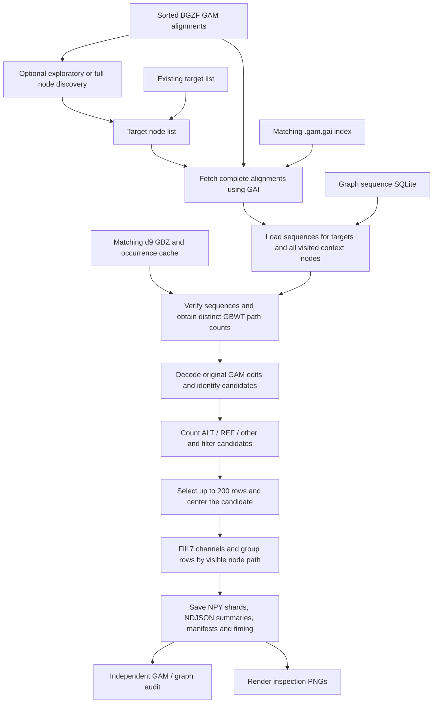

# Current tensor-building pipeline

Recorded against implementation commit **dd8b41f**. The default format is
**`indexed-gam-candidate-v4`**, schema 4. The latest rerun results are in
[samples/colo829t_100/retest.json](samples/colo829t_100/retest.json), and previous
optimization measurements are in [performance.json](samples/colo829t_100/performance.json).

## Overview



## Selected vg executable

As of 2026-09-19, use **`/scratch/jshen/bin/vg_v1.77.0`** (verified as
`vg version v1.77.0 "Ruby"`) for vg commands, replacing the previous local vg.
On this machine it is a symlink to `/scratch/jshen/bin/vg`.

```bash
source scripts/use_vg.sh
vg version
# Explicit invocation is also supported:
/scratch/jshen/bin/vg_v1.77.0 version
```

Source this after activating Conda so bare `vg` commands in upstream alignment
and graph-extraction scripts resolve to the selected binary. The activation
script verifies that resolution and sets `PANSOMA_VG` to the explicit path.
The v4 tensor builder reads GAM/GAI in Python and queries GBZ through its compiled
helper; neither stage invokes the vg executable. Earlier benchmark records
retain their original provenance.

## 1. Inputs and graph identity

The starting input is an already graph-aligned, sorted BGZF GAM. Mapping and
sorting are upstream prerequisites; truth labeling and model training are
downstream of these candidate tensors.

The COLO829T test uses:

- GAM: `/scratch/jshen/data/COLO829T/illumina/GAM/COLO829T_3M.sorted.gam`.
- GAI: the GAM filename plus `.gai`, unless `--index` overrides it.
- GBZ: `/scratch/jshen/data/AF-Filtered_VG_Indexes/hprc-v1.1-mc-grch38.d9.gbz`.
- Graph sequences: the same directory's
  `hprc-v1.1-mc-grch38.d9.GRCh38_CHM13_node_index.sqlite`.
- Target node IDs: one positive numeric ID per line.
- Occurrence cache: a reusable SQLite database made by the v4 pipeline.

The GAM, sequence database, and GBZ must use the same node identities. The GBZ
forward sequence is compared with the sequence database for every requested
context node. Missing nodes or disagreement fail explicitly. For this d9 graph,
node 2753 has 114 bases and 86 GBWT paths; node 51182 is `C` and has 24 paths.

The pipeline reads the existing GAI. If it is absent, `run.py index` can build
one from the sorted GAM. This rerun reused the real-data GAI; index construction
and retrieval against an independent full scan are also covered by synthetic tests.

## 2. Choose target nodes

`run.py discover` scans GAM records sequentially. With its defaults, it uses
alignments with **MAPQ > 5** and counts perfect/imperfect mappings per node.
A mapping is imperfect when an edit changes length or has replacement sequence.
A node is selected when it has at least one imperfect mapping and its imperfect
mapping fraction is **strictly greater than 0.05**. This is a mapping-based
prefilter, not the eventual candidate allele frequency.

`--max-alignments 300000` is an exploratory scan, not a whole-genome discovery
run. Omit that option for a full scan. Optional chromosome and node-whitelist
filters are available. The chromosome filter uses `Alignment.refpos.name`.

The reproducibility benchmark uses the frozen 3,000-node
[benchmark_nodes.txt](samples/colo829t_100/benchmark_nodes.txt), copied from the
historical benchmark input. Do not substitute the first 3,000 nodes of a fresh
discovery run: that is a different selection. The rerun tests discovery separately
and uses the frozen input for byte-for-byte tensor comparisons. For a new analysis,
use the discovery output directly or supply your own target list.

## 3. Retrieve complete alignments in bounded batches

Target IDs are deduplicated and sorted. Batches are bounded by both node count
and ID span; the benchmark uses 32 nodes and a maximum span of 10,000.

The GAI identifies candidate BGZF ranges. Overlapping ranges are merged, GAM
groups are read, and complete alignment records are filtered by actual node
membership. Distinct records with identical names or identical bytes remain
separate observations. A record matching multiple requested nodes is yielded
once within that batch. It can be fetched again in another batch; each candidate
belongs to only its target-node batch.

Build filtering uses **MAPQ > 10** in this test. The optional chromosome filter
is applied here too. All visited nodes are collected, including context nodes
outside the target batch. A maximum-alignment limit fails rather than silently
truncating an oversized batch.

The 64 MiB LRU cache retains serialized groups and node-to-record positions,
avoiding repeated full-group decoding. `--gam-cache-mb 0` disables reuse.
The budget covers retained group data, not total process memory, tensor shards,
the GBZ, or a transient group being decoded.

## 4. Read graph bases and occurrence counts

Graph bases are loaded with bounded SQLite `IN` queries through one read
connection/transaction for the entire build. JSON and GFA sequence inputs also
exist, but SQLite is used here.

For each context node, the occurrence cache supplies its forward sequence and
**number of distinct physical GBWT paths**. On a cache miss, a persistent C++
helper loads the matching GBZ once and queries its GBWT. Because the GBWT is
bidirectional, one forward-node query includes paths traversing either node
orientation. Sequence IDs are converted to physical path IDs and deduplicated.
Repeated visits and reverse-complement copies count once; reference, haplotype,
and generic paths are included. Fragments of one biological haplotype can have
different path IDs, so this is not a unique sample/haplotype frequency.

The cache stores graph path/size/mtime and an initial SHA-256. Source size/mtime
are checked on reuse, and node sequences are checked during lookup. A fully
populated cache avoids loading the GBZ helper. The old GFA W-record count is used
only by the explicitly selected legacy v3 format.

## 5. Decode GAM edits and form candidates

The builder consumes original edits with both read and graph cursors, checks
bounds and replacement sequences, and retains all mappings for row context.
Reverse mappings are converted to forward-node coordinates for candidate identity.

- Substitution edits produce SNP candidates for differing bases.
- Insertions and deletions produce candidates up to 50 bases in this test.
- Adjacent insertions or deletions within one mapping are merged before applying
  the length limit.
- Longer indels and complex replacements are logged as unsupported; complex
  replacement columns can remain as row context.

Candidate identity is `(node, forward position/interval, REF, ALT, event type)`.
There is no repeat left-normalization or equivalence merging across different
nodes. Ordinary GAM match edits are not rescanned to invent SNP candidates.

## 6. Count support and filter

Every eligible overlapping alignment record contributes once per candidate.
Repeated visits in one record resolve to ALT, then REF, then other; the earliest
mapping wins ties.

ALT requires an exact candidate observation meeting the allele-BQ threshold.
SNPs use their base quality, insertions use mean inserted-base quality, and
deletions use the minimum available neighboring-base quality. REF requires
matching graph bases over the affected interval; insertion REF additionally
requires evidence on both sides of the boundary. Remaining overlaps are `other`.
The allele-BQ threshold is an ALT-observation filter, not a universal row-BQ filter.

Coverage is `ALT + REF + other`; AF is `ALT / coverage`. These counts use all
eligible records before the 200-row cap. The inspection benchmark accepts
ALT count >= 1, AF >= 0.05, allele BQ >= 10, and all supported event types.
The normal CLI default for minimum ALT count is **3**, so it must be explicitly
set to 1 to reproduce this low-support inspection set.

## 7. Construct one tensor per passing candidate

Each tensor is **(7, 200, 101), int32**: channels × alignment rows × columns.
There is no dedicated reference row.

Row selection revision `window-edit-bp-group-uniform-v1` first prepares the
visible window for every eligible record. It counts differing read/reference
bases (substitutions, inserted bases and deleted bases); padding and aligned
absence-of-insertion gaps do not count. Edits outside the rendered window and
already omitted insertion columns do not count. Sort by decreasing edit bp,
then decreasing MAPQ, record SHA-256 and anchor mapping index. Stably group by
the visible, candidate-oriented node path; groups follow their first occurrence
in this sorted list and each group retains the edit-bp order. Only then sample
up to 200 rows, keeping order, at indices `floor(i*(N-1)/(K-1))` for K > 1;
for K = 1 take index `N//2`. There is no ALT-first selection or minimum group
quota. Counts and AF use all eligible records before sampling; duplicate records
remain separate. The seven-channel format stays v4; the row-selection revision
is recorded separately and must match between model training and inference.

Window revision `anchor-centered-columns-v1` fixes the candidate start/boundary
at column `width//2` (50 for width 101). Each record contributes the preceding
50 alignment columns, the anchor and the following 50 columns. Long I/D events
are cropped at the window edge; the complete event need not fit. No maximum
insertion from another record expands the shared window. For INS, shorter
alleles reserve up to the visible target insertion length, using G slots only
with boundary evidence; missing evidence stays all-zero padding. For DEL,
each deleted graph base remains a D column with its original reference base.
Partial mappings starting after the candidate anchor retain missing positions
before their first covered base. Context follows
each alignment's own graph traversal, so rows can have different neighboring
nodes. A reverse anchor reverses/complements the row into candidate orientation.
Candidate flags are determined per row from node/offset/boundary and mapping
visit, not from a shared rectangular candidate block. `candidate_columns` is
the nominal clipped target interval; actual flags can extend past it when a
row has additional insertion bases within a deletion. `omitted_context`
records central columns cropped by the right window boundary. The window
revision is saved in both manifest and per-candidate metadata; historical
v4 tensors without this revision use the old shared-block layout.

| Channel (1-based) | Meaning |
|---|---|
| 1 | Read base: A=1, C=2, G=3, T=4, N=5, gap=6; padding=0 |
| 2 | Base quality; -1 for missing quality or no read base |
| 3 | Flags: value 1 = difference; 2 = candidate region; 3 = both |
| 4 | Alignment MAPQ, present on aligned gaps too; capped at 32767 |
| 5 | Operation: M=1, X=2, I=3, D=4, complex=5, aligned no-insertion gap=6 |
| 6 | Graph-reference base for that row and column, with the same base encoding |
| 7 | Raw distinct GBWT path count of that column's node |

Deletions keep their mapped node's count. Insertions and aligned insertion-gap
slots use their anchor node's count. Missing coverage and unused rows have zero
occurrence. All seven channels of missing evidence are zero in this window
revision. D and supported G columns remain distinct from missing evidence.

Grouping takes place before sampling. All seven channels and row metadata
follow the same selected record order; no second sorting occurs after sampling.

## 8. Save, audit, and render

The builder writes:

- `shard_XXXXX_data.npy`: stacked tensor arrays.
- `variant_summary.ndjson`: candidate identity, coverage, support, AF, candidate
  columns, row groups, shard/index, format, and parameters. `--debug-rows` adds
  source record hashes and per-column node coordinates.
- `filtered_candidates.ndjson` and `unsupported_events.ndjson`: rejection evidence.
- `target_nodes.txt`, `manifest.json`, `run_report.json`: inputs, channel definitions,
  provenance, cache statistics, and stage/total wall times.

`--max-tensors 1000` makes this a bounded test. It does not process all 3,000
requested nodes once 1,000 candidates have been written.

`validate_examples.py` independently queries original GAM records and verifies
coverage, selected records, graph bases/orientation, groups, padding, candidate
flags, and occurrence cells. It requires debug row metadata. Regression tests
cover duplicates, reverse/repeated visits, cache eviction, invalid graphs, and
older supported formats.

The visualizer loads each tensor with its metadata and draws seven panels.
It marks the complete candidate block and labels channel 7 `Distinct GBWT paths`.
Rendering is separate from tensor generation and optional for bulk runs. The
published inspection set remains **100 examples** (70 SNP, 20 INS, 10 DEL).

## Latest post-optimization rerun

Implementation **dd8b41f** passed all **40 regression tests**. The full independent
audit passed for **1,000 tensors**, **1,427 alignment rows**, **104,620 graph-base
columns**, and **109,800 occupied occurrence cells**. All tensor bytes match the
previous output. Parsed summaries match too; the CLI writes the BQ threshold as
`10.0` instead of the earlier programmatic benchmark's `10`.

All **100 inspection PNGs** were regenerated, decoded successfully, and matched
the published images pixel for pixel. The published set remains 100 examples.

This rerun took **120.84 s to build** and **53.20 s to render/check the 100 images**.
The build reused occurrence counts but spent **107.63 s reading graph sequences**.
The earlier **8.16 s** warmed-storage result is not a runtime upper bound; stage
measurements show substantial run-to-run variation in graph reads. Discovery,
auditing, regression tests, and rendering are excluded from build timing.
See [the recorded results](samples/colo829t_100/retest.json) for exact versions,
arguments, input fingerprints, checksums, counters, and image checks.

## Reproduce the bounded test

Run from the repository root, using a new output directory. The current machine's
base Python has NumPy, protobuf, and pysam. Rendering uses the separate interpreter
shown below because the base environment's matplotlib has a NumPy ABI conflict.

```bash
python indexed_gam_pipeline/build_gbz_query.py \
  --deps /scratch/jshen/Github/gbz-tool/dependency --output tmp/gbz_node_counts

# Optional fresh discovery; its output is a different input from the frozen benchmark.
python indexed_gam_pipeline/run.py discover \
  --gam /scratch/jshen/data/COLO829T/illumina/GAM/COLO829T_3M.sorted.gam \
  --output tmp/new_discovery --max-alignments 300000 --min-mapq 5 --node-alt 0.05

python indexed_gam_pipeline/run.py build --format candidate-v4 \
  --gam /scratch/jshen/data/COLO829T/illumina/GAM/COLO829T_3M.sorted.gam \
  --nodes indexed_gam_pipeline/samples/colo829t_100/benchmark_nodes.txt \
  --node-sqlite /scratch/jshen/data/AF-Filtered_VG_Indexes/hprc-v1.1-mc-grch38.d9.GRCh38_CHM13_node_index.sqlite \
  --gbz /scratch/jshen/data/AF-Filtered_VG_Indexes/hprc-v1.1-mc-grch38.d9.gbz \
  --gbz-query tmp/gbz_node_counts --occurrence-cache tmp/hprc_gbwt_counts.sqlite \
  --output tmp/new_build --batch-nodes 32 --max-node-span 10000 --gam-cache-mb 64 \
  --shard-size 1000 --max-tensors 1000 --rows 200 --width 101 \
  --min-mapq 10 --min-af 0.05 --min-variants 1 --min-allele-bq 10 \
  --max-indel-len 50 --variant-type all --debug-rows

python indexed_gam_pipeline/validate_examples.py tmp/new_build \
  --gam /scratch/jshen/data/COLO829T/illumina/GAM/COLO829T_3M.sorted.gam \
  --node-sqlite /scratch/jshen/data/AF-Filtered_VG_Indexes/hprc-v1.1-mc-grch38.d9.GRCh38_CHM13_node_index.sqlite \
  --gbz /scratch/jshen/data/AF-Filtered_VG_Indexes/hprc-v1.1-mc-grch38.d9.gbz \
  --gbz-query tmp/gbz_node_counts --occurrence-cache tmp/hprc_gbwt_counts.sqlite \
  --output tmp/new_build/audit.json

# Preview the first 100 tensors; the published gallery uses its saved source_indices.
MPLBACKEND=Agg MPLCONFIGDIR=/tmp/pansoma_matplotlib \
  /wanglab/jshen/anaconda3/envs/hunyuanvideo15/bin/python scripts/visualize_tensor.py \
  tmp/new_build/shard_00000_data.npy --all-samples --max-samples 100 \
  --output-dir tmp/new_build/images
```

Implementation entry points: [run.py](run.py), [gam_reader.py](gam_reader.py),
[build_v2.py](build_v2.py) (also implements v4), [candidates.py](candidates.py),
[gbz_counts.py](gbz_counts.py), [gbz_node_counts.cpp](gbz_node_counts.cpp), and
[the visualizer](../src/pangenome_ml_data_generation/tensors/visualization.py).

## Bounded candidate optimizations (2026-09-21)

The HG008 performance comparison uses `benchmark_candidates.py` with 1,024
fixed discovery nodes, unchanged candidate-v4 `(7, 200, 101)` encoding, and
2,048-tensor shards (partial final shard allowed). The original full job 362252
is stopped with SIGSTOP; it is not resumed by this benchmark.

Optional builder settings (enable explicitly; the CLI defaults remain compatible):

- `--early-alt-filter`: scan qualified observations once per batch and count
  each exact candidate at most once per GAM record. This is an upper bound on
  final ALT support, so a bound below `--min-variants` safely excludes the
  candidate. Repeated visits do not add votes; duplicate records remain separate.
  Early rejection records explicitly use `alt_support_upper_bound` and
  `coverage_not_evaluated: true`; they do not claim to have evaluated coverage,
  REF/other counts, or AF. Surviving candidates retain all original filters.
- `--node-index-cache-nodes 1000 --node-index-cache-mb 64`: batch-scoped FIFO
  indices reference matching visits and ALT observations. Access does not renew
  an entry. At most 1,000 node entries are retained across workers, additionally
  bounded by an estimated container budget of 64 MiB total. Oversized nodes use
  the original scan. Estimates exclude the decoded reads themselves and are not
  a process RSS limit. Indices are cleared between batches.
- `--workers 2`: Linux fork processes share the parent's decoded batch initially
  through copy-on-write. The parent alone performs GAM/graph/GBZ access and shard
  writing. Each worker has at most 500 index entries and a 32 MiB estimated index
  budget. Tasks hold at most 16 candidates, with at most two submitted tasks at
  once; results are consumed in original candidate order. Python reference-count
  updates can dirty shared pages, so actual combined memory is measured using
  process-tree PSS in addition to RSS. Pools are released after each batch.

Anchor lookup, visible-window construction, mismatch ranking, grouping, and row
sampling are unchanged. The benchmark compares original code before and after
three optimized configurations to expose storage/cache drift. It checks every
NPY and the complete candidate summary with SHA-256, then audits the two-worker
output against source alignments. An external sampler checks process memory every
five seconds and records its own sampling time; no repeated traversal of Python
caches is added to the candidate loop.

The measured HG008 comparison and production-mode follow-up are recorded in
[runs/hg008_candidate_optimization.md](runs/hg008_candidate_optimization.md).
Performance measurements with `--debug-rows` include large per-column metadata;
use the separate no-debug comparison when choosing a production worker count.

## Alternative GAM retrieval and independent partition benchmark

`build --gam-reader vg --vg /scratch/jshen/bin/vg_v1.77.0` uses VG `find`
for each node batch, then parses the returned full alignment records and filters
against the exact target node set. The default remains `--gam-reader python`.
The VG backend requires the adjacent `.gam.gai`; it rejects a different explicit
index path rather than silently ignoring it. Temporary GAM transport is stored
under `TMPDIR` (or the system temporary directory), bounds retained Python
memory, and is removed when the fetch finishes or fails. VG failure is fatal.
Neither backend changes edit decoding, candidate identity, support filtering,
row selection, window encoding or the tensor channels.

`benchmark_partition_reader.py` performs two separate treatments against the
saved early-ALT-only HG008 baseline: (1) independent Python builders on the first
and second contiguous halves, and (2) one builder using VG. Both enable only
`--early-alt-filter`, with `--node-index-cache-nodes 0 --workers 1`. Two Python
builders divide the total 8 GiB GAM-cache budget (4 GiB each); their decoded
objects and other buffers can still increase combined process memory. The
benchmark uses separate GBWT caches/output directories, merges partitions in
node order, repacks NPY shards at 2,048 tensors, and adjusts only shard-location
fields in the summary. Tensor files and full summaries must match the saved
baseline byte-for-byte. This is a bounded two-batch comparison using debug rows
for compatibility with that baseline, not a full-genome speed forecast.

Results: [HG008 partition and reader comparison](runs/hg008_partition_reader.md).

## Whole-HG008 two-reader comparison

`full_reader_comparison.py` runs two independent contiguous partitions for each
backend. Every builder uses only early ALT filtering (`--early-alt-filter`), no
candidate node cache (`--node-index-cache-nodes 0`), and one internal candidate
worker (`--workers 1`). There are two builder processes per backend, not nested
candidate pools. Each Python builder gets its own **8 GiB** group cache; the VG
backend does not use that cache. The candidate-index optimization remains off.
Each backend therefore has a 16 GiB total GAM-cache budget when using Python,
plus decoded-read, graph/helper and shard-buffer memory.

Full input: 16,560,350 previously discovered nodes, split into 8,280,175 nodes
per process. Partition 0 spans IDs 128–29,829,066 (16,193 batches); partition 1
spans 29,829,077–60,118,238 (16,191 batches). The split creates one extra batch
relative to the unsplit traversal. Both backends use the same partition files.
Full GAM discovery and the complete graph sequence index are reused, with input
fingerprints verified. No max-node, max-read or max-tensor limit is added.

A preflight compares 128 nodes from each actual half against a serial Python
reference, checks both backend/process outputs and exercises final merging.
Full launches require the preflight to succeed and recheck prepared source and
input fingerprints. Each process has a separate GBWT SQLite cache and output
directory. Worker failure stops its peer and records a failed run; SIGTERM/SIGINT
also trigger cleanup of the owned child process groups. The two backend runs
have separate output trees and must not write to the old stopped run.

Per-part batch timings, manifests, resource reports and controller status are
retained. Full runs disable debug rows and the external PSS sampler. Per the
user's simplification, the launched wrapper calls only `run_builders`: each
process writes its own 2,048-tensor NPY shards, with a permitted partial final
shard. There is no full-output cross-comparison job and no merge/repacking stage.
Basic per-part shape/count validation remains. The comparison and merge modes
in the generic helper are not used by these submitted jobs.

Launch details: [HG008 full two-reader run](runs/hg008_full_two_readers.md).
