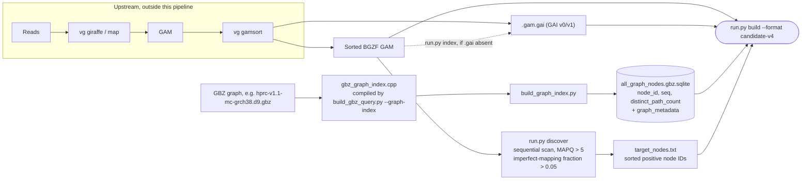
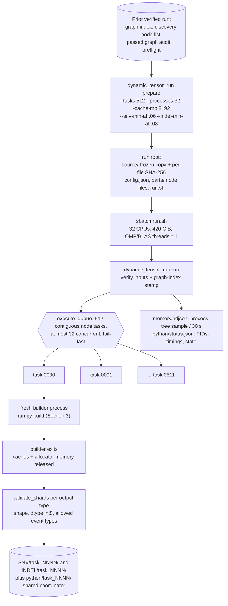
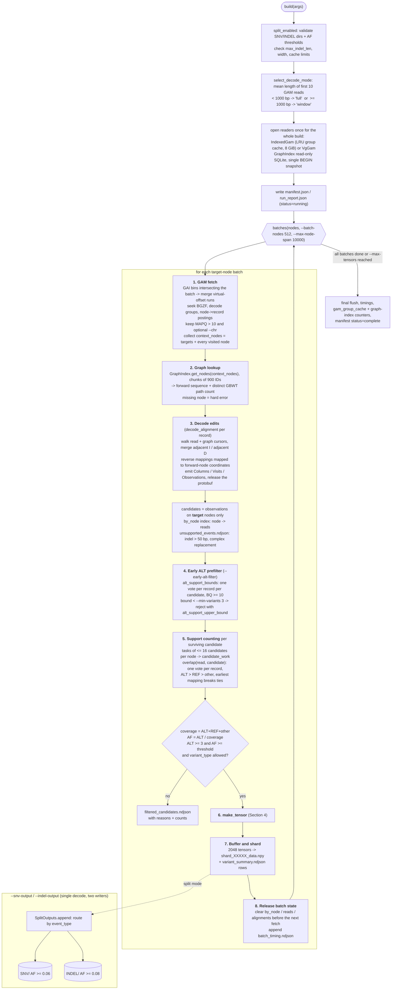
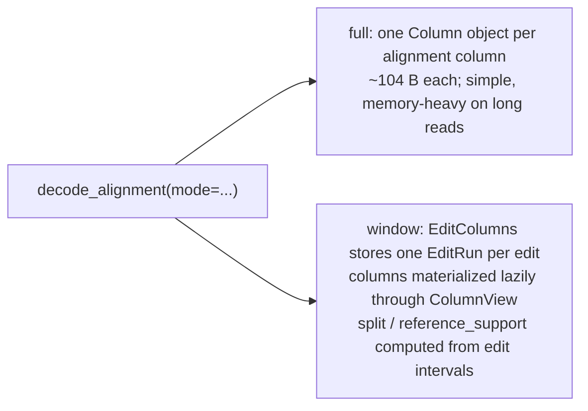
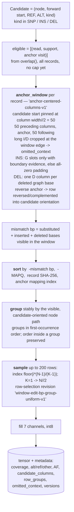
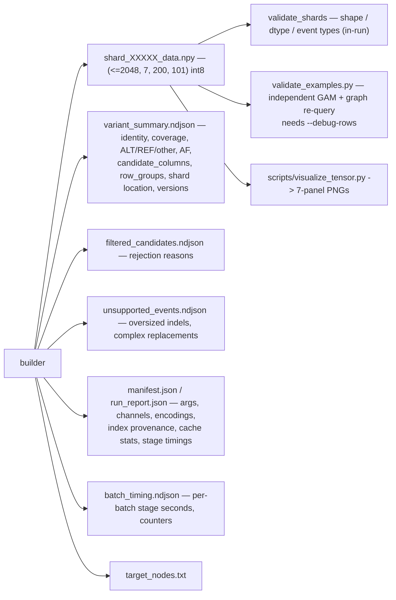

# Current tensor-building pipeline — diagrams

Drawn from the working-tree code on 2026-09-22 (`run.py`, `build_v2.py`,
`gam_reader.py`, `graph_index.py`, `candidates.py`, `candidate_work.py`,
`edit_columns.py`, `split_outputs.py`, `tensor_storage.py`,
`dynamic_tensor_run.py`). Prose reference: [CURRENT_PIPELINE.md](CURRENT_PIPELINE.md),
[UNIFIED_GRAPH_INDEX.md](UNIFIED_GRAPH_INDEX.md), [DYNAMIC_TENSOR_RUN.md](DYNAMIC_TENSOR_RUN.md).

Default format `indexed-gam-candidate-v4`, schema 4, shape `(7, 200, 101)`,
`int8`, storage encoding `int8-count-div4-v1`.

---

## 1. Offline / one-time inputs

`--graph-index` is the current path: one SQLite file replaces the old
`--node-sqlite` sequence source **and** the per-process `--gbz/--gbz-query/--occurrence-cache`
GBWT occurrence cache. Mixing the two input styles is rejected.

---

## 2. Production orchestration (`dynamic_tensor_run.py`)

One builder per task, one candidate worker per builder; shards are never merged.
Any task failure stops the queue. There is no automatic resume — recovery is a
new prepared run over the unfinished node intervals (`runs/recover_*.py`).

---

## 3. The builder: per-batch dataflow (the core)

`run.py build` → `build_v2.build` → `_dispatch` → `_build` → `_build_impl`.

Key invariants visible in the code:

- **One GAM pass per batch, shared by both variant types.** `SplitOutputs` only
  fans out at write time; SNV and INDEL never re-fetch or re-decode.
- **Only the parent process touches GAM / SQLite / GBZ.** With `--workers > 1`,
  forked candidate workers see the decoded batch copy-on-write and return
  `(tensor, metadata)` in original candidate order.
- **Counts use all eligible records**, before the 200-row cap.
- Timings accumulate into `gam_fetch_seconds`, `graph_index_seconds`,
  `decode_edits_seconds`, `candidate_tensors_and_shard_writes_seconds`.

### Decode mode

Production HG008 runs currently pin `full` (`config['params']['decode_policy']`),
which is the dominant memory term — see
[runs/memory_diagnosis_362962.md](runs/memory_diagnosis_362962.md).

---

## 4. One candidate → one `(7, 200, 101)` tensor

| Channel (1-based) | Contents |
|---|---|
| 1 | Read base — A=1, C=2, G=3, T=4, N=5, gap=6; padding 0 |
| 2 | Base quality, clipped to −1…127; −1 = missing quality / no read base |
| 3 | Flags — 1 = difference, 2 = candidate region, 3 = both |
| 4 | Alignment MAPQ, clipped to −1…127; present on aligned gaps |
| 5 | Operation — M=1, X=2, I=3, D=4, complex=5, aligned no-insertion gap=6 |
| 6 | Graph reference base for that row/column, same base encoding |
| 7 | `min(distinct GBWT path count of the column's node // 4, 127)` |

Insertions and insertion-gap slots take their **anchor** node's count;
deletions keep their mapped node's count; missing evidence is zero in all
seven channels.

---

## 5. Outputs and verification

`--debug-rows` adds per-row record hashes, full read paths and per-column graph
coordinates; it is required by the independent auditor and is disabled on full
production runs because of its size.
