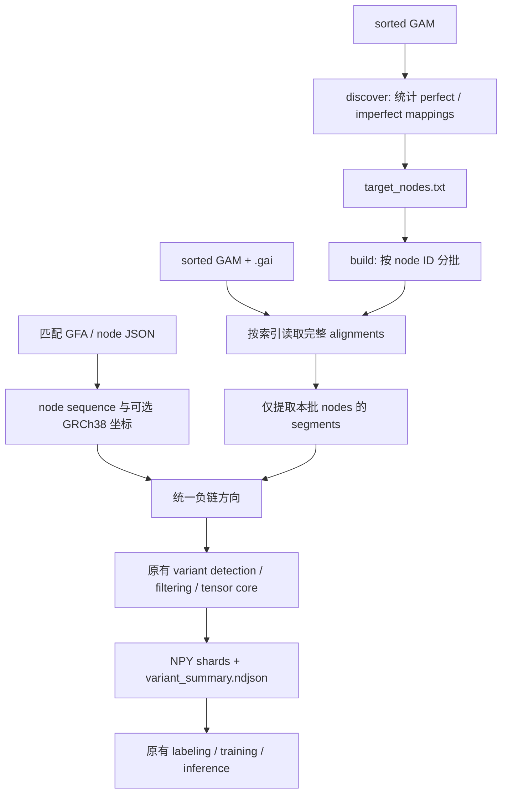

# Seven-channel candidate tensors (v4): GBZ node occurrences

`build` defaults to **candidate-v4**, shape `(7,200,100)`, `int32`.
Channel 7 is `node_distinct_gbwt_path_count`: the number of distinct physical
GBWT paths visiting the column's node, including reference and haplotype paths.
Repeated visits, both node orientations, and a path's reverse-complement copy
count once. This is a path count, not a count of unique biological haplotypes:
fragmented paths can belong to the same sample/haplotype. Counts are unscaled.
The first six channels, row selection, and candidate statistics retain v3 semantics.

The previous GFA W-record metric missed paths available in our GBZ. For example,
on **hprc-v1.1-mc-grch38.d9**, node 2753 has 86 GBWT paths (old W count 1), and
51182 has 24 (old W count 0), independently checked with `gbz-tool find-batch`.
Node IDs are graph-specific: this graph has a 114-base node 2753 and a `C` at
51182. Queries returning a 10-base node 2753 and `G` at 51182 use different node
identities and cannot supply counts for these GAM alignments.

Compile the helper using the dependencies installed by gbz-tool (gbwtgraph,
gbwt, sdsl, handlegraph, divsufsort, and nlohmann/json; C++17 and OpenMP required):

```bash
python indexed_gam_pipeline/build_gbz_query.py \
  --deps /scratch/jshen/Github/gbz-tool/dependency --output tmp/gbz_node_counts
python indexed_gam_pipeline/run.py build --format candidate-v4 \
  --gam /scratch/jshen/data/COLO829T/illumina/GAM/COLO829T_3M.sorted.gam \
  --nodes tmp/colo829t_1000_nodes.txt \
  --node-sqlite /scratch/jshen/data/AF-Filtered_VG_Indexes/hprc-v1.1-mc-grch38.d9.GRCh38_CHM13_node_index.sqlite \
  --gbz /scratch/jshen/data/AF-Filtered_VG_Indexes/hprc-v1.1-mc-grch38.d9.gbz \
  --gbz-query tmp/gbz_node_counts --occurrence-cache tmp/hprc_gbwt_counts.sqlite \
  --output tmp/my_candidate_v4_run --max-tensors 1000 --debug-rows
python scripts/visualize_tensor.py tmp/my_candidate_v4_run/shard_00000_data.npy \
  --all-samples --output-dir tmp/my_candidate_v4_run/images
```

The helper loads the GBZ once per build when uncached nodes are needed. SQLite
stores node counts and forward sequences, graph path/size/mtime, initial SHA-256,
and the counting definition. A changed source fingerprint, old GFA cache, missing
GBZ node, or sequence disagreement with the tensor graph fails explicitly. Source
SHA-256 is recorded at cache creation; size/mtime are checked on reuse. Use one
writer per cache. No GFA fallback or missing-node zero is used.

For insertions and aligned insertion-gap slots, the count comes from the anchor
node; deletions use their mapped node. Missing coverage and padding remain zero.
Manifests and summaries carry `indexed-gam-candidate-v4` / schema 4. Standalone
arrays require `--format candidate-v4` so the image legend identifies GBWT paths.
The debug auditor accepts `--gbz`, `--gbz-query`, and `--occurrence-cache`.
Older v3 files retain their explicit GFA meaning and remain readable.

Regression tests, including a real tiny GBZ with repeated and reverse visits:

```bash
GBZ_QUERY=tmp/gbz_node_counts GBZ_TOOL=/scratch/jshen/Github/gbz-tool/gbztool \
  python -m unittest discover -s indexed_gam_pipeline/tests -q
```

See the [100-example gallery](samples/colo829t_100/README.md) for corrected tensors,
images, independent query comparisons, and measured generation time.

---

# Seven-channel candidate tensors (v3): cached graph walk counts

The retained **`--format candidate-v3`** uses shape `(7,200,100)`, `int32`.
The first six channels and node-path row grouping retain v2 semantics. Channel 7
contains the **exact number of distinct GFA W records visiting the column's node**.
It is a graph feature, independent of GAM read coverage. Existing six-channel and
five-channel checkpoints require their corresponding older formats or retraining.
Use `--format candidate-v2` for six channels or `--format legacy` for five.

Build the reusable lookup once (plain or gzip-compressed GFA):

```bash
python indexed_gam_pipeline/walk_counts.py \
  --gfa /scratch/jshen/data/AF-Filtered_VG_Indexes/hprc-v1.1-mc-grch38.d9.gfa \
  --output tmp/hprc_distinct_w_counts.sqlite
```

Then query the cache during tensor builds:

```bash
python indexed_gam_pipeline/run.py build --format candidate-v3 \
  --gam tmp/HG008_pacbio_test.sorted.gam --index tmp/indexed_gam_current/rebuilt.gai \
  --nodes tmp/indexed_gam_ten_examples/combined/target_nodes.txt \
  --node-sqlite /scratch/jshen/data/AF-Filtered_VG_Indexes/hprc-v1.1-mc-grch38.d9.GRCh38_CHM13_node_index.sqlite \
  --walk-counts tmp/hprc_distinct_w_counts.sqlite \
  --output tmp/my_candidate_v3_run --batch-nodes 3 --debug-rows
python scripts/visualize_tensor.py tmp/my_candidate_v3_run/shard_00000_data.npy \
  --all-samples --output-dir tmp/my_candidate_v3_run/images
```

The cache builder makes one sequential pass over the GFA. For each W record it
collects distinct positive numeric vg node IDs, ignoring traversal orientation
and repeated visits within that record. W identity uses its first seven fields
(type, sample, haplotype, sequence ID, start, end, walk); exact duplicates count
once, while different intervals are distinct W records. Optional tags do not
create additional walks. S/L/P records do not contribute. Malformed walks, missing
walk strings and graphs without W records fail explicitly.

Counts accumulate in a disk-backed vector for normal vg IDs and a sparse table
for unusually large IDs, then are persisted in an indexed SQLite table. Tensor
batches query only their context-node IDs; they never rescan the GFA. The cache
records the source path, file size/mtime, SHA-256 of uncompressed GFA content,
record counts and construction time. Changed source size/mtime invalidates it.
Incomplete caches are not published, and existing cache files are not overwritten.
For a relocated cache, original source size/mtime is checked only when that source
path remains available; ensure that the cache matches the graph used for alignment.

Channel 7 conventions:

- Reference bases and deletions use their own mapped node's count.
- Inserted bases and shared aligned insertion-gap slots use their boundary node's
  count, including context insertions on other branches.
- Missing coverage and unused rows have count 0. A real mapped node absent from
  all W records also has count 0; other channels distinguish it from padding.
- Counts are raw integers, never normalized or clipped. `int32` preserves counts
  above the previous format's int16 maximum. Out-of-range counts fail explicitly.
- Reverse orientation does not alter the count. All seven channels are permuted
  together when grouping rows by node path. Candidate statistics and row selection
  do not depend on this feature.

The format identifier is `indexed-gam-candidate-v3`, schema version 3. Manifests
include channel definitions, encodings and full walk-cache provenance. The image
visualizer auto-detects v3 from metadata and draws a seventh count panel; use
`--format candidate-v3` for standalone arrays without a manifest. The debug auditor
`validate_examples.py` accepts `--walk-counts` to verify every occupied count cell.
The cache, full GFA and generated tensor shards remain outside Git.
The [COLO829T 100-example gallery](samples/colo829t_100/README.md) includes
matching PNGs, a compressed tensor subset, metadata, and measured run times.

The following documentation describes the retained six-channel v2 format.

---

# Indexed GAM candidate-centered tensors (v2)

Select `--format candidate-v2` for the retained six-channel version: one alignment per row,
shape `(6, 200, 100)`, `int16`, with no reference row. Select `--format legacy`
for the original `(5, 201, 100)` int8 tensors and existing checkpoints.
Six-channel v2 is a new encoding and **cannot be consumed directly by existing
five-channel checkpoints** (nor by an arbitrary older six-channel model).

```bash
python indexed_gam_pipeline/run.py build --format candidate-v2 \
  --gam tmp/HG008_pacbio_test.sorted.gam \
  --index tmp/indexed_gam_current/rebuilt.gai \
  --nodes tmp/indexed_gam_current/known_nodes.txt \
  --node-sqlite /scratch/jshen/data/AF-Filtered_VG_Indexes/hprc-v1.1-mc-grch38.d9.GRCh38_CHM13_node_index.sqlite \
  --output tmp/my_candidate_v2_run --batch-nodes 3 --debug-rows
```

Use a new output directory. `discover` retains imperfect-mapping node selection;
its exclusive MAPQ threshold is configurable with `--min-mapq` (default 5).
Build also retains its exclusive MAPQ threshold (default 10), chromosome filter,
minimum ALT count/AF/BQ, variant type, batching, and shard size. Graph sequences
must cover **all visited context nodes**, not just the target-node list. SQLite is
recommended; GFA and JSON are supported. Queries merge indexed intervals and
retain distinct records, including byte-identical records and same-name mates.
An alignment can be fetched in multiple batches, but candidates belong to exactly
one target-node batch. `--max-batch-segments` bounds complete alignment records
in v2; long reads can still require substantial memory. No genome-scale performance
or memory claim is made.

Candidate and counting contract:

- Candidates come directly from edits: equal lengths with empty sequence are
  matches; replacements of equal length yield individual SNPs; insertions and
  deletions are supported through 50 bp inclusive. Adjacent I or D edits are
  merged before applying the length limit. No realignment against read bases is
  used to discover candidates.
- Coordinates are zero-based on the forward node. Reverse mappings use oriented
  offsets and reverse-complement both alleles; identity is exact node, forward
  position, REF, ALT and event type. Repeat-shift equivalence and equivalence
  across nodes are not asserted. Graph-path-only variants are outside scope.
- Oversized events and unequal positive-length replacements are written in full
  to `unsupported_events.ndjson`; they never become supported candidate ALTs.
  This log includes non-target context events and identifies batch/record indices
  and `in_target_nodes`; a contextual event can recur in different query batches.
  Complex context is marked operation C using ordered replacement slots, with
  tail gaps for unequal lengths. It is not represented as a normalized CIGAR.
- SNP/deletion coverage requires intersection with the affected reference
  interval, including deletion spans. Partial interval overlap counts as coverage
  but cannot establish REF. Insertion coverage includes either endpoint of a
  consumed mapping interval (`start <= boundary <= end`), including terminal
  boundaries and spanning deletions. There is no additional minimum flank rule.
- Insertion REF requires adjacent M/X reference columns on both sides of the
  boundary and no insertion at that boundary; neighbors can belong to different
  nodes at a true node edge, but not at an interior partial-mapping endpoint. A terminal boundary with no inserted sequence is **other**, not REF.
  Exact edit ALT support requires minimum BQ: SNP BQ, mean insertion BQ, or
  minimum available adjacent read BQ for deletions. Absent qualities are -1.
  Low-BQ ALT observations remain in coverage as other. REF counts require the
  complete affected reference allele; other includes alternate alleles and
  insufficient evidence. MAPQ applies to every counted record.
- Each record counts once per candidate. With repeated visits, choose ALT over
  REF over other, then earliest mapping. Preserve the complete alignment in its
  single row. Full counts and AF are computed before row selection. Row selection uses
  ALT/REF/other, descending MAPQ, then serialized-record SHA256. After selection,
  rows are stably grouped by their candidate-oriented node path visible in the
  tensor window, ordered lexicographically by node ID and orientation. Within
  each path group, the selection order is retained. All six channels and debug
  metadata move together; counts, AF and the selected record set are unchanged.
  Distant nodes outside the window do not split groups. Repeated visible visits
  remain in the path key. `row_groups` gives half-open row ranges and node paths;
  `row_order` records the rule. Duplicate records remain distinct.

Window and encoding contract:

| Channel (1-based) | Meaning |
|---|---|
| 1 | Actual read bases |
| 2 | Base qualities |
| 3 | Bit flags: difference/event = 1; candidate region = 2 |
| 4 | Mapping quality (saturated at int16 maximum) |
| 5 | Alignment operation |
| 6 | That row's graph-reference bases |

Base encoding: padding=0, A=1, C=2, G=3, T=4, N/unknown=5, alignment gap=6.
Operation encoding: padding=0, M=1, X=2, I=3, D=4, C=5, G=6
(G is an aligned absence in the shared insertion block). Quality is -1 when
there is no read base or no recorded quality; ordinary padding is 0. Unused rows
are all zero. In occupied rows the candidate flag marks the entire central range,
including missing coverage. Missing insertion coverage keeps read padding but
reference-gap channel values. Metadata disambiguates the candidate region.

Each row follows all ordered mappings, using only consumed node slices, reversing
sequence, quality order and context together when its anchor mapping is reversed.
Node boundaries add no padding. Branches may differ: outside the shared anchor,
columns describe candidate-relative context, not a common graph coordinate.
Matched alternative graph nodes supply real reference bases. Context insertions
stay within their row's path. For deletions, internal context insertions are
retained in that row's central region; other rows pad spare central slots.
If that entire central region exceeds the requested width, construction fails
explicitly rather than dropping affected reference bases.

Insertion candidates share a block equal to the longest observed boundary allele
up to 50 bp (at least the candidate length). Alleles are left-aligned with trailing
alignment gaps; insufficient boundary evidence uses padding. Oversized other
insertion alleles remain other and are reported unsupported; any omitted columns
in their tensor depiction are reported in `omitted_context`, never treated as a
shorter supported allele. The candidate region is centered and consumes width;
outer context is trimmed. `candidate_columns=[start,end)` specifies its full range.
`--rows` and `--width` default to 200 and 100; width must accommodate the configured
maximum INDEL size.

Outputs: NPY shards `(N,6,rows,width)`, `variant_summary.ndjson`,
`filtered_candidates.ndjson`, `unsupported_events.ndjson`, `target_nodes.txt`,
`manifest.json` and matching `run_report.json`. The schema is version 2 and format
is `indexed-gam-candidate-v2`. Summaries carry candidate identity/alleles, full
ALT/REF/other/coverage/AF, selected counts, parameters and shard coordinates.
`--debug-rows` adds original ordered mapping intervals, chosen visit, record hash,
orientation, and column-to-node offsets/boundaries for every selected row.
Generated real-data artifacts remain in ignored `tmp/`; the sample manifest
records provenance and checksums without adding bulk data to Git.

Export paired text rows (`.` padding, `-` gap) with:

```bash
python indexed_gam_pipeline/inspect_tensor.py tmp/my_candidate_v2_run tmp/my_candidate_v2_run/paired_rows.txt
```

Run regression tests with:

```bash
python -m unittest discover -s indexed_gam_pipeline/tests -v
```

Image visualization supports both formats through the existing CLI:

```bash
python scripts/visualize_tensor.py tmp/my_candidate_v2_run/shard_00000_data.npy --all-samples --output-dir tmp/my_candidate_v2_run/images
```

V2 format and candidate intervals are loaded from the adjacent manifest and
summary; use `--format candidate-v2` for standalone arrays. The six panels retain
row zero as an alignment, show distinct gaps/padding, mark the entire candidate
range, and display the actual per-row reference channel. Existing five-channel
rendering remains available. See [the portable comparison gallery](samples/README.md)
for real-data PNGs, old/new counts, and the verified BQ-policy difference.

The historical documentation below describes **legacy mode**.

---

# Indexed GAM → node pileup → tensors

独立的新 pipeline。输入 sorted GAM 和对应 `.gai`，先确定目标 nodes，再按批
读取 alignments，在内存中构建 segments 和 pileup，直接输出 5-channel tensors。
不生成、不读取 NPU `.dat/.idx`，也不需要编译 `fast_writer` 或安装 `vg` 来查询。



## 文件

| 文件 | 功能 |
|---|---|
| `run.py` | `discover`、`validate`、`build` 三个命令 |
| `gam_reader.py` | 解析 GAI v0/v1、BGZF seek、精确 node 过滤 |
| `segments.py` | mapping 拆分、质量过滤、负链转换 |
| `tests/test_pipeline.py` | 索引读取与原 tensor 算法的合成回归检查 |
| `samples/` | HG008 三节点真实 5-channel tensor、summary、节点和校验清单 |
| `LOCAL_TEST_REPORT.md` | 本次真实 GAM 本地测试记录 |

共享 tensor 核心位于
`src/pangenome_ml_data_generation/tensors/builders.py::build_tensors_from_segments`。
只是把已有的内存计算部分提取为函数，保留该模块的原 `.dat` reader 调用路径。
原有 `scripts/generate_testing_tensors.py` 未修改，作为回归比较基准。

## 环境

在项目根目录运行，并使用现有项目环境：

```bash
conda activate pangenome-ml-data-generation
python indexed_gam_pipeline/run.py --help
```

需要 Python、NumPy、pysam 和 protobuf。此目录内的 `vg_pb2.py` 由
`cpp/proto/vg.proto` 用 protoc 3.20.3 生成，可使用当前 protobuf C 实现。
GAM 必须为带 `GAM` tag 的 BGZF GAM，`.gai` 必须对应这份 GAM。
文件名/索引范围校验不能证明两者来自同一次排序；不要复用另一份 GAM 的索引。
不支持 GAF。第一版采用单进程、顺序批处理，便于结果核对。

## 本地简单测试：不需要 GFA

```bash
# 前 100,000 条 alignment 仅用于选出一小组测试 nodes。
python indexed_gam_pipeline/run.py discover \
  --gam tmp/COLO829T_3M.sorted.gam \
  --max-alignments 100000 \
  --max-nodes 12 \
  --output tmp/indexed_gam_smoke/discovery

# 对这 12 个 nodes 做真正的 .gai 随机读取，随后独立顺序扫描整份 GAM 核对。
python indexed_gam_pipeline/run.py validate \
  --gam tmp/COLO829T_3M.sorted.gam \
  --nodes tmp/indexed_gam_smoke/discovery/target_nodes.txt \
  --output tmp/indexed_gam_smoke/validation

python -m unittest discover -s indexed_gam_pipeline/tests -v
```

`validate` 比较完整 alignment 的多重集合，以及每个 node 的 segment 多重集合。
保留相同 read name、paired reads 和真正重复的记录，不按 read name 去重。
该命令不访问图、不构建真实样本 tensors，也不执行模型推理。

`--max-alignments` 会产生不完整的候选统计，只适合 smoke test；
`discovery_report.json` 会明确标为 `exploratory: true`。
索引查询和验证扫描不受这个测试采样上限限制。
所有输出目录要求不存在或为空，重跑请使用新目录，避免混入旧 shards。

## Server：正式运行

下面路径为需要替换的示例。GFA 必须保留与 GAM 相同的 vg node IDs。

### 1. 完整发现目标 nodes

```bash
python indexed_gam_pipeline/run.py discover \
  --gam /path/to/sample.sorted.gam \
  --node-alt 0.05 \
  --output /path/to/run/discovery
```

可加 `--chr-nodes /path/to/chr1.component.nodes.raw.txt` 限制目标 node 集合。
也可用 `--chr chr1` 按 GAM `Alignment.refpos.name` 过滤，与原发现及
`.dat/.idx` 构建命令的 chromosome 语义相同；同一 `--chr` 应传给
`discover`、`validate` 和 `build`。
已有确定的 node 清单时可直接跳到第二步。清单格式为每行一个正整数 node ID。
统计输出包括 `node_stats.json`、`target_nodes.txt`、`discovery_report.json`。
`node_stats.json` 保留旧发现阶段的四字段 schema：`perfect`、
`not_perfect`、`max_read_length`、`max_cigar_length`。

### 2. 直接生成 tensors

```bash
python indexed_gam_pipeline/run.py build --format legacy \
  --gam /path/to/sample.sorted.gam \
  --nodes /path/to/run/discovery/target_nodes.txt \
  --gfa /path/to/matching_graph.gfa \
  --node-json /path/to/GRCh38.nodes.json \
  --output /path/to/run/tensors \
  --batch-nodes 128 \
  --max-node-span 10000 \
  --variant-type snp \
  --min-af 0.08 \
  --min-variants 3 \
  --min-allele-bq 10 \
  --min-mapq 10 \
  --shard-size 4096
```

`--gfa`、`--node-sqlite` 和 `--node-json` 至少提供一个。
`--node-sqlite` 读取匹配图的 `nodes(node_id, seq)` 表，适合已有 GFA
节点索引、无需重新扫描大型 GFA 的场景；SQLite 与 JSON 序列冲突时会报错。
GFA 与 JSON 支持 gzip。

这条路径仍使用原 `build_dat_idx.py` 的 segment 字段语义：node 内 offset、
read sequence、原始 Phred BQ、M/X/I/D CIGAR、strand 和 alignment MAPQ。
GAM/GAI 查询直接填充这些内存字段，再调用原 tensor 核心；不写 `.dat/.idx`。
只有 GFA 时也能生成 tensors，但不会自动计算 GRCh38 坐标。
JSON 格式沿用原流程：记录列表或 `{"nodes": [...]}`，每条包含 `node_id`、
`sequence`，已有的坐标字段原样保留。JSON 可以只覆盖参考路径 nodes，其他
目标 node 的序列由 GFA 补齐；二者序列冲突、缺失序列时会报错。
若 JSON 已覆盖全部目标 nodes，可以省略 GFA。

默认读取 `<gam>.gai`，非默认位置可用 `--index /path/to/index.gai`。
若 `.gai` 来自另一版 sorted GAM，可从当前 GAM 重建索引：

```bash
python indexed_gam_pipeline/run.py index \
  --gam /path/to/sample.sorted.gam \
  --output /path/to/sample.rebuilt.gai
```

`index` 只写新的 GAI 文件，不覆盖已有文件；后续 `build` / `validate`
使用 `--index /path/to/sample.rebuilt.gai`。索引会扫描完整 GAM。

输出：

```text
tensors/
├── candidate_nodes.json
├── target_nodes.txt
├── run_report.json
├── variant_summary.ndjson
└── shard_00000_data.npy ...
```

每个 tensor 为 `(5, 201, 100)`、`int8`，包含 1 行 reference、最多 200 行
reads，窗口宽度 100。五通道及 summary 的 `shard_index`、
`index_within_shard` 字段保持原格式。`run_report.json` 的 `status=complete`
表示成功；中途失败时保留 `running`，不要把这种目录用于下游。

五通道顺序为 base、base quality、mismatch flag、mapping quality、CIGAR。
`samples/hg008_3nodes_data.npy.gz` 保存三个真实 SNV tensor，可用
`numpy.load(io.BytesIO(gzip.open(path, 'rb').read()))` 读取；对应的 summary、
node records 和行顺序无关的 SHA-256 位于 `samples/`。样本每个 tensor 的
完整 read 行多重集合与旧 NPU 输出逐字节一致，read 行顺序可能不同。

### 3. 沿用现有 labeling / inference

```bash
python scripts/label_tensors.py \
  /path/to/run/tensors/variant_summary.ndjson \
  /path/to/run/tensors/candidate_nodes.json \
  /path/to/truth.vcf.gz \
  --chr chr1 \
  --data-dir /path/to/run/tensors
```

推理时把新 tensor 目录作为 `--input_dir`，并传入该目录的
`candidate_nodes.json` 和 `variant_summary.ndjson`。完整模型命令见原 README。
线性坐标 labeling / VCF 输出仍依赖对应的 GRCh38 坐标注释。

## 兼容性与当前边界

- Node discovery 保留 `MAPQ > 5`；目标筛选为 imperfect 数量至少 1，且
  `imperfect / (perfect + imperfect) > node_alt`。这里统计的是 mappings。
- Segment 阶段保留旧 NPU writer 的 `MAPQ > 10`，同时满足
  `MAPQ >= min_mapq`。读入全部合格 reference/ALT reads，避免改变 AF 分母。
- 每个 node 只属于一个 batch。跨批次 alignment 可以再次被读取，但仅分发给
  当前批次拥有的 nodes；一次查询会合并重叠的索引区间，避免重复读取同一记录。
- 负链 offset 按 reference-consuming CIGAR span 转换；segment 原始方向保留。
- 旧算法先按非 M 长度排序，最多保留 400 segments 用于候选统计，再选最多
  200 tensor read rows。本版保留这套行为，coverage/AF 并非保证是全深度统计。
- 本版保留真实的末尾 BQ=0，不执行旧 `.dat` reader 对质量字节的 `rstrip(0)`。
  所以受旧 reader 末尾零质量丢弃影响的 reads，其结果可能与旧管线不同。
- 不等长且 `from_length/to_length` 同时非零的复杂 edit 明确报错；旧 writer
  对此会漏写 CIGAR。缺失/不匹配的质量值也明确报错，不静默输出不完整结果。
- 原始 GAM 与 sorted GAM 的 read 顺序可能不同。比较新旧 tensors 时，应使用
  同一份 sorted GAM 生成旧 NPU，按 node/variant key 比较，不能按 shard 文件顺序比较。
- GAI 的 bin 范围可能很宽，稀疏查询也可能解码较多额外 records。当前实现采用
  保守的 bin 交集查询，没有使用 window 下界优化；正确性以顺序扫描核对。
- 批次在内存收齐 segments 后再处理，不会提前截断而漏掉 ALT reads。
  `--max-batch-segments` 默认 1,000,000，超限会报错。可减小 batch，或明确提高
  上限；该限制是 segment 数量，不是严格内存字节上限。

GAI 格式依据 vg 官方
[`stream_index.cpp`](https://github.com/vgteam/vg/blob/d08602f3855d5eb5ca406a388b01d2cd12c002d5/src/stream_index.cpp)
的序列化定义与 bin-prefix 规则实现。
