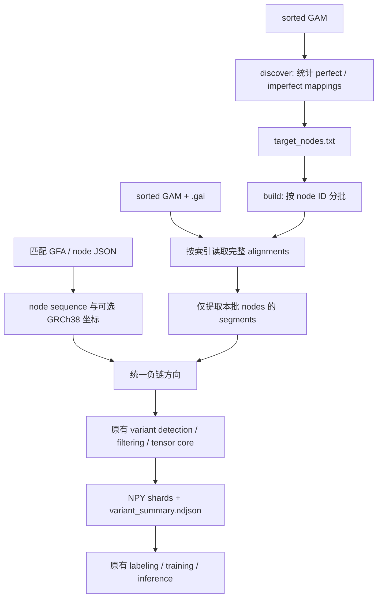

# Indexed GAM → node pileup → tensors

独立的新 pipeline。输入 sorted GAM 和对应 `.gai`，先确定目标 nodes，再按批
读取 alignments，在内存中构建 segments 和 pileup，直接输出 5-channel tensors。
不生成、不读取 NPU `.dat/.idx`，也不需要编译 `fast_writer` 或安装 `vg` 来查询。



## 文件

| 文件 | 功能 |
|---|---|
| `run.py` | `discover`、`validate`、`build` 三个命令 |
| `gam_reader.py` | 解析 GAI v0/v1、BGZF seek、精确 node 过滤 |
| `segments.py` | mapping 拆分、质量过滤、负链转换 |
| `tests/test_pipeline.py` | 索引读取与原 tensor 算法的合成回归检查 |
| `LOCAL_TEST_REPORT.md` | 本次真实 GAM 本地测试记录 |

共享 tensor 核心位于
`src/pangenome_ml_data_generation/tensors/builders.py::build_tensors_from_segments`。
只是把已有的内存计算部分提取为函数，保留该模块的原 `.dat` reader 调用路径。
原有 `scripts/generate_testing_tensors.py` 未修改，作为回归比较基准。

## 环境

在项目根目录运行，并使用现有项目环境：

```bash
conda activate pangenome-ml-data-generation
python indexed_gam_pipeline/run.py --help
```

需要 Python、NumPy、pysam 和 `protobuf==3.20.3`，复用仓库的 `vg_pb2.py`。
GAM 必须为带 `GAM` tag 的 BGZF GAM，`.gai` 必须对应这份 GAM。
文件名/索引范围校验不能证明两者来自同一次排序；不要复用另一份 GAM 的索引。
不支持 GAF。第一版采用单进程、顺序批处理，便于结果核对。

## 本地简单测试：不需要 GFA

```bash
# 前 100,000 条 alignment 仅用于选出一小组测试 nodes。
python indexed_gam_pipeline/run.py discover \
  --gam tmp/COLO829T_3M.sorted.gam \
  --max-alignments 100000 \
  --max-nodes 12 \
  --output tmp/indexed_gam_smoke/discovery

# 对这 12 个 nodes 做真正的 .gai 随机读取，随后独立顺序扫描整份 GAM 核对。
python indexed_gam_pipeline/run.py validate \
  --gam tmp/COLO829T_3M.sorted.gam \
  --nodes tmp/indexed_gam_smoke/discovery/target_nodes.txt \
  --output tmp/indexed_gam_smoke/validation

python -m unittest discover -s indexed_gam_pipeline/tests -v
```

`validate` 比较完整 alignment 的多重集合，以及每个 node 的 segment 多重集合。
保留相同 read name、paired reads 和真正重复的记录，不按 read name 去重。
该命令不访问图、不构建真实样本 tensors，也不执行模型推理。

`--max-alignments` 会产生不完整的候选统计，只适合 smoke test；
`discovery_report.json` 会明确标为 `exploratory: true`。
索引查询和验证扫描不受这个测试采样上限限制。
所有输出目录要求不存在或为空，重跑请使用新目录，避免混入旧 shards。

## Server：正式运行

下面路径为需要替换的示例。GFA 必须保留与 GAM 相同的 vg node IDs。

### 1. 完整发现目标 nodes

```bash
python indexed_gam_pipeline/run.py discover \
  --gam /path/to/sample.sorted.gam \
  --node-alt 0.05 \
  --output /path/to/run/discovery
```

可加 `--chr-nodes /path/to/chr1.component.nodes.raw.txt` 限制目标 node 集合。
已有确定的 node 清单时可直接跳到第二步。清单格式为每行一个正整数 node ID。
统计输出包括 `node_stats.json`、`target_nodes.txt`、`discovery_report.json`。

### 2. 直接生成 tensors

```bash
python indexed_gam_pipeline/run.py build \
  --gam /path/to/sample.sorted.gam \
  --nodes /path/to/run/discovery/target_nodes.txt \
  --gfa /path/to/matching_graph.gfa \
  --node-json /path/to/GRCh38.nodes.json \
  --output /path/to/run/tensors \
  --batch-nodes 128 \
  --max-node-span 10000 \
  --variant-type snp \
  --min-af 0.08 \
  --min-variants 3 \
  --min-allele-bq 10 \
  --min-mapq 10 \
  --shard-size 4096
```

`--gfa` 和 `--node-json` 至少提供一个；两者支持 gzip。
只有 GFA 时也能生成 tensors，但不会自动计算 GRCh38 坐标。
JSON 格式沿用原流程：记录列表或 `{"nodes": [...]}`，每条包含 `node_id`、
`sequence`，已有的坐标字段原样保留。JSON 可以只覆盖参考路径 nodes，其他
目标 node 的序列由 GFA 补齐；二者序列冲突、缺失序列时会报错。
若 JSON 已覆盖全部目标 nodes，可以省略 GFA。

默认读取 `<gam>.gai`，非默认位置可用 `--index /path/to/index.gai`。

输出：

```text
tensors/
├── candidate_nodes.json
├── target_nodes.txt
├── run_report.json
├── variant_summary.ndjson
└── shard_00000_data.npy ...
```

每个 tensor 为 `(5, 201, 100)`、`int8`，包含 1 行 reference、最多 200 行
reads，窗口宽度 100。五通道及 summary 的 `shard_index`、
`index_within_shard` 字段保持原格式。`run_report.json` 的 `status=complete`
表示成功；中途失败时保留 `running`，不要把这种目录用于下游。

### 3. 沿用现有 labeling / inference

```bash
python scripts/label_tensors.py \
  /path/to/run/tensors/variant_summary.ndjson \
  /path/to/run/tensors/candidate_nodes.json \
  /path/to/truth.vcf.gz \
  --chr chr1 \
  --data-dir /path/to/run/tensors
```

推理时把新 tensor 目录作为 `--input_dir`，并传入该目录的
`candidate_nodes.json` 和 `variant_summary.ndjson`。完整模型命令见原 README。
线性坐标 labeling / VCF 输出仍依赖对应的 GRCh38 坐标注释。

## 兼容性与当前边界

- Node discovery 保留 `MAPQ > 5`；目标筛选为 imperfect 数量至少 1，且
  `imperfect / (perfect + imperfect) > node_alt`。这里统计的是 mappings。
- Segment 阶段保留旧 NPU writer 的 `MAPQ > 10`，同时满足
  `MAPQ >= min_mapq`。读入全部合格 reference/ALT reads，避免改变 AF 分母。
- 每个 node 只属于一个 batch。跨批次 alignment 可以再次被读取，但仅分发给
  当前批次拥有的 nodes；一次查询会合并重叠的索引区间，避免重复读取同一记录。
- 负链 offset 按 reference-consuming CIGAR span 转换；segment 原始方向保留。
- 旧算法先按非 M 长度排序，最多保留 400 segments 用于候选统计，再选最多
  200 tensor read rows。本版保留这套行为，coverage/AF 并非保证是全深度统计。
- 本版保留真实的末尾 BQ=0，不执行旧 `.dat` reader 对质量字节的 `rstrip(0)`。
  所以受旧 reader 末尾零质量丢弃影响的 reads，其结果可能与旧管线不同。
- 不等长且 `from_length/to_length` 同时非零的复杂 edit 明确报错；旧 writer
  对此会漏写 CIGAR。缺失/不匹配的质量值也明确报错，不静默输出不完整结果。
- 原始 GAM 与 sorted GAM 的 read 顺序可能不同。比较新旧 tensors 时，应使用
  同一份 sorted GAM 生成旧 NPU，按 node/variant key 比较，不能按 shard 文件顺序比较。
- GAI 的 bin 范围可能很宽，稀疏查询也可能解码较多额外 records。当前实现采用
  保守的 bin 交集查询，没有使用 window 下界优化；正确性以顺序扫描核对。
- 批次在内存收齐 segments 后再处理，不会提前截断而漏掉 ALT reads。
  `--max-batch-segments` 默认 1,000,000，超限会报错。可减小 batch，或明确提高
  上限；该限制是 segment 数量，不是严格内存字节上限。

GAI 格式依据 vg 官方
[`stream_index.cpp`](https://github.com/vgteam/vg/blob/d08602f3855d5eb5ca406a388b01d2cd12c002d5/src/stream_index.cpp)
的序列化定义与 bin-prefix 规则实现。
