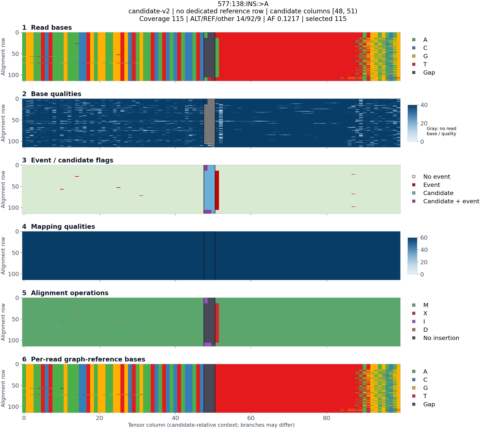

# HG008 legacy / candidate-v2 comparison

These PNGs are ready to view on a laptop; no GAM, graph database or new tensor
shards are required. Open the image links below, or browse `images/`.
Both formats were built from the same 10,000-alignment HG008 test GAM, matching
rebuilt GAI, graph sequences, three target nodes and `--variant-type all`.
The earlier bundled legacy sample used `--variant-type snp`, explaining its three
tensors versus the five in this all-variant comparison.

Counts are **coverage / ALT / REF / other**, computed at equivalent graph loci.
Legacy insertions use the preceding base (137); v2 uses the actual boundary (138).

| Candidate | Legacy counts | V2 counts | Legacy AF | V2 AF | Images |
|---|---|---|---:|---:|---|
| 577:138 insertion A | 115 / 14 / 92 / 9 | 115 / 14 / 92 / 9 | 0.1217 | 0.121739 | [Legacy](images/577_ins_A_legacy.png) · [V2](images/577_ins_A_v2.png) |
| 577:138 insertion AT | 115 / 8 / 92 / 15 | 115 / 8 / 92 / 15 | 0.0696 | 0.069565 | [Legacy](images/577_ins_AT_legacy.png) · [V2](images/577_ins_AT_v2.png) |
| 577:138 T>A | 115 / 92 / 23 / 0 | 115 / 92 / 23 / 0 | 0.8000 | 0.800000 | [Legacy](images/577_snp_T_A_legacy.png) · [V2](images/577_snp_T_A_v2.png) |
| 1841:0 T>C | 117 / 117 / 0 / 0 | 117 / 117 / 0 / 0 | 1.0000 | 1.000000 | [Legacy](images/1841_snp_T_C_legacy.png) · [V2](images/1841_snp_T_C_v2.png) |
| 2189:0 C>A | 72 / 71 / 0 / 1 | 72 / 70 / 0 / 2 | 0.9861 | 0.972222 | [Legacy](images/2189_snp_C_A_legacy.png) · [V2](images/2189_snp_C_A_v2.png) |

The sole count difference was verified directly against original GAM edits:
read `m84039_240114_012401_s1/24708040/ccs` has MAPQ 60 and ALT **BQ 3**.
Its reverse mapping has a `1 -> 1` substitution `T`, corresponding to forward
C>A. Legacy counts all ALT observations and filters the candidate by their mean
BQ (37.14 here). V2 requires each ALT observation to pass BQ 10, so that record
moves from ALT to other while coverage stays 72. The other non-ALT record is a
deletion spanning the SNP. This is a counting-policy difference, not a missing
alignment. The current per-observation v2 policy is unchanged by this comparison.

The independent raw-edit audit matched all three SNP counts in both formats.
See [legacy_comparison.json](legacy_comparison.json) for exact evidence and
[the compact v2 summary](hg008_candidate_v2_summary.ndjson) for full statistics.
AF-only differences in the matching cases are legacy rounding to four decimals.
These formats intentionally differ in shape, encoding, context and row order;
whole-tensor element equality is not expected.

## Reading the images

V2 has six panels in channel order: read bases, base qualities, event/candidate
flags, mapping qualities, alignment operations, and per-read graph-reference
bases. Every occupied row, including row zero, is an alignment. Black outlines
mark the complete candidate column interval. Different rows may follow different
graph branches, so their reference panels can differ outside the anchor.
White is missing-coverage padding; dark gray bases are alignment gaps. Gray BQ
cells have no read base or recorded quality; real BQ zero is retained. Unused rows
are cropped by default. Figure titles report full coverage/counts and selected
rows separately. Legacy keeps its existing five panels and reference row.



## Regenerate figures

Use a Python environment with compatible NumPy, Matplotlib and Pillow versions.
The server's default Python has a pre-existing NumPy 2 / Matplotlib binary mismatch;
these images and visualization tests used the existing
`/wanglab/jshen/anaconda3/envs/hunyuanvideo15/bin/python`
(NumPy 1.26.4, Matplotlib 3.10.8). No packages were installed or downgraded.

```bash
python scripts/visualize_tensor.py tmp/indexed_gam_candidate_v2_verified/shard_00000_data.npy \
  --all-samples --output-dir tmp/indexed_gam_candidate_v2_verified/images
```

The visualizer loads adjacent `manifest.json` and `variant_summary.ndjson`.
For a standalone tensor without metadata, pass `--format candidate-v2`;
`--summary-path`, `--manifest-path` and `--shard-index` accept explicit metadata.
`--show-all-rows` keeps padded rows; `--marker-column -1` hides candidate outlines.
Six channels alone do not identify an encoding, so automatic mode requires a v2
format identifier. Existing five-channel visualization remains supported.

The small pre-existing compressed five-channel tensor fixture is retained for
legacy regression testing. New generated tensor shards, bulk alignments, graph
files and large per-read debug metadata remain server-local under ignored `tmp/`.
No genome-scale run was performed.
