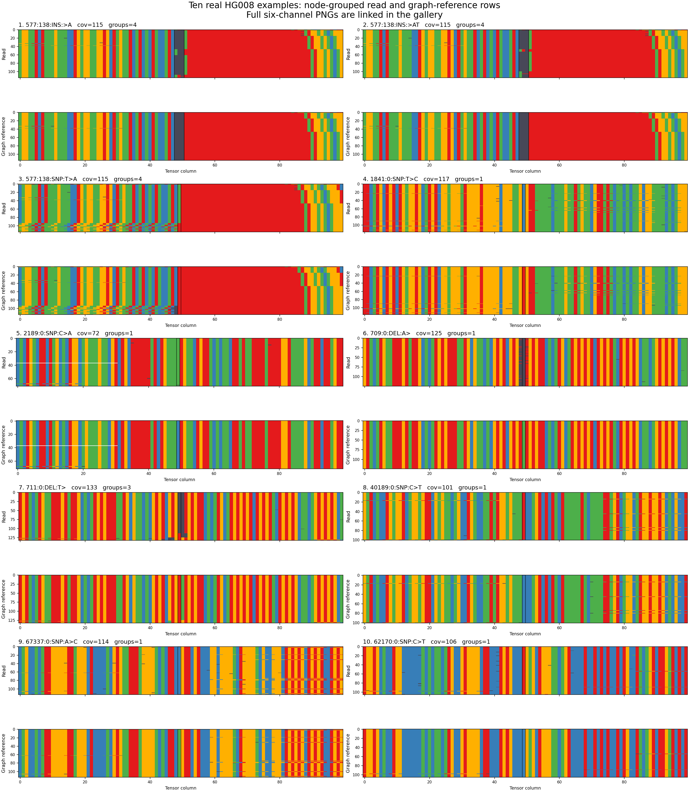

# Ten checked HG008 examples after node-path grouping

All **10 real-data examples passed**. Every link below opens a full six-channel
PNG on your laptop; no server data or plotting environment is required.
The examples contain **6 SNPs, 2 insertions and 2 deletions** across eight target
nodes. They come from bounded queries of the same 10,000-record HG008 test GAM.

Rows are grouped by their ordered node IDs and orientations within the candidate
window. Every row's six channels move together; selection and full statistics
are unchanged. Counts below use the complete coverage, before the row limit.

| # | Candidate (forward node coordinates) | Coverage | Legacy ALT/REF/other | V2 ALT/REF/other | Node-path groups | Comparison | Image |
|---|---|---:|---|---|---:|---|---|
| 1 | 577:138:INS:→A | 115 | 14/92/9 | 14/92/9 | 4 | Exact count match | [PNG](images/577_ins_A_v2.png) |
| 2 | 577:138:INS:→AT | 115 | 8/92/15 | 8/92/15 | 4 | Exact count match | [PNG](images/577_ins_AT_v2.png) |
| 3 | 577:138:SNP:T→A | 115 | 92/23/0 | 92/23/0 | 4 | Exact count match | [PNG](images/577_snp_T_A_v2.png) |
| 4 | 1841:0:SNP:T→C | 117 | 117/0/0 | 117/0/0 | 1 | Exact count match | [PNG](images/1841_snp_T_C_v2.png) |
| 5 | 2189:0:SNP:C→A | 72 | 71/0/1 | 70/0/2 | 1 | BQ-3 ALT observations become other | [PNG](images/2189_snp_C_A_v2.png) |
| 6 | 709:0:DEL:A→ | 125 | 125/0/0 | 125/0/0 | 1 | Exact count match | [PNG](images/709_del_A_none_v2.png) |
| 7 | 711:0:DEL:T→ | 133 | 113/20/0 | 113/20/0 | 3 | Exact count match | [PNG](images/711_del_T_none_v2.png) |
| 8 | 40189:0:SNP:C→T | 101 | 100/1/0 | 100/1/0 | 1 | Exact count match | [PNG](images/40189_snp_C_T_v2.png) |
| 9 | 67337:0:SNP:A→C | 114 | 113/0/1 | 111/0/3 | 1 | BQ-3 ALT observations become other | [PNG](images/67337_snp_A_C_v2.png) |
| 10 | 62170:0:SNP:C→T | 106 | 106/0/0 | 106/0/0 | 1 | Exact count match | [PNG](images/62170_snp_C_T_v2.png) |



The overview shows read and graph-reference bases; use the per-example links
above for full six-channel images.

## Checks performed

- Independently recounted coverage from original GAM mapping intervals and matched
  every selected record against the source record multiset.
- Checked all **1,113 occupied rows**, the six-channel shape/dtype, count sums,
  AF, candidate flags, insertion reference gaps, gap qualities and unused padding.
- Checked **110,503 reference columns** against the original graph sequences,
  including orientation, and reconstructed every node-path group from debug maps.
- Rendered all 10 full-resolution PNGs and verified their image integrity.
- Rebuilt legacy outputs for the same extra nodes. All 10 coverages match;
  eight ALT/REF/other sets match exactly. Independently audited original edits
  for all six SNPs. The two differences are entirely explained below.
- The initial five examples also passed a byte-for-byte six-channel row-multiset
  comparison before versus after sorting, including tensor/debug pairing.

### Explained legacy differences

At node **2189**, one ALT observation has BQ 3: legacy ALT/other = 71/1,
v2 = 70/2. At node **67337**, two ALT observations have BQ 3: legacy = 113/1,
v2 = 111/3. All have MAPQ 60 and remain in coverage. Legacy filters candidate
mean ALT BQ; v2 applies BQ >= 10 to each ALT observation. These were verified in
original GAM edits, including their reverse orientations; no records are lost.
AF is otherwise equal after legacy four-decimal rounding.

The expanded builds explicitly recorded **103 unsupported context-event
observations**, all outside the selected target nodes. These were not promoted
to candidate alleles. No full genome-scale run was performed.

## Files and provenance

- [Validation report](ten_examples_validation.json)
- [Legacy comparisons and raw-edit evidence](ten_examples_legacy_comparison.json)
- [Manifest, image hashes and source paths](ten_examples_manifest.json)
- [Compact summaries, counts and node-path groups](ten_examples_summary.ndjson)
- [Original five-example before/after sorting checks](grouping_validation.json)

Full tensors and debug mappings remain server-local at
`tmp/indexed_gam_ten_examples/combined/`. Only PNG previews and small reports are
synchronized. The combined shard contains the five previously checked examples,
four examples from nodes 709/711/40189/67337, and one from node 62170, without
additional candidate filtering during assembly.

To rerun the checks on the server:

```bash
python indexed_gam_pipeline/validate_examples.py tmp/indexed_gam_ten_examples/combined \
  --gam tmp/HG008_pacbio_test.sorted.gam --index tmp/indexed_gam_current/rebuilt.gai \
  --node-sqlite /scratch/jshen/data/AF-Filtered_VG_Indexes/hprc-v1.1-mc-grch38.d9.GRCh38_CHM13_node_index.sqlite \
  --output tmp/indexed_gam_ten_examples/combined/validation.json
python scripts/visualize_tensor.py tmp/indexed_gam_ten_examples/combined/shard_00000_data.npy \
  --all-samples --output-dir tmp/indexed_gam_ten_examples/combined/images
```

The image command needs compatible NumPy/Matplotlib versions, as documented in
[the original gallery](README.md).

## Measured single-tensor runtime

A timed build at node 62170 produced one `(6,200,100)` tensor from 106 alignments
and 1,138 graph context nodes in **8.82 seconds end to end**. Tensor assembly and
row grouping took **0.053 seconds**. Debug metadata was enabled. This measurement
followed related runs and may benefit from filesystem caches; it is not a
cold-cache or genome-scale throughput estimate. Loading can be shared across
candidates in a batch. See [the recorded timing](single_tensor_timing.json).
