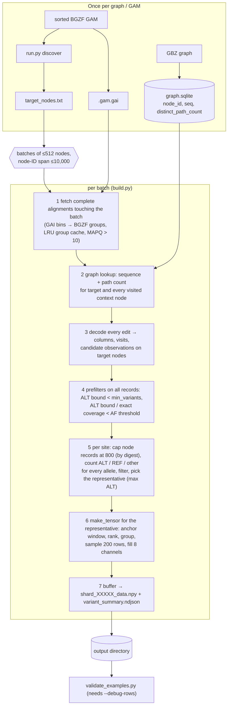

# indexed_gam_pipeline_v2

Candidate-centered pileup tensors built directly from a sorted, indexed GAM and a
GBZ pangenome graph. One tensor per candidate **site** — `(node, position, SNV|INDEL)`,
all passing alleles listed in its summary record — shape `(8, 200, 101)`, `int8`.

This is a cleaned-up rewrite of `indexed_gam_pipeline/` (v1) with about half of the
code and none of the experimental or superseded paths. Decoding, support counting,
row selection and window encoding are unchanged and were verified **byte-identical**
to v1 on real HG008 PacBio data. On top of that, v2 defines tensor format
**`indexed-gam-candidate-v5`**: a candidate-ALT channel replaces the flag channel,
path counts use an int8 log scale, and a strand channel is added (section 7;
rationale in section 8). Candidate handling follows the 2026-09-23 changes made to
v1 (session `d969188c`): site units, a per-node read cap of 800 and an AF upper-bound
prefilter (section 7 "Candidates, prefilters and sites"). Channels 0/1/3/4/5,
summaries and audit files are still identical to v1 (section 9). v1 is left
untouched for reference and for the frozen production runs that still point at it.

```
v1: 25 modules ≈ 4,250 lines + 14 test files ≈ 1,840 lines (91 tests)
v2: 10 modules ≈ 2,200 lines +  7 test files ≈ 1,450 lines (54 tests, ~7 s)
```

---

## 1. Quick start

```bash
cd /scratch/jshen/Github/Pansoma            # run everything from the repository root
PY=/wanglab/jshen/anaconda3/bin/python      # needs numpy, protobuf, pysam

# (once per graph) compile the native helper and build the unified graph index
$PY -m indexed_gam_pipeline_v2.graph_index compile \
    --deps /scratch/jshen/Github/gbz-tool/dependency --output bin/gbz_graph_index
$PY -m indexed_gam_pipeline_v2.graph_index build \
    --gbz  /scratch/jshen/data/AF-Filtered_VG_Indexes/hprc-v1.1-mc-grch38.d9.gbz \
    --builder bin/gbz_graph_index --output /path/to/hprc-v1.1-d9.graph.sqlite

# (once per GAM) the .gai normally comes from `vg gamsort -i`; otherwise:
$PY indexed_gam_pipeline_v2/run.py index --gam sample.sorted.gam --output sample.sorted.gam.gai

# choose target nodes: nodes where > 5 % of MAPQ>5 mappings carry an edit
$PY indexed_gam_pipeline_v2/run.py discover --gam sample.sorted.gam --output discovery/

# build tensors for those nodes (SNV and INDEL to separate directories)
$PY indexed_gam_pipeline_v2/run.py build \
    --gam sample.sorted.gam --nodes discovery/target_nodes.txt \
    --graph-index /path/to/hprc-v1.1-d9.graph.sqlite \
    --output out/shared --snv-output out/SNV --indel-output out/INDEL \
    --snv-min-af 0.06 --indel-min-af 0.08
```

For a whole genome on a Slurm node use the orchestrator (section 5).

---

## 2. Pipeline overview



Key invariants:

* **One GAM pass per batch.** With `--snv-output/--indel-output` SNP and INS/DEL
  tensors are written to separate directories from the *same* decoded reads.
* **Only decoded reads of the current batch are alive.** Protobufs are dropped as
  soon as they are decoded; the batch is cleared before the next fetch.
* **Counts use every eligible record** (up to the 800-record per-node cap), before the
  200-row cap. Nodes shallower than 800 records are never subsampled.
* **Prefilters never change an accepted output** without a read cap: both are proven
  upper bounds computed over all records (tested byte-for-byte on real data).
* **Deterministic.** Candidate order, row ranking and sampling do not depend on
  fetch order; two builds of the same input are byte-identical.

---

## 3. Modules

| File | Purpose |
|---|---|
| `common.py` | `write_json` (atomic), `stamp`, `sha256_file`, `load_nodes`, `batches`, `on_chromosome` |
| `gam_reader.py` | GAI v0/v1 parsing, GAI construction (`build_index`), sequential `scan_gam`, `IndexedGam.fetch` with a bounded LRU group cache |
| `graph_index.py` | `GraphIndex` read-only lookup; `compile`/`build` CLI for the unified GBZ index (`gbz_graph_index.cpp`) |
| `candidates.py` | `decode_alignment` (edits → `Column`/`Visit`/`Observation`), `overlap` (ALT/REF/other per record), `NodeReads`/`VisitView` (the indexed form of `overlap` and windowing used per node), `alt_support_bounds`, `exact_coverage`, `anchor_window`, `make_tensor` |
| `build.py` | the batch loop above: prefilters, `capped_reads`, `candidate_units` (sites), `count_support`, `evaluate_unit`; `OutputDir` (manifest + NDJSON streams + shards), split routing |
| `run.py` | CLI: `index`, `discover`, `validate`, `build` |
| `orchestrate.py` | Slurm-scale runs: `prepare` / `run [--resume]` / `task`, `node_costs` (cost prediction), `execute_queue`, `validate_shards`, `MemoryRecorder` |
| `validate_examples.py` | independent audit of `--debug-rows` output against the GAM and graph |
| `inspect_tensor.py` | text dump of read/graph/path-count rows for eyeballing |
| `vg_pb2.py` | generated protobuf bindings for `vg.proto` (do not edit) |
| `gbz_graph_index.cpp` | native builder: one pass over every GBWT path, exports all nodes to SQLite |

Import order is strictly top-down: `common` ← `gam_reader`/`graph_index` ← `candidates` ← `build` ← `run` ← `orchestrate`.

---

## 4. Commands

### `run.py build`

```
--gam GAM --nodes NODES --graph-index SQLITE --output DIR [--index GAI] [--chr NAME]

split mode (one decoding pass, two tensor directories):
  --snv-output DIR --indel-output DIR --snv-min-af F --indel-min-af F   (requires --variant-type all)

batching / memory:
  --batch-nodes 512  --max-node-span 10000  --max-batch-alignments 20000  --gam-cache-mb 1024

candidate filters:
  --min-mapq 10 (exclusive)  --min-variants 3  --min-allele-bq 10  --min-af 0.05  --max-indel-len 50 (≤50)
  --variant-type {snp,indel,all}

candidate units / speed (defaults shown; see section 7):
  --candidate-unit site      one tensor per (node, start, SNV|INDEL); 'allele' = one per allele
  --max-node-reads 800       per target node use at most 800 records (smallest SHA-256); 0 = no cap
  --early-af-filter          AF upper-bound prefilter; --no-early-af-filter disables it

tensor / output:
  --rows 200  --width 101  --shard-size 2048  --max-tensors N  --debug-rows
```

`--gam-cache-mb` bounds only the retained GAM group cache. Decoded reads, graph
records, candidate state and shard buffers are on top of it (see section 6).

### `run.py discover / index / validate`

* `discover` scans the GAM once (`--max-alignments` for an exploratory subset) and
  writes `target_nodes.txt`, `node_stats.json`, `discovery_report.json`. A node is
  selected when it has ≥1 imperfect mapping and `imperfect / (perfect+imperfect) > --node-alt`.
* `index` writes a GAI v1 from a sorted BGZF GAM.
* `validate` checks that indexed retrieval for a node list returns exactly the record
  multiset an independent full scan finds.

### `graph_index.py compile | build`

Builds `graph.sqlite` (tables `nodes(node_id, seq, distinct_path_count)` and
`graph_metadata`). The count is the number of distinct logical GBWT paths that
visit the node in either orientation (reference paths included, revisits counted
once). Publication is atomic; an existing output is never overwritten. The
metadata (source path/size/mtime/SHA-256, node and path totals, timings) is stored
in the index and copied into every tensor manifest.

### `validate_examples.py FOLDER --gam GAM --graph-index SQLITE --output report.json`

Requires `--debug-rows`. Recounts coverage from raw mapping intervals, re-derives
ranking/grouping/sampling from the recorded audit, and checks every selected
column's graph base, path count, candidate flag and padding.

### `inspect_tensor.py FOLDER out.txt [--per-class 3]`

### Rendering PNGs

`scripts/visualize_tensor.py` (shared with the older formats) renders v5 tensors as
eight panels; it reads `manifest.json`/`variant_summary.ndjson` beside the shard.
The base conda environment's matplotlib has a NumPy ABI conflict, so use the
interpreter below:

```bash
MPLBACKEND=Agg MPLCONFIGDIR=/tmp/pansoma_matplotlib \
  /wanglab/jshen/anaconda3/envs/hunyuanvideo15/bin/python scripts/visualize_tensor.py \
  out/SNV/shard_00000_data.npy -i 0 -o figure.png          # or --all-samples --max-samples 50 --output-dir figs/
```

---

## 5. Whole-genome runs (`orchestrate.py`)

```bash
# 1. prepare: freezes a copy of this package, splits the node list into contiguous tasks,
#    predicts each task's cost from discovery's node_stats.json, fingerprints every input,
#    writes config.json and run.sh
$PY -m indexed_gam_pipeline_v2.orchestrate prepare \
    --root /path/to/run_root --tensors /path/to/tensors \
    --gam  /path/to/HG008.sorted.gam --nodes /path/to/discovery/target_nodes.txt \
    --node-stats /path/to/discovery/node_stats.json \
    --graph-index /path/to/hprc-v1.1-d9.graph.sqlite \
    --tasks 512 --processes 24 --gam-cache-mb 8192 \
    --snv-min-af 0.06 --indel-min-af 0.08

# 2. run under Slurm (run.sh cds into the frozen source and calls `orchestrate run`)
sbatch --cpus-per-task=24 --mem=420G --time=14-00:00:00 \
       --output=/path/to/run_root/slurm-%j.out --error=/path/to/run_root/slurm-%j.err \
       /path/to/run_root/run.sh

# 3. if the job died (OOM, time limit, node failure): resume, redoing only unfinished tasks
sbatch ... /path/to/run_root/run.sh --resume
```

How it works:

* Each task is one **fresh builder process** (`run.py build`) over one contiguous
  node interval; at most `--processes` run at once. When a builder exits, all of
  its memory is returned before the slot is reused.
* **Most expensive tasks start first.** With `--node-stats`, `prepare` records each task's
  `predicted_cost` (sum of discovery's `not_perfect` over its nodes: MAPQ-passing mappings
  with an edit) and `run` starts tasks in descending predicted cost (longest-processing-time
  order), so a heavy task cannot start late and run alone at the end. Without it the order
  is the task index. The partition itself is unchanged (equal node counts); reading the
  6 GB HG008 `node_stats.json` takes ~1 min and ~7 GB (mostly mapped file pages).
* After the builder exits the task supervisor runs `validate_shards` on every
  output (shape, dtype, shard lengths, summary/manifest agreement, allowed event types).
* Any task failure stops the queue and terminates the running tasks (`fail fast`).
* `--resume` re-validates every task directory, skips the complete ones, moves
  partial outputs to `incomplete/<timestamp>/` and reruns only the rest.
* Inputs (GAM, GAI, graph index, node list) and the frozen source are fingerprinted
  in `config.json`; `run` refuses to start if anything changed.

Layout — bookkeeping under `--root`, tensors under `--tensors` (default `<root>/tensors`):

```
<root>/
  config.json            inputs, fingerprints, builder options, partition table, tensor directory
  run.sh                 sbatch-able entry point (forwards extra args, e.g. --resume)
  source/                frozen copy of indexed_gam_pipeline_v2 (hashes in config.json)
  parts/nodes_NNNN.txt   node list of each task
  logs/task_NNNN.log     builder output; task_NNNN.resources.txt from /usr/bin/time -v
  queue_status.json      per-task state, PIDs, wall times
  status.json            overall state, tensors by type, peak sampled RSS
  memory.ndjson          process-tree RSS every 30 s
  outputs.json           catalog of every tensor directory with its tensor count (written on success)
<tensors>/
  shared/task_NNNN/      shared manifest, batch_timing.ndjson, complete audit streams   (split mode)
  SNV/task_NNNN/         SNV shards + summary + manifest                                (split mode)
  INDEL/task_NNNN/       INDEL shards + summary + manifest                              (split mode)
  ALL/task_NNNN/         everything in one directory                                    (single-output mode)
```

Downstream code should consume `<root>/outputs.json` (or glob `<tensors>/SNV/task_*/shard_*_data.npy`
together with the matching `variant_summary.ndjson`). Shards are never merged.

---

## 6. Memory: what to expect and which knobs matter

Per builder process, the peak is roughly

```
GAM group cache (≤ --gam-cache-mb)
+ decoded reads of one batch      ← dominant for long reads (one Column object ≈ 100 B per aligned base)
+ graph records for the batch's context nodes
+ shard buffer (--shard-size × 161,600 B per output)
```

Measured on the heaviest HG008 PacBio batch (512 nodes, 3,441 reads, 74 Mb of read
sequence, 96.5 M columns): ~8.3 GiB after fetch (cache), **~20.4 GiB** after decode,
back to ~8.7 GiB after the batch is released. Peak per process therefore scales with
`reads per batch × read length`, not with the number of target nodes.

Knobs, in order of effect:

1. `--processes` (orchestrator): total ≈ processes × per-process peak. 32 × ~20 GiB
   exceeded a 420 GiB allocation on HG008; 20–24 is the safe range there.
2. `--batch-nodes` / `--max-node-span`: fewer target nodes per batch → fewer reads
   decoded at once (long reads still bring in their full length).
3. `--gam-cache-mb`: trades re-decoding of BGZF groups for memory; 8 GiB is plenty,
   1 GiB costs little time on PacBio data.
4. `--max-batch-alignments`: a hard stop, not a limiter — the build fails instead of
   decoding an unexpectedly huge batch.

---

## 7. Tensor semantics (what the numbers mean)

**Candidate identity** is `(node, forward start, REF, ALT, kind)` with `kind ∈ {SNP, INS, DEL}`
in zero-based forward-node coordinates. Reverse-strand mappings are converted;
there is no left-normalization and no merging across nodes. Adjacent I (or D)
edits in one mapping are merged before the `--max-indel-len` check. Candidates
containing `N`, and insertions anchored on `N`, are context only. Indels longer
than the limit and complex replacements are logged to `unsupported_events.ndjson`.

**Candidates, prefilters and sites** (ported 2026-09-23 from v1 session `d969188c`, where
they were designed and tested on the slowest HG008 recovery tasks). Every allele is still
an exact candidate as above; what changed is how much work each one costs and what a
tensor stands for:

1. *ALT prefilter* — ALT support upper bound (one vote per record with a qualifying
   observation) `< --min-variants` → rejected with `coverage_not_evaluated`.
2. *AF prefilter* (`--early-af-filter`, default) — ALT bound / exact coverage `<` the AF
   threshold → rejected with `reasons: [min_af]`, `af_upper_bound`, `coverage`,
   `support_not_evaluated`. Coverage comes from visit intervals alone, with exactly the
   covering rule `overlap()` uses, so it equals the eligible-record count. Both prefilters
   use **all** records of the node, before the read cap; without a cap neither can change
   an accepted output. Why it matters: in a collapsed repeat with ~1,890 reads per node,
   3 supporting reads is an AF of 0.16 %, so the ALT prefilter alone lets through almost
   every sequencing-error allele (HG008 node 57658580: 1,506 of 2,547 candidates reached
   full support counting, AF median 0.6 %); with the AF prefilter 79 do.
3. *Read cap* (`--max-node-reads 800`, default; 0 disables) — after the prefilters, each
   target node's records are ordered by the SHA-256 of the serialized GAM record and the
   first 800 are used for support counting and row selection of every candidate on that
   node. Deterministic and order-free. Only nodes deeper than 800 records are affected;
   their AF and counts become estimates on those 800 (normal 116× HiFi sites have a
   median coverage of ~40, p90 < 200). Comparable tools cap too (DeepVariant 1,500 per
   partition, ClairS 64 + 64 rows, Mutect2 ~1,000 per active region).
4. *Sites* (`--candidate-unit site`, default) — surviving alleles are grouped by
   `(node, start, SNV|INDEL)`; INS and DEL at one start share an INDEL site, SNV and
   INDEL sites stay separate outputs. Every allele is filtered exactly as on its own;
   the passing alleles are ranked by ALT count (ties: candidate order) and the first —
   the *representative* — supplies the site's tensor, byte-identical to that allele's
   own tensor (its ALT is what channel 2 shows). Reason: the tensor carries the reads,
   not the allele, so same-position SNV tensors were identical (620/620 checked in v1
   HG008 output) and could receive contradictory labels. **Label by `site_id`**; the
   truth ALT need not be the representative — check `alleles[]`. `--candidate-unit
   allele` restores one tensor per allele. No repeat/left normalization is done, so
   STR deletions with different start positions remain different sites.

**Support.** For each candidate, every record whose mapping covers it counts once:
`alt` if it has an exact observation with base quality ≥ `--min-allele-bq`
(insertion quality = mean inserted BQ, deletion quality = min flanking BQ);
`ref` if the graph bases over the interval match (for INS: matched bases on both
sides of the boundary); otherwise `other`. Repeated visits: ALT > REF > other,
earliest mapping wins. `coverage = alt + ref + other`, `AF = alt / coverage`.
Filters: `alt ≥ --min-variants`, `AF ≥ threshold`, `--variant-type`.

**Rows.** Every eligible record is windowed with the candidate start pinned at
column 50 (`anchor-centered-columns-v1`), ranked by visible edit bp ↓, MAPQ ↓,
record SHA-256, mapping index; grouped stably by the visible node path; then
uniformly sampled to 200 rows (`window-edit-bp-group-uniform-v1`). Rows of one
group are contiguous; `row_groups` in the summary gives their boundaries.

**Channels** (`indexed-gam-candidate-v5`, all `int8`; a cell without evidence is 0 in every channel):

| # | Channel | Encoding |
|---|---|---|
| 0 | read base | A=1 C=2 G=3 T=4 N=5 gap=6 |
| 1 | base quality | clip(q, −1, 127); −1 = no read base / no quality |
| 2 | candidate ALT | the candidate's ALT base at that column (encoding of channel 0; DEL columns = 6), identical in every row, only in the candidate region `[50, 50 + allele length)` |
| 3 | MAPQ | clip(MAPQ, −1, 127) |
| 4 | operation | M=1 X=2 I=3 D=4 complex=5 aligned-no-insertion gap=6 |
| 5 | graph base | the graph reference base under that row/column, encoding as channel 0 |
| 6 | path count | `floor(14·log2(distinct GBWT paths of the column's node + 1) + 0.5)`, max 127; insertion/gap columns use the anchor node |
| 7 | strand | 1 = read sequenced on the candidate node's forward strand, 2 = reverse; one value per row |

Reading the channels: **row matches REF** ⇔ channel 0 == channel 5; **row matches
ALT** ⇔ channel 0 == channel 2 (per column, so a different insertion at the same
boundary fails on some column). The REF allele of an SNP/DEL is channel 5 at the
candidate columns; an INS has an empty REF. Path-count levels: 1→14, 2→22, 3→28,
4→33, 8→44, 45→77, 90→91, 331→117, ≥524→127 (`count ≈ 2^(value/14) − 1`); every
real node has ≥1 path, so 0 is unambiguously "no evidence". Strand is the anchor
mapping's `is_reverse` relative to the candidate node's forward strand — the same
frame as channels 2 and 5, so an allele/strand imbalance is consistent no matter
how the node is oriented against the linear reference. Insertions and gap slots
take their **anchor** node's count; deletions keep their mapped node's count.

**Files.** `variant_summary.ndjson` has one record per tensor: `candidate_id`,
`node_id`, `start`, `end`, `ref`, `alt`, `event_type`, `coverage`, `alt_count`,
`ref_count`, `other_count`, `af` (all of the representative allele),
`selected_alignments`, `row_groups`, `candidate_columns`, `omitted_context`,
versions, `parameters` (incl. `max_node_reads`, `candidate_unit`, `early_af_filter`),
`shard_index`, `index_within_shard`; in site mode also `sample_unit: "site-v1"`,
`site_id` (`"node:start:SNV|INDEL"`), `alleles[]` (every passing allele by ALT count:
`candidate_id, start, end, ref, alt, event_type, event_length, coverage, alt_count,
ref_count, other_count, af`), `allele_count` and `second_allele_af` (0 when single;
two high-AF alleles at one site usually indicate a mapping artifact).
`filtered_candidates.ndjson` holds every rejected allele (with `site_id` in site mode);
each allele appears exactly once, either in some site's `alleles[]` or there.
`manifest.json` carries the format/encoding versions, channel list, parameters, CLI
arguments, `sample_unit`/`site_definition`, `read_cap`, graph-index provenance, cache
statistics, stage timings and counters (`tensors`, `shards`, `filtered_candidates`,
`early_rejected`, `early_af_rejected`, `unsupported_events`).

---

## 8. What changed from v1

Behaviour of the production path (`--format candidate-v4 --graph-index --gam-reader python
--decode-mode full --early-alt-filter --workers 1 --node-index-cache-nodes 0`) is preserved
exactly. Everything below was removed or simplified:

| Removed | Why |
|---|---|
| `--format legacy / candidate-v2 / candidate-v3`, `walk_counts.py` (GFA W-record counts), `segments.py`, `compare_formats.py` | superseded tensor formats; v4 with the unified graph index is the only one in use |
| `gbz_counts.py`, `gbz_node_counts.cpp`, `--gbz/--gbz-query/--occurrence-cache`, `--node-sqlite/--node-json/--gfa` | per-node GBZ helper + separate sequence sources; replaced by the single `--graph-index` SQLite |
| `vg_reader.py`, `--gam-reader vg`, `--vg` | `vg find` backend was a benchmark alternative; Python reader is what production uses |
| `candidate_work.py`: `NodeIndexCache`, forked `--workers`, `--node-index-cache-*` | production ran with these off; the fork pool and FIFO index were the most intricate code in v1 |
| `edit_columns.py`, `--decode-mode window/auto` | lazy "window" decoding; production explicitly pinned `full`, and the lazy `ColumnView.split` index math was the riskiest code. Full decoding is the only mode now. If long-read memory becomes the blocker again, this is the place to revisit — v1 keeps a tested implementation |
| `--early-alt-filter` flag | now always on. It is a provable upper bound (one vote per record), so it can only skip candidates that would have failed `min_variants` anyway; production had it on |
| `full_run.py`, `unified_full_run.py`, `prepare_unified_run.py`, `full_reader_comparison.py`, `continue_hg008.py`, `retest_windows.py`, `benchmark_*.py`, `dynamic_tensor_run.py` | seven overlapping orchestrators/benchmarks; `orchestrate.py` keeps the one design that ran production (disposable per-task builders) and adds `--resume` so recovery no longer needs hand-written scripts |
| `run_report.json` | was an exact copy of `manifest.json`; nothing read it |
| prose fields in the manifest (`coordinates`, `normalization`, `insertion_overlap`, …) | documentation, now in this README |
| `max_cigar_length` in `node_stats.json` | unused statistic |

### Tensor format v5 (2026-09-23)

Three deliberate changes relative to v1's `candidate-v4` (everything else in the
tensor is unchanged and still byte-identical):

| Change | Why |
|---|---|
| Channel 2: flags (1 differs / 2 candidate region) → **candidate ALT stripe** | Neither v1 nor the legacy tensor told the model *which* allele is being asked about; two candidates at one site produced near-identical tensors. The stripe gives the ALT per column in the same alphabet as channels 0/5, so "matches ALT" and "matches REF" are the same equality operation, and it covers INS/DEL content uniformly. The dropped "differs" bit is derivable (channel 0 ≠ channel 5; I/D/C in channel 4). |
| Channel 6: `count // 4` → **`floor(14·log2(count+1)+0.5)`** | On the HPRC v1.1 d9 graph (60.1 M nodes, mean 71.5 paths, max 331) `// 4` collapsed the 955 k nodes with 1–3 paths — the rarest 1.6 %, i.e. exactly the "private allele or error" signal — onto 0, the padding value, and used only 23 of 127 levels. The log scale keeps counts 1–19 distinct, stays int8, and reaches 127 only at ~524 (headroom for HPRC v2). |
| **Channel 7: strand** (new) | Strand imbalance among ALT reads is a classic false-positive signal (damage/FFPE artifacts, strand-specific ONT/PacBio error contexts, mapping artifacts); neither older format carried it. vg giraffe keeps the read as sequenced and marks reverse-strand molecules with `is_reverse` on the mappings (≈50 % of reads; verified against the FASTQ and across `vg gamsort`, which does not reorient). |

Cost: `(8, 200, 101)` = 161,600 B per tensor, +14 % over v4.

### Candidate sites, read cap, AF prefilter (2026-09-23)

Ported from the changes made to v1 in session `d969188c` (v1 files `candidate_work.py`,
`build_v2.py`, `run.py`, `split_outputs.py`, `full_run.py`, `full_reader_comparison.py`,
`dynamic_tensor_run.py`); semantics, defaults, record fields and output order are the
same as v1's, verified on real data (section 9). Not ported because v2 already had
them or they were rejected there: target-node-only observations + protobuf release
(already in v2), the FIFO node index (measured +2–4 %, left off), forked workers, and
the time-budget task re-splitting (removed from v1 at the user's request).

| v1 | v2 |
|---|---|
| `candidate_work.exact_coverage` | `candidates.exact_coverage` (next to `overlap()`, whose rule it mirrors) |
| `candidate_work.node_reads`, `group_sites`, `site_key/site_id`, `evaluate`, `process_node` | `build.capped_reads`, `candidate_units`, `site_key/site_id`, `count_support`, `evaluate_unit` |
| prefilter block in `build_v2._build_impl` | step 4 of `build._build_batches` (the ALT prefilter was already always on) |
| `--early-af-filter/--no-early-af-filter`, `--candidate-unit`, `--max-node-reads` | same options; the orchestrator freezes them in `config.json` and passes them explicitly |
| `full_run.validate_shards` site checks | `orchestrate.validate_shards` (+ record/manifest `sample_unit` agreement) |
| manifest `candidate_optimization.{max_node_reads, early_af_rejected}` | top-level `read_cap`, `early_af_rejected`; the three options are also in `parameters` of every summary record |
| — | `validate_examples.py` re-applies the read cap independently from record digests |

Renamed / new defaults (the orchestrator passes everything explicitly, so only
interactive use is affected):

* `--max-batch-segments` → `--max-batch-alignments` (it always counted alignments).
* Defaults now match production: `--batch-nodes 512`, `--shard-size 2048`,
  `--max-batch-alignments 20000`, `--gam-cache-mb 1024` (8192 in `orchestrate prepare`).
  v1 defaulted to 128 / 4096 / 1,000,000 / 64.
* `make_tensor(candidate, eligible, path_counts, rows, width, debug)` — path counts
  are mandatory (always 8 channels).
* `decode_alignment(alignment, sequences, max_indel, target_nodes)` — no `mode`.
* Orchestrator layout: tensor outputs live under a dedicated directory (`--tensors`, default
  `<root>/tensors`) as `shared/`, `SNV/`, `INDEL/` (split) or `ALL/` (single output), separate from the
  run bookkeeping; logs under `<root>/logs/`; `outputs.json` catalog at the end.

### Candidate-stage speedup and cost-ordered scheduling (2026-09-23)

The v5 HG008 PacBio run (job 363651, 1,024 tasks × 48 processes) took 12.3 h, of which the
last ~5 h ran task 979 alone. 75 of 32,803 batches (0.2 %) took over 10 min each, all in
collapsed high-depth repeats, and nearly all of that time was in step 5 (support counting
+ `make_tensor`): the cost grew as candidates × records × visit length because every
(candidate, record) pair re-scanned the record's visits and observations and re-sliced and
re-oriented (for reverse visits: re-created) every column of the visit, and every tensor
was filled cell by cell. Two changes, outputs unchanged byte for byte:

* **A — indexed support counting and windowing (`candidates.py`, `build.py` step 5).**
  `NodeReads` holds one node's capped records; a `VisitView` per (record, visit) is built
  once (oriented columns with `width` flanking columns, a position → column index, the
  insertion boundaries) and shared by every candidate on the node, so a REF check or a
  window cut costs O(allele length + width). `Read.visits_on` / `Read.alt_quality` index a
  record's visits by node and its observations by (mapping, candidate) once per batch.
  `make_tensor` fills all selected rows with vectorized lookups (`fill_rows`) and checks
  path counts only for the nodes it encodes. The views are dropped when the next node starts.
  If a visit ever violated the index invariants (one column per graph base, non-decreasing
  positions) the original scans are used for it. `overlap()` / `anchor_window()` keep their
  signatures and are thin wrappers over the same code.
* **B — longest-first task order (`orchestrate.py`).** `prepare --node-stats` records a
  `predicted_cost` per task (Σ discovery `not_perfect` over the task's nodes); `run` starts
  tasks in descending predicted cost. On the 363651 wall times: Spearman 0.78 between
  predicted cost and task wall time; replaying the run with this order gives 7.24 h instead
  of 12.19 h (optimal order: 7.15 h). A cap on concurrently running heavy tasks was
  simulated and rejected: peak memory is dominated by the 48 × ~6–8 GB baseline, so the cap
  barely lowered it while adding up to 3 h.

Expected effect of A + B on the same run (from per-task stage times, 48 processes): ~5.6 h;
the sum of per-task peak RSS of concurrently running tasks rises from 432 to 473 GB because
the heavy tasks now overlap at the start (the real peak was 0.85 × that bound, 368 GB).
With 44 processes: ~6.1 h and a bound of ~437 GB, i.e. about this run's real peak.

---

## 9. Verification

**Pipeline equivalence (before the v5 format change).** Byte-for-byte comparison
against v1 (working tree at 2026-09-22, i.e. the `target_nodes` + protobuf-release
optimisation that job 362965 validated) on a real HG008 PacBio Revio sample
(`tmp/target_release_benchmark/sample.gam`: 128 alignments, 512 target nodes,
5,676 context nodes, 4,320 candidates), production flags, split outputs,
`--max-tensors 8`:

```
SAME  SNV/variant_summary.ndjson      SAME  INDEL/variant_summary.ndjson
SAME  SNV/shard_00000_data.npy        SAME  INDEL/shard_00000_data.npy
SAME  SNV/filtered_candidates.ndjson  SAME  INDEL/filtered_candidates.ndjson
SAME  SNV/unsupported_events.ndjson   SAME  INDEL/unsupported_events.ndjson
SAME  shared/filtered_candidates.ndjson (3,011 records)   SAME  shared/unsupported_events.ndjson
```

A second, exhaustive comparison on the same sample with `--debug-rows --min-variants 1
--batch-nodes 64 --shard-size 3` (8 batches, 671 tensors in 224 shards, 3,649 filtered
and 16,630 unsupported records, full per-column audit metadata in every summary row):
**all 228 output files identical**, wall time 911 s (v2) vs 919 s (v1).

A third run with the exact production configuration and no tensor cap (529 tensors:
180 SNV, 349 INDEL) is also identical; back-to-back on an idle node v2 took 61–62 s
and 920 MB peak RSS versus 63–66 s and 922 MB for v1, i.e. no speed or memory regression.

**Format v5.** The same 529-tensor production run, rebuilt in v5: channels 0, 1, 3, 4, 5
are identical to v1 for every tensor; `variant_summary.ndjson` is identical apart
from the version/channel-list fields; `filtered_candidates.ndjson` and
`unsupported_events.ndjson` are identical. Channel 2 is non-zero only at columns
`[50, 50+len)` and only where the row has evidence; channels 6 and 7 are non-zero
exactly where channel 0 is. `validate_examples.py` (which recomputes the ALT stripe,
strand and log path counts independently from the summary metadata and the graph
index) passes on a 48-tensor `--debug-rows` build of the sample (594,761 reference
columns checked). For SNPs, rows with channel 0 == channel 2 at the anchor equal
the summary's selected ALT count in 175/180 tensors; the 5 exceptions are exactly
the ALT bases with BQ < 10 that the support counting classifies as "other".

The sample above contains forward-strand reads only (reverse-strand reads walk the
graph in decreasing node order, so they sort late in a GAM and were not among its
first records). A second slice was therefore taken from the full sorted PacBio GAM:
all 3,222 MAPQ > 10 reads touching 48 target nodes, 1,188 of them reverse-strand.
Its 47 tensors carry both strand values (5,946 forward / 3,454 reverse rows, matching
the read mix), ALT rows split across both strands per candidate (e.g. SNP C>T:
110 forward / 73 reverse), and `validate_examples.py` passes on all 47 (9,400 rows,
942,591 reference columns).

**Sites, read cap, AF prefilter (2026-09-23).** Compared with v1 after the same changes
(session `d969188c`), identical options (`--candidate-unit site --max-node-reads 800
--early-af-filter`, split SNV/INDEL), using `tmp/v2_verification_20260923/compare_v1_v2.py`
(channels 0/1/3/4/5, summaries modulo version/parameter fields, audit streams, counters):

| data | v1 | v2 | result |
|---|---|---|---|
| sample above (normal depth) | 174 SNV sites (6 multi-allelic), 347 INDEL sites; 3,791 filtered (2,991 ALT-, 800 AF-prefilter) | same | all equivalent; 43–49 s vs 55 s |
| HG008 node 57658580, ~1,890 reads (collapsed repeat; v1 job 363648, copied to `tmp/v2_verification_20260923/site_k800_deep1/v1_deep1_new`) | 75 SNV sites (3 multi-allelic), 1 INDEL site; 2,468 filtered (1,041 ALT-, 1,427 AF-prefilter) | same | all equivalent; 275 s vs 305 s, 12.5 GB peak (Slurm 363649) |

On that node the read cap is active (1,890 → 800 records): a `--debug-rows` build passed
`validate_examples.py`, which re-applies the cap independently from the record digests
(76 tensors, 15,200 rows, 1.49 M reference columns). The production build (earlier
per-node `exact_coverage`) and the debug build (single-pass version) produced identical
tensors and filtered logs.

**Candidate-stage speedup (A), 2026-09-23.** Nine production batches of job 363651 (six of the
slowest, three ordinary) were rebuilt one batch each, with the new code and with the frozen v5
source side by side on one node (Slurm 363658; `tmp/v2_speedup_20260923/`). Every new output
(SNV/INDEL tensors, `variant_summary`, shared and typed `filtered_candidates`,
`unsupported_events`) is byte-identical to the production batch; so is every old rerun.

| batch (task/batch) | identical | step 5 s, old → new | batch s, old → new | peak RSS GB, old → new |
|---|---|---:|---:|---:|
| 526/28 | yes | 1,268 → 105 (12.1×) | 1,453 → 282 | 8.8 → 8.9 |
| 130/14 | yes | 1,807 → 130 (13.9×) | 2,036 → 360 | 10.3 → 10.5 |
| 979/16 | yes | 3,058 → 182 (16.8×) | 3,417 → 554 | 22.3 → 22.7 |
| 77/22 | yes | 1,026 → 130 (7.9×) | 1,347 → 424 | 16.1 → 16.7 |
| 63/13 | yes | 812 → 70 (11.5×) | 968 → 226 | 7.5 → 7.6 |
| 541/30 | yes | 918 → 64 (14.5×) | 1,144 → 279 | 8.9 → 9.1 |
| 500/32, 979/1, 100/10 | yes | 6/3/1 → 3/2/1 | 140/210/140 → 138/209/140 | 5.3–7.0, unchanged |

(Single-batch rebuilds start with a cold GAM cache, hence ~130–200 s of fetch even for small
batches; in production the stage-5 times of these batches were about 2× higher under 48-way
contention.) What remains in a hot batch is roughly a third each of GAM fetch, decoding and
step 5 (profile of 130/14).

**v5 production sample check, 2026-09-23.** All 2,048 SNV/INDEL task directories carry a passed
`validation_report.json`; manifests, `outputs.json` and `status.json` agree (1,358,799 SNV +
1,407,928 INDEL). 3,072 random tensors from 64 random tasks: channel domains, per-row MAPQ and
strand constancy, zero padding, the ALT stripe, AF/ALT thresholds, REF allele and anchor graph
base / path-count code against the graph index, and for 1,536 SNPs the anchor-column ALT/REF row
counts against `selected_counts` — no failures. Four random batches rebuilt with `--debug-rows`
by the frozen v5 source are byte-identical to production and pass `validate_examples.py`
(225 tensors, 14,315 rows, 1.42 M reference columns against the raw GAM). 100 rendered
examples: `examples/hg008_pacbio_v5/`.

Unit tests (60, ~110 s — the randomized reference-equivalence test takes ~100 s; the two
native tests need the compiled builder and `gbztool`):

```bash
cd /scratch/jshen/Github/Pansoma
python -m unittest discover -s indexed_gam_pipeline_v2/tests
GBZ_TOOL=/scratch/jshen/Github/gbz-tool/gbztool GBZ_GRAPH_INDEX=tmp/gbz_graph_index \
    python -m unittest discover -s indexed_gam_pipeline_v2/tests
```

They cover: GAI parsing/building and cache equivalence with a full scan; N
filtering on both strands; indel merging and limits; reverse-strand equivalence;
support classification edge cases (insertion boundaries, node edges, repeated
visits, partial coverage); window cropping; ranking/grouping/uniform sampling;
int8 log path-count encoding (monotonic, small counts distinct); the candidate-ALT
stripe and strand channel for SNP/INS/DEL rows on both strands; foreign tagged
groups (giraffe `PARAMS_JSON`) in a GAM; `exact_coverage` equal to `overlap()` coverage for every
position/event/strand/repeat; the AF prefilter leaving outputs unchanged without a cap (site and allele
units); the deterministic read cap and the cap-aware audit (incl. a manifest hiding the cap failing);
one tensor per site equal to its representative allele's tensor, every allele accounted for exactly once,
duplicate-site / bad allele-list rejection; frozen orchestrator commands carrying the three options;
end-to-end builds; split mode equals two independent builds;
`--max-tensors`; the auditor catching a corrupted channel; the task queue
(refill, fail-fast, logs, a given start order); discovery-stats cost scanning; node partitioning; a full
`prepare → run → resume` cycle with cost-ordered starts; and `NodeReads`/`VisitView`/`fill_rows` equal to the frozen
reference implementation (`tests/reference_candidates.py`) on random records at widths 1–101 and 1–200 rows,
including the scan fallback.
