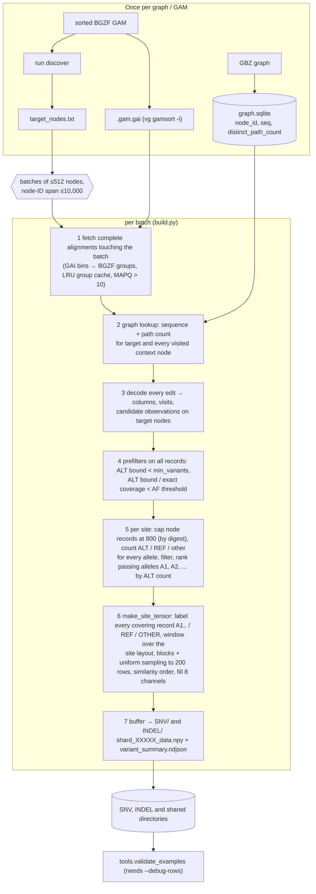

# indexed_gam_pipeline_v3

Candidate-centered pileup tensors built directly from a sorted, indexed GAM and a GBZ pangenome
graph. One tensor per candidate **site** — `(node, position, SNV|INDEL)`, all passing alleles
listed in its summary record — shape `(8, 200, 101)`, `int8`, tensor format
`indexed-gam-candidate-v6` (section 7).

v3 is v2 (git `d0d25d6`) made smaller by subtraction only. It keeps v2's file names and module
boundaries, and every byte-producing code path is v2's, verbatim apart from package-relative
imports. **Given the same inputs and options it writes the same files byte for byte**: shards,
summaries, audit streams, displaced/target node lists, merged per-chromosome shards and labels
(sections 8 and 11). What went: modes and options production never used, dead helpers, v2-compatibility
shims, write-only bookkeeping, and the one-time graph and diagnostic tooling, which moved to
`tools/` and is no longer frozen into every run (section 10). v2 stays as it is and remains the
tool for the roots it prepared (the v5 and v6 runs).

```
v2: 5,238 lines of Python outside tests (18 files); frozen per run: 224 files, ~64 MB (examples/ included)
v3: runtime 4,382 lines (16 files) + tools 916 lines (6 files); frozen per run: 20 files, ~2.4 MB
    (2.0 MB of it the compiled decoder); tests 4,125 lines, 122 tests, ~50 s on a quiet node
```

---

## 1. Quick start

```bash
cd /scratch/jshen/Github/Pansoma            # run everything from the repository root
PY=/wanglab/jshen/anaconda3/bin/python      # numpy, protobuf, pysam; pybind11 + a C++17 compiler for the decoder
P=indexed_gam_pipeline_v3
G=/scratch/jshen/data/HG008_GIAB/pansoma_v2_tensors/graph_index   # HPRC v1.1 d9 graph index, reference path, chr table

# (once per checkout and Python version) the native C++ record decoder: ~28x faster decoding,
# identical output. The .so is gitignored, so compile before `orchestrate prepare`.
$PY -m $P.native compile                   # prints the build info
$PY -m $P.native check                     # available? if not, why

# (once per sample) target nodes: nodes where > 5 % of MAPQ>5 mappings carry an edit, counted after
# the builder's indel left-normalization (--normalized); parallel over GAM segments (native module)
$PY -m $P.run discover --gam sample.sorted.gam --output discovery/ --normalized \
    --graph-index /path/to/hprc-v1.1-d9.graph.sqlite --processes 48

# (whole genome, one Slurm node) prepare a run root, then submit it
$PY -m $P.orchestrate prepare --root /path/to/run_root --tensors /path/to/tensors \
    --gam sample.sorted.gam --nodes discovery/target_nodes.txt --node-stats discovery/node_stats.json \
    --graph-index /path/to/hprc-v1.1-d9.graph.sqlite --tasks 512 --processes 24 \
    --snv-min-af 0.06 --indel-min-af 0.08 \
    --chromosomes autosome --chr-index $G/hprc-v1.1-mc-grch38.d9.chr_node_ranges.tsv \
    --merge-shard-size 32768 --reference-path $G/hprc-v1.1-mc-grch38.d9.grch38_path \
    --somatic-vcf ... --somatic-bed ... --germline-vcf ... --germline-bed ... \
    --reference-fasta GRCh38.fasta --truth-dir /path/to/truth
sbatch --cpus-per-task=24 --mem=420G --time=14-00:00:00 \
       --output=/path/to/run_root/slurm-%j.out /path/to/run_root/run.sh
sbatch ... /path/to/run_root/run.sh --resume              # after a crash: redo only unfinished tasks
$PY -m $P.orchestrate finalize --root /path/to/run_root   # only the merge + labels (idempotent)

# (one task by hand, e.g. an audit) exactly what every task runs
$PY -m $P.run build --gam sample.sorted.gam --nodes nodes.txt --graph-index /path/to/graph.sqlite \
    --output out/shared --snv-output out/SNV --indel-output out/INDEL --snv-min-af 0.06 --indel-min-af 0.08
```

The graph index, the reference-path directory and the chromosome block table are made once per
graph with `tools` (section 4); for HPRC v1.1 d9 they exist under `$G`. A `.gai` comes from
`vg gamsort -i`.

---

## 2. Pipeline overview



Key invariants:

* **One GAM pass per batch.** SNP and INS/DEL site tensors are written to separate
  directories (`--snv-output`, `--indel-output`) from the *same* decoded reads.
* **Only decoded reads of the current batch are alive.** Protobufs are dropped as
  soon as they are decoded; the batch is cleared before the next fetch.
* **Counts use every eligible record** (up to the 800-record per-node cap), before the
  200-row cap. Nodes shallower than 800 records are never subsampled.
* **Prefilters never change an accepted output** without a read cap: both are proven
  upper bounds computed over all records (tested byte-for-byte on real data).
* **Deterministic.** Candidate order, row ranking and sampling do not depend on
  fetch order; two builds of the same input are byte-identical.

---

## 3. Modules: runtime, tools, tests

**Runtime** — frozen into `<root>/source/` by `orchestrate prepare` and run from there:

| File | Purpose |
|---|---|
| `common.py` | `write_json` (atomic, `indent=2` plus newline), `read_json`, `stamp`, `sha256_file`, `new_output`, `load_nodes`, `batches` |
| `vg_pb2.py` | generated protobuf bindings for `vg.proto` (do not edit or regenerate; its deterministic serialization defines record digests and the read cap) |
| `gam_reader.py` | protobuf stream framing (incl. the giraffe `PARAMS_JSON` / foreign-group skip), `scan_gam`, `IndexedGam`: GAI v1 bins (tested all at once as arrays), merged virtual-offset runs, BGZF group seek, bounded LRU group cache without records under `--min-mapq`, `fetch` (file order, each record once; `sample=N`: the N records with the smallest `sample_key`) |
| `graph_index.py` | read-only `GraphIndex` over the graph SQLite (sequence + distinct path count per node) |
| `candidates.py` | the data path from GAM record to site tensor: `decode_alignment` (+ `left_align_indels`, `indel_runs`, `indel_observations`: the part `fastdecode.cpp` ports), `NodeReads`/`VisitView` support counting (with the scan fallback), `alt_support_bounds`, `exact_coverage`, `SiteLayout`, `make_site_tensor`, format constants |
| `native.py`, `fastdecode.cpp` | optional C++ decoder: `compile`/`check`, load-time SHA + 300-record self-test, `select_decoder` (`--decoder`, `PANSOMA_DECODER`), `NativeDecoder` with per-record Python fallback, `ColumnArray`; `Discovery` counters and `group_nodes` for `run discover` |
| `build.py` | the per-task builder: batch loop, prefilters, `capped_reads`, `candidate_units` (sites), `count_support`, `evaluate_unit`, `OutputDir`; always shared + SNV + INDEL |
| `discovery.py` | `run discover`: segments of the GAM cut at GAI group starts, native per-node counts (raw or `--normalized` rule) merged in first-appearance order, streamed `node_stats.json`; sequential pure-Python fallback |
| `run.py` | builder CLI: `discover`, `build` |
| `orchestrate.py` | whole-genome controller: `prepare` / `run [--resume]` / `task` / `finalize`, `node_costs`, `execute_queue`, `validate_shards`, supplement rounds, `read_config` (package guard), `MemoryRecorder` |
| `tensor_postprocessing/` | node → chromosome blocks (also `--chromosomes`), per-chromosome merge, truth labels; CLI `merge`/`label` (own [README](tensor_postprocessing/README.md)) |

Import order is top-down: `common` ← `gam_reader`/`graph_index` ← `candidates` ← `native` ←
`build` ← `run` ← `orchestrate`; `tensor_postprocessing` uses only `common`/`graph_index` and is
used by `build` (`--chromosomes`) and `orchestrate` (`finalize`).

**Tools** (`tools/`) — offline, run from the checkout, never imported by a runtime module and not
frozen (a static test enforces both):

| File | Purpose |
|---|---|
| `tools/graph_index_build.py`, `tools/gbz_graph_index.cpp` | compile the native GBZ → SQLite builder, build the graph index (once per graph) |
| `tools/graph_prep.py` | `ref-path-scan`, `ref-path-check`, `chr-index` (once per graph) |
| `tools/validate_examples.py` | independent audit of a `--debug-rows` output against the GAM and graph |
| `tools/binary_requirements.py` | newest GLIBC/GLIBCXX/CXXABI symbol versions and AVX/AVX-512/BMI use of a binary |
| `tools/compare_runs.py` | byte and normalized comparison of two run roots, task or build directories (stdlib only) |

**Tests** (`tests/`, a subpackage) — section 9.

---

## 4. Commands

All entry points are `python -m indexed_gam_pipeline_v3.<module>`, run from the repository root
(or, for a run, from `<root>/source`, which `run.sh` does).

### `run build`

```
--gam GAM --nodes NODES --graph-index SQLITE [--index GAI (default GAM.gai)]
--output SHARED_DIR --snv-output DIR --indel-output DIR --snv-min-af F --indel-min-af F   (all required)

target nodes:
  --chromosomes all|autosome|chr1,chr2,...   keep target nodes of these chromosome blocks (default all)
  --chr-index TSV                            node ID -> block table (tools.graph_prep chr-index), needed unless all

batching / memory:
  --batch-nodes auto  --max-node-span 10000  --max-batch-alignments 200000  --gam-cache-mb 1024 (at least 1)
  --batch-nodes N            a fixed batch size instead of auto (512/1024/2048 per position), see below
  --downsample-nodes TSV     deep nodes (first column; orchestrate prepare writes downsample_nodes.tsv)
  --downsample-reads 10000   a deep node, or a single node over --max-batch-alignments, is built alone
                             from this many MAPQ-passing records (smallest hash of the record bytes)

candidate filters:
  --min-mapq 10 (exclusive)  --min-variants 3  --min-allele-bq 10  --max-indel-len 50 (≤50)
  --min-af 0.05              recorded in the shared manifest's parameters only (the filters use
                             --snv-min-af / --indel-min-af)

speed (defaults shown; see section 7):
  --max-node-reads 800       per target node use at most 800 records (smallest SHA-256); 0 = no cap
  --early-af-filter          AF upper-bound prefilter; --no-early-af-filter disables it
  --decoder auto             native C++ decoder if built and self-tested, else Python (identical output);
                             native = fail if unavailable; python = never native; PANSOMA_DECODER=native|python overrides auto

tensor / output:
  --rows 200  --width 101  --shard-size 2048  --debug-rows
```

Exits 1 with `Error: ...` on a bad input. The option help texts are v2's; a few still name v2's
places (`graph_index.py build`, `tensor_postprocessing chr-index`, "single-output mode" for
`--min-af`), which are now `tools.graph_index_build`, `tools.graph_prep` and "recorded only".
`--min-allele-bq` is a float option with the int default 10, as in v2: a standalone build without
it records `"min_allele_bq": 10`, an orchestrated task `10.0` (both pinned by tests).

`--gam-cache-mb` bounds only the retained GAM group cache. Decoded reads, graph records, candidate
state and shard buffers are on top of it (section 6).

`--chromosomes` filters the **target nodes** by the chromosome block of their node ID
(Minigraph-Cactus numbers each chromosome's graph as one contiguous ID interval, including the
off-GRCh38 insertion and branch nodes; see `tensor_postprocessing/README.md`). Reads are not
filtered: a read on a chr1 target keeps its columns on neighbouring nodes of any block.
`autosome` removes chrX/Y/M/EBV and the unplaced contigs up front — on HG008 v5 that is 4.4 % of
the target nodes, including the 24,258 unplaced nodes behind one task's 5.8 h tail. The selection
(and chr-index SHA-256) is recorded in every manifest as `chromosome_selection`.

Outputs (details in section 7 "Files"):

```
SNV/ and INDEL/   shard_XXXXX_data.npy (n, 8, rows, width) int8, variant_summary.ndjson, filtered_candidates.ndjson,
                  unsupported_events.ndjson, manifest.json
shared/           manifest.json (+ output_layout, variant_outputs, tensors_by_type), every audit record
                  (filtered_candidates / unsupported_events), batch_timing.ndjson, target_nodes.txt,
                  displaced_nodes.tsv, downsampled_nodes.tsv (only if a node was sampled; no shards)
```

**Deep nodes.** A node with far more reads than the rest of the sample (collapsed satellites, rDNA:
on HG008 Illumina WGS the median target has 220 MAPQ>5 mappings, 683 have more than 10,000 and one
5.4 million) is built alone in its batch from a fixed sample: the `--downsample-reads` MAPQ-passing
records with the smallest BLAKE2b key of their bytes, so the same records whatever the batching or
process count, uniform with respect to the alleles they carry (AF is unbiased), read once. The
node's sites get `downsampled_from` (the records sampled from) in their summary; the shared
directory lists every sampled node in `downsampled_nodes.tsv` (node, records, kept, reason) and the
manifests record `downsample` (the table and its SHA-256, the sample size). Deep nodes come from
`--downsample-nodes` (`orchestrate prepare --node-stats` writes it: discovery `perfect +
not_perfect` > `--downsample-reads`); a single node that alone exceeds `--max-batch-alignments`
is sampled the same way (reason `max_batch_alignments`), so one node never fails a run. Every
other node is built from all its records. `orchestrate run` gathers the tasks' tables into
`<root>/downsampled_nodes.tsv` (with a `task` column; `outputs.json` counts them) before the merge,
which may delete the task directories. PacBio and ONT HG008 have no node over 10,000 (maxima
7,023 and 3,181).

### `run discover`

`discover --gam G --output DIR [--min-mapq 5] [--node-alt 0.05] [--processes N] [--index GAI]
[--normalized --graph-index SQLITE [--max-indel-len 50]] [--max-alignments N]` scans the GAM once and
writes `target_nodes.txt`, `node_stats.json` (per node `perfect`, `not_perfect`, `max_read_length`;
`prepare --node-stats` reads it) and `discovery_report.json`. A node is selected when it has ≥1
imperfect mapping and `imperfect / (perfect+imperfect) > --node-alt`.

* **Rules.** Raw (default): a mapping is imperfect when vg's edits on it are not plain matches — the
  rule of every earlier run. `--normalized`: each record is decoded and its indels left-normalized
  exactly as the builder does (same C++ code, `--max-indel-len`), and a mapping is imperfect when its
  columns contain any non-match after that, so an indel counts on the node the builder will see it
  on. vg places repeat indels at one end in read orientation, so the raw rule misses the nodes
  normalization moves indels onto; those came back only through supplement rounds (HG008 PacBio v6:
  392 k nodes, 6.1 % of the tensors, but 40 % of all builder time at 2.16 s per node against 0.08 s
  in main tasks). With normalized targets the supplement rounds are nearly empty. A record the
  normalization cannot decode is counted with the raw rule (`normalization_fallbacks` in the report).
* **Parallel scan.** With the native module the GAM is cut at group starts taken from its GAI into
  4 × `--processes` contiguous segments; each worker reads its segment once with pysam and counts in
  C++ (normalized: node sequences per group from the graph index); the counts are merged in order
  of first appearance, so `node_stats.json` and `target_nodes.txt` are byte-identical to the
  sequential scan (tests/test_discovery.py). Without the native module, or for `--max-alignments`
  (exploratory, raw rule), the sequential pure-Python scan runs.

### `native compile | check`

The optional native record decoder (`fastdecode.cpp`, a line-by-line C++ port of
`decode_alignment`, `left_align_indels`, the joined `indel_runs` and `indel_observations`).
`compile [--cxx CXX]` builds `_fastdecode<EXT_SUFFIX>` into the package (C++17 + pybind11 headers,
`-O3`, no `-march` or fast-math flags; libstdc++/libgcc linked statically when the toolchain allows,
else dynamically) in a temporary directory, runs it against the Python decoder on 5,000 synthetic
records in a fresh interpreter, only then moves it into place, and prints its build info (no file
besides the module is written). `check` says whether the builder will use it and why not.

The builder (`--decoder auto`) uses it only if it imports, was compiled from the `fastdecode.cpp`
next to it (the source SHA-256 is compiled in) and reproduces the Python decoder on 300 synthetic
records at load time; otherwise it decodes in Python. A record the native code raises on is decoded
again in Python (so any error is the reference's) — a task completes whenever it would in pure
Python. The manifest's `decoder` records the choice, the reason and `native_record_fallbacks`;
every task log has a `Decoder: native|python` line. Columns stay in the C++ struct array
(`ColumnArray`, ~24 bytes per column instead of a ~120-byte object) and become `Column` objects
only where downstream code reads them, per block of 128 columns; each read keeps its 16 most
recently used blocks (`CACHED_BLOCKS`), which bounds the memory of dense long-read batches
(HG008 ONT-UL, one 2048-node batch: 41 GiB unbounded, 12.6 GiB bounded, same output). Compiled modules are per Python version and platform;
`prepare` freezes the package, compiled module included, so compile *before* `prepare`.

Portability report of the compiled module (glibc symbol versions, CPU extensions; the decoder uses
none): `python -m indexed_gam_pipeline_v3.tools.binary_requirements indexed_gam_pipeline_v3/_fastdecode*.so`.

### `orchestrate prepare | run | task | finalize`

Section 5. `prepare` takes the builder options of `run build` except the outputs and
`--debug-rows` (`--gam-cache-mb` defaults to 8192 there), plus `--root`, `--tensors`, `--nodes`,
`--node-stats`, `--tasks 512`, `--processes 32`, `--supplement-rounds 0` (3 with raw-rule targets),
`--supplement-min-records 3` and the finalize options (`--merge-shard-size 32768`, 0 = no merge and
no labels; `--keep-sources`; `--reference-path`; `--somatic-vcf --somatic-bed --germline-vcf
--germline-bed --reference-fasta --truth-dir`, all or none). `run [--resume]` executes the tasks,
`task --root R --index I` is spawned by `run`, `finalize --root R` merges and labels.

### `tensor_postprocessing merge | label`

Manual re-merge or re-label of a v3 root (`orchestrate finalize` runs both as frozen at prepare):
see [tensor_postprocessing/README.md](tensor_postprocessing/README.md).

### Tools

```bash
# graph index (once per graph): nodes(node_id, seq, distinct_path_count) + graph_metadata
$PY -m $P.tools.graph_index_build compile --deps /scratch/jshen/Github/gbz-tool/dependency \
    --output bin/gbz_graph_index [--cxx CXX] [--no-portable]
$PY -m $P.tools.graph_index_build build --gbz /scratch/jshen/data/AF-Filtered_VG_Indexes/hprc-v1.1-mc-grch38.d9.gbz \
    --builder bin/gbz_graph_index --output /path/to/new.graph.sqlite
# reference path and chromosome blocks (once per graph; tensor_postprocessing/README.md)
$PY -m $P.tools.graph_prep ref-path-scan --gfa G.gfa --output DIR [--reference-sample GRCh38]
$PY -m $P.tools.graph_prep ref-path-check --path DIR --graph-index DB --fasta FA [--samples 100000]
$PY -m $P.tools.graph_prep chr-index --components-dir D --reference-path DIR --output PREFIX [--graph-index DB]
# audit of a --debug-rows build (one typed directory)
$PY -m $P.tools.validate_examples out/SNV --gam G [--index GAI] --graph-index DB --output report.json
# compare two run roots, task directories or build directories; exit 1 on any difference
$PY -m $P.tools.compare_runs A B [--mask DOTTED.KEY ...] [--report FILE]
```

* **Graph index.** The count is the number of distinct logical GBWT paths that visit the node in
  either orientation (reference paths included, revisits counted once). Publication is atomic; an
  existing output is never overwritten. The metadata (source path/size/mtime/SHA-256, node and
  path totals, timings) is stored in the index and copied into every tensor manifest. `compile`
  links libstdc++/libgcc statically when possible (`--no-portable`: dynamically) and writes
  `<output>.build.json` next to the binary with the compiler, flags, glibc symbol versions and CPU
  extensions; it warns on AVX/BMI instructions, which come from the gbwtgraph dependencies
  (sdsl-lite's `-march=native`), not from `gbz_graph_index.cpp`. Our build
  (`gbz-tool/dependency`) needs glibc ≥ 2.34 and an AVX/BMI CPU; for a builder that runs anywhere,
  build the dependencies with generic flags inside an old-glibc image (manylinux2014) and compile
  there — or ship the finished SQLite, which is needed only once per graph.
* **validate_examples** requires `--debug-rows`. It recounts every site allele's (and the site's)
  coverage from raw mapping intervals, re-applies the read cap from the record digests, re-derives
  the site layout, the allele blocks and the uniform sampling from the recorded audit, and checks
  every selected column's graph base, path count, site-allele code, strand and padding.
* **compare_runs** compares raw bytes for data files (shards, labels, summaries, audit streams,
  node lists, validation reports, truth tables) and normalized JSON for the rest: manifests whole
  and order-sensitive minus timing, `graph_index_performance`, `decoder`, `created`,
  `arguments.decoder`; `batch_timing.ndjson` minus elapsed times; `outputs.json`, `status.json` and
  `config.json` reduced to their content keys; paths under the compared root replaced by `<ROOT>`.
  `source/`, `logs/`, `incomplete/`, `memory.ndjson`, `queue_status*.json`, `run.sh` are ignored. A
  file present in only one tree is a difference. The module docstring lists every rule.

Tensor PNGs: `scripts/visualize_tensor.py` (shared with older formats) renders v5/v6 tensors as
eight panels from a shard plus the `manifest.json`/`variant_summary.ndjson` beside it, with the
allele blocks. The base environment's matplotlib has a NumPy ABI conflict; use
`MPLBACKEND=Agg MPLCONFIGDIR=/tmp/pansoma_matplotlib /wanglab/jshen/anaconda3/envs/hunyuanvideo15/bin/python
scripts/visualize_tensor.py SHARD -i 0 -o figure.png`.

---

## 5. Whole-genome runs (`orchestrate`): lifecycle and recovery

**prepare**:
1. before creating the root, checks the finalize options and the native decoder of this checkout:
   `--decoder native` with an unusable module is refused; under `auto` it warns on stderr that the
   tasks will decode in Python (much slower); `--decoder python` is not checked;
2. freezes a copy of the package into `<root>/source/` (without `tests/`, `tools/`, `__pycache__`,
   `*.pyc`, `.fastdecode-build-*`; the compiled decoder is included) and records every file's
   SHA-256;
3. applies `--chromosomes` to the node list (`<root>/nodes_selected.txt`), splits it into `--tasks`
   contiguous, near-equal node lists (`parts/nodes_NNNN.txt`) and, with `--node-stats`, records
   each task's `predicted_cost` (Σ discovery `not_perfect` over its nodes; reading the 6 GB HG008
   file takes ~1 min and ~7 GB) and writes `downsample_nodes.tsv` (node, mappings) of the targets
   with more than `--downsample-reads` discovery mappings (section 4 "Deep nodes");
4. fingerprints every input (GAM, GAI, graph index, node list, chr index, reference path, truth
   files) and writes `config.json` and `run.sh` (`cd <root>/source && exec <python> -m
   indexed_gam_pipeline_v3.orchestrate run --root <root> "$@"`). It prints a summary including
   `native_decoder`.

`config.json` holds `package` (the guard below), `python`, `tensors`, `inputs`,
`chromosome_selection`, `source_sha256`, `tasks`, `processes`, `schedule`, `parts`, `supplement`
(`max_rounds`, `min_records`, `max_tasks`, `rounds`), `builder` (every builder option, passed
explicitly to each task, so a run never depends on the CLI defaults of the code that executes it),
`native_decoder` (`available`, `reason`; `available` null under `--decoder python`),
`downsample` (`reads`, `nodes`, `rule`, and with deep nodes `mappings`, `nodes_file`, `sha256`;
`verify` checks the table like the partitions), `variant_outputs` ({SNV: AF, INDEL: AF}) and
`postprocess`.

**run** (`sbatch <root>/run.sh`, or `bash <root>/run.sh [--resume]`):
1. refuses a merged root, fewer allocated CPUs (`SLURM_CPUS_PER_TASK`) than `processes`, and any
   changed input, frozen file or partition;
2. runs the tasks, at most `processes` at once, **most expensive predicted first** (LPT order; on
   the v5 wall times this replays 12.2 h as 7.2 h), else in index order. Each task is a fresh
   `run build` process under `/usr/bin/time -v` in `<root>/source`, so all its memory is returned
   when it exits; then `validate_shards` checks every output (shape, dtype, shard lengths and
   sizes, summary/manifest agreement, site rows and allele lists) and writes
   `validation_report.json`. Any failure stops the queue and terminates the running tasks
   (TERM, then KILL after 10 s);
3. **supplement rounds** (below), then `outputs.json` (every task directory with its tensor count)
   and `status.json` `complete`;
4. **finalize**: with `--merge-shard-size N` the task outputs are merged into
   `<tensors>/<kind>/<chrom>_shard_*` (chr1–22; other blocks under `<tensors>/non_autosomal/`),
   byte-verified, the task directories deleted unless `--keep-sources`, and with the truth options
   every merged tensor labelled (somatic 1, germline 2, non 0, ignore −1). One merge covers the
   main and the supplement tasks; a chromosome's merged shards hold the main tasks' tensors in node
   order followed by the supplement tasks' tensors.

**Why supplement rounds.** Tensors are only built on discovery's target nodes, and discovery chose
them from vg's *raw* indel placement. Left-normalization (v6) moves some indels onto a neighbouring
node that no task covers — typically across a homopolymer or STR chopped into 1-bp nodes (the
forward-strand left of a node need not have a lower node ID) — and those sites would be missing (8
of 100 reviewed examples, incl. INDELs at AF 0.2–0.35). Extending the target list instead is costly
(+160 % target nodes even for a 10-bp window on one side). So every builder lists, in
`displaced_nodes.tsv`, the nodes outside its batch that a target-node indel was moved onto. After
the main tasks, `run` sums those lists over all tasks, drops every node already in a task list and
nodes outside the chromosome selection, keeps nodes with ≥ `supplement.min_records` displaced
records (default 3: a site needs ≥ 3 ALT reads), and builds the rest as extra tasks of the same run
(`parts/supplement_NN/`, appended to `config.json` with the next task indices and recorded in
`supplement.rounds` before they run). There those nodes are ordinary targets: all reads covering
them are fetched, so counts and AF are complete, and no site can be built twice (a node is in one
list only). A round's own displaced nodes feed the next one; the rounds stop at an empty list or
after `--supplement-rounds` (default 0 = off, for targets from `discover --normalized`, which already
contain these nodes; use 3 with raw-rule targets). A round has
`min(nodes, supplement.max_tasks)` tasks; `max_tasks` is fixed at prepare as 4 × `processes`, so
lowering `processes` in a recovery does not move supplement task boundaries. Measured on 98
example batches: normalized indels landed on 4,110 nodes outside their batch; the supplement built
576 INDEL sites (no SNV), 218 alleles exist only thanks to it, no site id occurs twice; +51 % CPU of
those cold single-batch builds. On the full HG008 run min-records 3 keeps 391,457 of the 576,809
nodes that 2 keeps.

**Resume and recovery.**
* `run --resume` re-validates every task directory with `validate_shards` (serially: ~24 min for a
  genome run), skips the complete ones, moves partial outputs to `incomplete/<timestamp>/` and
  reruns only the rest, including an interrupted supplement round. A plain `run` refuses existing
  task outputs; a merged root refuses `run`/`--resume`.
* If the job died during the merge or labels: `orchestrate finalize --root R` (from the checkout or
  from `R/source`). It skips steps already done (`outputs.json` has `merge`; every
  `labels.manifest.json` exists), so it can be repeated; it prints what it did (`{}` when nothing
  was left). To re-label, delete `<tensors>/{SNV,INDEL}/labels.manifest.json` and run it again.
* Hand edits of `config.json` (e.g. after an out-of-memory failure): every task re-reads it when
  it starts, so `builder.gam_cache_mb` (memory; recorded in the manifests' arguments, tensor bytes
  unchanged) applies to tasks started later; `processes`, `supplement.min_records` and
  `supplement.max_tasks` are read when `run` starts, so set them before `--resume`. Edit only while
  no `run` is active (a supplement round rewrites `config.json`), and never edit builder options
  that change tensors (thresholds, rows, width, ...) in a started run. `verify()` checks only the
  recorded input stamps, frozen files and partitions, so a frozen `__pycache__` does not break a
  resume.
* **Package guard**: `run`, `task`, `finalize` and the supplement listing refuse a root whose
  `config.package` is not this package (`<root> was prepared by ..., not indexed_gam_pipeline_v3`).
  Roots prepared by v2 have no `package` key; finalize or re-label them with v2's checkout.
* The queue ledger (`queue_status.json`, `queue_status_supplement_NN.json`: per-task state, PIDs,
  wall times) is written at start, whenever a task starts or ends, and at the end.

Layout — bookkeeping under `--root`, tensors under `--tensors` (default `<root>/tensors`):

```
<root>/
  config.json              inputs, fingerprints, builder options, partition table, supplement rounds
  run.sh                   sbatch-able entry point (forwards extra args, e.g. --resume)
  source/                  frozen copy of indexed_gam_pipeline_v3 (hashes in config.json)
  nodes_selected.txt       node list after --chromosomes (when not all)
  parts/nodes_NNNN.txt     node list of each main task; parts/supplement_NN/ per supplement round
  logs/task_NNNN.log       builder output; task_NNNN.resources.txt from /usr/bin/time -v
  queue_status*.json       per-task state, PIDs, wall times (main queue, each supplement round)
  status.json              status, tensors, tensors_by_type, merged, merge_layout, labeled, peak sampled RSS
  memory.ndjson            process-tree RSS every 30 s
  outputs.json             catalog of every task directory with its tensor count (outputs.pre_merge.json after a merge)
  batch_timing.ndjson      every task's batch timings (after the merge)
<tensors>/
  shared/task_NNNN/        shared manifest, batch_timing.ndjson, complete audit streams, displaced/target nodes
  SNV/task_NNNN/           SNV shards + summary + audit + manifest + validation_report.json
  INDEL/task_NNNN/         INDEL shards + summary + audit + manifest + validation_report.json
  SNV/, INDEL/             after the merge: <chrom>_shard_NNNNN_data.npy, <chrom>_variant_summary.ndjson,
                           labels (<chrom>_shard_NNNNN_labels.npy, <chrom>_labels.ndjson, labels.manifest.json),
                           merged audit streams, manifest.json, validation_report.json
  non_autosomal/<kind>/    chrX, chrY, chrM, chrEBV, unplaced (not training data)
  <set>.recall.tsv, truth_recall.json
```

Downstream code should read `<tensors>/<kind>/manifest.json` after a merge (per-chromosome shard
lists) and the files it names; without a merge, `<root>/outputs.json` and the
`<tensors>/SNV/task_*/shard_*_data.npy` files with the matching `variant_summary.ndjson`.

---

## 6. Memory: what to expect and which knobs matter

Per builder process, the peak is roughly

```
GAM group cache (≤ --gam-cache-mb)
+ decoded reads of one batch      ← dominant for long reads (one Column object ≈ 100 B per aligned base)
+ graph records for the batch's context nodes
+ shard buffer (--shard-size × 161,600 B per output)
```

Measured on the heaviest HG008 PacBio batch (512 nodes, 3,441 reads, 74 Mb of read
sequence, 96.5 M columns): ~8.3 GiB after fetch (cache), **~20.4 GiB** after decode,
back to ~8.7 GiB after the batch is released. Peak per process therefore scales with
`reads per batch × read length`, not with the number of target nodes. These are Python-decoder
figures: the native decoder keeps a record's columns in C++ arrays (~24 B per column) until they
are read, which measured 0.46–0.60 instead of 2.0–2.15 MiB of decoded reads per PacBio record.

Knobs, in order of effect:

1. `--processes` (orchestrator): total ≈ processes × per-process peak. 32 × ~20 GiB
   exceeded a 420 GiB allocation on HG008; 20–24 is the safe range there.
2. `--batch-nodes` / `--max-node-span`: fewer target nodes per batch → fewer reads
   decoded at once (long reads still bring in their full length). `auto` (the default)
   prices the next 512, 1024 and 2048 target nodes by the compressed GAM bytes their fetch
   reads (from the GAI alone; the node-ID span limit scales with the size) and takes a larger
   batch only when it reads ≥ 20 % fewer bytes per target node. With long reads neighbouring
   batches read the same GAM groups: on the HG008 ONT-UL GAM (≈ 100 MiB groups, every 512-node
   batch reading ~53 of them with no cache hits between batches) 2048-node batches cut the time
   per node 4.9x (146 → 30 s per 1,000 nodes; 4096: 8x). A batch that exceeds
   `--max-batch-alignments` is split in halves and retried instead of failing. Tensors and
   summaries do not depend on the grouping; audit-stream order and batch_timing rows do
   (each row records its `batch_plan`).
3. `--gam-cache-mb`: trades re-decoding of BGZF groups for memory; 8 GiB is plenty,
   1 GiB costs little time on PacBio data.
4. `--max-batch-alignments` (200,000 MAPQ-passing records): a hard stop, not a limiter — with a
   fixed `--batch-nodes` a multi-node batch over it fails, with `auto` it is split; a single node
   over it is built from a sample (`--downsample-reads`). It counts records, so it binds short
   reads: HG008 Illumina 1024-node batches hold 25–92 k records at 2.6–6.4 GiB, while no PacBio
   or ONT batch ever held more than 7,359 / 3,352 (v2's 20,000 split every Illumina batch and
   failed every fixed size, 256 included).

---

## 7. Tensor format v6 (what the numbers mean)

**Candidate identity** is `(node, forward start, REF, ALT, kind)` with `kind ∈ {SNP, INS, DEL}`
in zero-based forward-node coordinates, plus the further nodes of a deletion over several nodes
(`path`, see below). Reverse-strand mappings are converted. Adjacent I (or D) edits, also over
consecutive mappings, are merged before the `--max-indel-len` check. Candidates
containing `N`, and insertions anchored on `N`, are context only. Indels longer
than the limit and complex replacements are logged to `unsupported_events.ndjson`.

**Indel left-normalization** (v6, `candidates.left_align_indels`, applied while decoding). vg
places a gap at one end of a repeat in *read* orientation, so in forward node coordinates
forward- and reverse-strand reads put the same repeat indel at opposite ends — often on
different nodes of a repeat chopped into short nodes — and v5 kept them as two candidates,
each supported by one strand only (14 of 33 reviewed v5 INS examples had every ALT row
on one strand). Now every indel of at most `--max-indel-len` bases without
`N` is shifted one base at a time to lower forward coordinates while the matched base it
passes equals its last forward base (the VCF / `bcftools norm` convention; an insertion
rotates, e.g. +AT at the right end of `CATATG` becomes +AT after the `C`). It crosses node
boundaries within a run of same-orientation mappings, deletions of any length included
(a deletion that ends up over several nodes is one candidate, see "Deletions over several
nodes" below); a mismatch, another indel of a different kind,
an orientation change or `N` stops it; an adjacent indel of the same kind merges with it,
and inserted bases continuing across a mapping boundary are one insertion. Every insertion
is finally attached to the graph base that follows it on the forward strand, so an
insertion between nodes is always `(next node, its first offset)`. Read bases, qualities,
graph positions and visit intervals are unchanged — only which columns are I/D vs M moves
— so both strands' reports of one molecule give identical candidates and columns
(`tests/test_left_align.py`). Flank insertions still take their own columns (unchanged).

**Candidates, prefilters and sites** (ported 2026-09-23 from v1 session `d969188c`, where
they were designed and tested on the slowest HG008 recovery tasks). Every allele is still
an exact candidate as above; what changed is how much work each one costs and what a
tensor stands for:

1. *ALT prefilter* — ALT support upper bound (one vote per record with a qualifying
   observation) `< --min-variants` → rejected with `coverage_not_evaluated`.
2. *AF prefilter* (`--early-af-filter`, default) — ALT bound / exact coverage `<` the AF
   threshold → rejected with `reasons: [min_af]`, `af_upper_bound`, `coverage`,
   `support_not_evaluated`. Coverage comes from visit intervals alone, with exactly the
   covering rule of support counting (`NodeReads.classify`), so it equals the eligible-record
   count. Both prefilters
   use **all** records of the node, before the read cap; without a cap neither can change
   an accepted output. Why it matters: in a collapsed repeat with ~1,890 reads per node,
   3 supporting reads is an AF of 0.16 %, so the ALT prefilter alone lets through almost
   every sequencing-error allele (HG008 node 57658580: 1,506 of 2,547 candidates reached
   full support counting, AF median 0.6 %); with the AF prefilter 79 do.
3. *Read cap* (`--max-node-reads 800`, default; 0 disables) — after the prefilters, each
   target node's records are ordered by the SHA-256 of the serialized GAM record and the
   first 800 are used for support counting and row selection of every candidate on that
   node. Deterministic and order-free. Only nodes deeper than 800 records are affected;
   their AF and counts become estimates on those 800 (normal 116× HiFi sites have a
   median coverage of ~40, p90 < 200). Comparable tools cap too (DeepVariant 1,500 per
   partition, ClairS 64 + 64 rows, Mutect2 ~1,000 per active region).
4. *Sites* — surviving alleles are grouped by
   `(node, start, SNV|INDEL)`; INS and DEL at one start share an INDEL site, SNV and
   INDEL sites stay separate outputs. Every allele is filtered exactly as on its own;
   the passing alleles are ranked by ALT count (ties: candidate order) as `A1`, `A2`, ...
   and **all of them are in the site's one tensor** (v6): every record covering any passing
   allele is a row, labeled with the allele it carries (the first by rank), `REF` when it
   matches the reference for every allele it covers, else `OTHER`. The top-level counts/AF
   are A1's (the *representative*). Reason: the tensor carries the reads, not the allele,
   so same-position SNV tensors were identical (620/620 checked in v1 HG008 output) and
   could receive contradictory labels. **Label by `site_id`** and `alleles[]`; the truth ALT
   need not be A1.
   With left-normalization, STR alleles of one repeat share a start and hence a site.

**Deletions over several nodes** (v6). vg writes an indel that spans nodes as one edit per
mapping. A run of deleted (or inserted) columns that continues across mapping boundaries in
one orientation is now **one** event: `--max-indel-len` applies to its total length (a longer
one is logged as `indel_exceeds_limit_across_mappings` and is no candidate — before, its
pieces became many small "indels"; on one HG008 batch a single ~80-bp event across 54 short
nodes gave 54 DEL sites), left-normalization moves it across nodes, and a deletion is one
candidate on its forward-first node with `path` = `[[node, start, end], ...]` of the further
nodes (`candidate_id` `node:start:DEL:REF>@n2+n3`; `ref` spans all nodes). vg never split an
insertion over mappings in the HG008 data, but the same rule applies.

**Support.** For each candidate, every record whose mapping covers it counts once:
`alt` if it has an exact observation with base quality ≥ `--min-allele-bq`; `ref` if it has a
plain match (M/X, read base = graph base, no inserted base) at every graph base of REF — over
every node of a multi-node deletion — **and aligned neighbours**: the bases right before and
after are M/X graph neighbours (no indel, no read end next to the site; v6); for INS, no
inserted base at the boundary and M/X bases on both sides; otherwise `other`. Repeated visits:
ALT > REF > other, earliest mapping wins. `coverage = alt + ref + other`, `AF = alt / coverage`.
Filters: `alt ≥ --min-variants`, `AF ≥` the output's threshold (`--snv-min-af` for SNP,
`--indel-min-af` for INS/DEL).

**Indel base quality, strand-symmetric** (v6). HiFi base qualities in a homopolymer depend on
the sequencing direction, and after left-normalization forward and reverse reads carry the same
indel at opposite ends of their own run, so "the inserted bases" or "the bases next to the
deletion" would be different read bases per strand (forward 40 vs reverse 5 on the test pattern
— a one-strand ALT loss). An insertion's quality is the mean over the read bases of all its
equivalent placements (its bases plus the repeat bases it could shift across); a deletion's is
the lower of the nearest read bases outside that span (inside it when the span reaches both
read ends). Outside repeats both reduce to the old rule (inserted-base mean, flanking minimum).

**Site layout** (`site-layout-columns-v1`). A site occupies the columns from 50 on:
`insertion_slots` = the longest INS allele's length, then `span` = the graph bases of the
longest DEL allele (or the SNV base); `site_layout` and `candidate_columns` in the summary.
Every row uses the same layout: a record's own inserted bases at the boundary fill the slots
(padded with "no insertion" gaps, op 6, when it is aligned across the boundary — M/X on
both sides, or a deletion starting there — else left empty; bases beyond the slots are
cropped and counted in `omitted_context[].cropped_inserted_bases`), then its columns over
the span, then the right flank. So rows carrying alleles of different lengths stay aligned
after the site. Without insertion slots an insertion at the boundary stays in the left flank.

**Rows** (`site-allele-blocks-uniform-similarity-v1`). Rows come in blocks `A1, A2, ..., REF,
OTHER`. The records are ordered by block, then record SHA-256, and uniformly sampled to 200
rows over that order (each block keeps its share; `selected_ranks` are the sampled ranks).
Inside each block the sampled rows are ordered by similarity: a record's *events* are every
non-match column of its window (mismatch base, inserted base, deletion, complex), keyed by
graph position and read base, plus every node transition of its visible path; the distance
of two records counts the events one has and the other lacks although it covers that column
(both ways; uncovered columns are unknown, not different). Average-linkage clustering orders
the rows along the tree's leaves (larger subtree first), so e.g. records sharing a flank
insertion or a nearby heterozygous SNP are adjacent — without a threshold: an event only one
record has shifts its distance to all others equally and so decides nothing. Runs of rows
with identical events are ordered forward strand first, then by record hash. `row_groups`
gives the blocks (`start_row, end_row, allele`). Deterministic and independent of record order.

**Channels** (`indexed-gam-candidate-v6`, all `int8`; a cell without evidence is 0 in every channel):

| # | Channel | Encoding |
|---|---|---|
| 0 | read base | A=1 C=2 G=3 T=4 N=5 gap=6 |
| 1 | base quality | clip(q, −1, 127); −1 = no read base / no quality |
| 2 | site allele | per row, over the site columns only: the allele this record carries (encoding of channel 0, gaps = 6) — an INS allele's bases in the slots (gap-padded) then the span's graph bases; a DEL allele's gaps over its deleted bases then the rest of the span; an SNV's ALT base; REF = slot gaps + the span's graph bases; `OTHER` rows 0 |
| 3 | MAPQ | clip(MAPQ, −1, 127) |
| 4 | operation | M=1 X=2 I=3 D=4 complex=5 aligned-no-insertion gap=6 |
| 5 | graph base | the graph reference base under that row/column, encoding as channel 0 |
| 6 | path count | distinct GBWT paths of the column's node: the count itself up to 100, then `100 + ceil(log2(count − 99))` (331 → 108), max 127 (`int8-count-linear100-log2-v1`); insertion/gap columns use the anchor node |
| 7 | strand | 1 = read sequenced on the candidate node's forward strand, 2 = reverse; one value per row |

Reading the channels: **row matches REF** ⇔ channel 0 == channel 5; channel 2 is the
pipeline's call of which site allele each record carries (blank for OTHER), so blocks and
their strand mix (channel 7) can be read directly. The REF allele of an SNP/DEL is
channel 5 at the site columns; an INS has an empty REF. Path counts are exact up to 100
(v6): on HPRC v1.1 d9 99.29 % of the 60.1 M nodes have ≤ 100 paths and 57 % have 85–90, which
v5's `floor(14·log2(count+1)+0.5)` collapsed (88, 89, 90 and 91 all → 91, i.e. "missing
from one or two haplotypes" looked like "in every haplotype"); above 100 (repeat nodes
revisited by one haplotype) 101→101, 102–103→102, 104–107→103, …, 331→108; a value k > 100
means a count in (99 + 2^(k−101), 99 + 2^(k−100)]. Every real node has ≥1 path, so 0 is
unambiguously "no evidence". (A graph with more than ~100 haplotypes, e.g. HPRC v2, would
put most nodes in the log range again — revisit the encoding, or store counts as int16, then.) Strand is the anchor
mapping's `is_reverse` relative to the candidate node's forward strand — the same
frame as channels 2 and 5, so an allele/strand imbalance is consistent no matter
how the node is oriented against the linear reference. Insertions and gap slots
take their **anchor** node's count; deletions keep their mapped node's count.

**Files.** `variant_summary.ndjson` has one record per tensor: `candidate_id`,
`node_id`, `start`, `end`, `ref`, `alt`, `event_type`, `coverage`, `alt_count`,
`ref_count`, `other_count`, `af` (all of the representative allele A1),
`site_coverage`, `site_counts` (records per block), `selected_alignments`, `selected_counts`,
`row_groups`, `selected_ranks`, `site_layout`, `allele_labels` (`A1` → candidate id, ...),
`candidate_columns`, `omitted_context`,
versions, `parameters` (incl. `max_node_reads`, `candidate_unit` (always `site`), `early_af_filter`),
`shard_index`, `index_within_shard`, `sample_unit: "site-v2"`,
`site_id` (`"node:start:SNV|INDEL"`), `alleles[]` (every passing allele by ALT count:
`label, candidate_id, start, end, ref, alt, event_type, event_length, coverage, alt_count,
ref_count, other_count, af`), `allele_count` and `second_allele_af` (0 when single;
two high-AF alleles at one site usually indicate a mapping artifact).
`filtered_candidates.ndjson` holds every rejected allele (with `site_id`);
each allele appears exactly once, either in some site's `alleles[]` or there.
`manifest.json` carries the format/encoding versions, channel list, parameters, CLI
arguments (v2's 31 keys in v2's order; the removed options keep fixed values: `max_tensors` null,
`variant_type` all/snp/indel, `candidate_unit` site), `sample_unit`/`site_definition`, `read_cap`,
`decoder` (requested, used, reason, `native_record_fallbacks`), graph-index provenance, cache
statistics, stage timings and counters (`tensors`, `shards`, `filtered_candidates`,
`early_rejected`, `early_af_rejected`, `unsupported_events`).

---

## 8. Outputs are v2's bytes: what is pinned

* Output constants (format/schema/storage versions, channels, encodings, `KIND`, `SITE_UNIT`,
  `PARAMETERS`, `ALLELE_FIELDS`, `SITE_DEFINITION`, `READ_CAP_RULE`, merge and label constants) equal
  v2's recorded dump; `orchestrate.BUILDER_OPTIONS` is v2's minus `candidate_unit`.
* `parameters` and `arguments` in every manifest and summary record are rendered from explicit key
  tables in v2's order (`build.PARAMETERS`, `build.ARGUMENTS`); the removed options keep fixed
  values at their v2 positions (`build.LEGACY_ARGUMENTS`: `max_tensors` null, `variant_type` `all`
  — `snp`/`indel` in the typed manifests — and `candidate_unit` `site`).
* Emission order goes only through `sorted(candidates)`, sorted site keys and
  `sorted(displaced.items())`; no set is iterated when emitting, so outputs do not depend on
  `PYTHONHASHSEED` (asserted).
* Build epilogue: `displaced_nodes.tsv`, flush typed outputs, timings, **close every stream**, typed
  manifests `complete`, shared totals, shared `complete` — so a `complete` manifest never has an
  unclosed audit stream (v2 closed the streams after the saves; the bytes are the same).
* The only manifest change is volatile provenance: `decoder` no longer has a `build` entry.
* `compare_runs` masks the GAM query and group-cache counters (`batch_timing` `gam_query`, manifest
  `gam_group_cache`) like timings: they say how the reader found the records, not what was built.
  The goldens were recorded again from the unchanged v2 (`d0d25d6`) with these masks when v3's
  reader stopped re-parsing low-MAPQ records (2026-09-25); every other fingerprint was unchanged.

---

## 9. Testing

```bash
cd /scratch/jshen/Github/Pansoma
PY=/wanglab/jshen/anaconda3/bin/python
$PY -m unittest discover -s indexed_gam_pipeline_v3/tests -t .                          # ~50 s (quiet node), goldens included
PANSOMA_DECODER=python $PY -m unittest discover -s indexed_gam_pipeline_v3/tests -t .   # ~40 s, Python decoder
GBZ_TOOL=/scratch/jshen/Github/gbz-tool/gbztool GBZ_GRAPH_INDEX=tmp/native_check/gbz_graph_index \
    $PY -m unittest discover -s indexed_gam_pipeline_v3/tests -t .                      # + the native graph-index builder
```

Run from the repository root with `-t .` (the tests are the subpackage
`indexed_gam_pipeline_v3.tests`). Never in the same interpreter as the v2 suite: only one
`_fastdecode` module can load per process, and `tests/__init__.py` refuses to load next to another
pipeline package. Compile the decoder first: without a `_fastdecode*.so` the native cases are
skipped with the reason printed; with one present, a module that does not load (stale build,
another package's) fails the suite instead of silently decoding in Python. With the decoder built,
the only skip of the first pass is the native graph-index builder test, which needs the two
environment variables of the third line.

144 tests in 13 files cover: GAI reading, cache/scan equivalence (limits 1, 2048 and 64 MiB),
refusal of cache 0 and GAI v0/v99, bin arrays against the per-bin scan, the MAPQ-filtered cache,
the sampled fetch; deep-node builds (alone, fixed sample, other nodes unchanged, single-node limit)
and the prepare table; decoding, N filter, limits, unsupported events, left-normalization
(strand symmetry, idempotence, cross-node insertions and deletions); support rules, windows, blocks
and sampling, similarity order, stripes/strand, storage encodings; `NodeReads`/`VisitView` against
per-record classification on random records at widths 1–101, the forced scan fallback and the
narrow-view rebuild (`test_views.py`); the split output contract with the independent audit and a
corrupted channel caught, one fetch and decode per record, SNV bytes independent of the INDEL
threshold, streams closed before `complete`; read cap and cap-aware audit, early-AF exactness,
multi-allelic sites and allele accounting; `parameters` bytes against the literal e2e strings; the
30,000-record native == Python decoder equivalence, decoder selection and fallbacks; the task queue,
cost scan, partition, `prepare → run → resume`, supplement rounds, merge and labels, the package
guard, the native refusal at prepare, a subprocess import of the frozen source, a standalone
`finalize` after an interrupted one, and static checks (no runtime import of `tools`/`tests`, no
module-search-path edits, no v2 package name in code).

**Goldens** (`tests/golden.py`, `tests/golden_hashes.json`). v2 itself built nine production-shaped
fixture cases and one orchestrated run in subprocesses, under both decoders, before any trimming;
`golden_hashes.json` holds their `compare_runs` fingerprints, v2's output constants, the fixture
input hashes and the recording environment (commit, source SHA-256s, python/numpy/protobuf/pysam/
pybind11 versions). `test_golden.py` rebuilds every case with v3 — G1–G8 with `--decoder python`
and `native`, G8 also under `PYTHONHASHSEED` 1 and 2, O1 (`prepare` → tasks → supplement → merge →
labels) under `auto` with and without `PANSOMA_DECODER=python` — and requires identical
fingerprints and constants. It is skipped when `PANSOMA_DECODER` is set (it runs both decoders
itself). A mismatch prints the differing files and any environment difference from the recording.

```bash
$PY -m indexed_gam_pipeline_v3.tests.golden check [--decoder python|native] [--case G1 O1 ...] [--keep DIR]   # ~5 s
```

| case | input | options |
|---|---|---|
| G1 | tiny GAM | default (int) `--min-allele-bq`, `--min-variants 1`, batch 2, shard 2, cache 1 MiB |
| G2 | AF fixture | `--min-allele-bq 10`, `--debug-rows`, shard 1, AF 0.06/0.08 |
| G3 | multi-allelic sites | `--debug-rows`, rows 7, AF 0.2/0.1, `--min-variants 2` |
| G4a/b | mixed-AF sites | `--no-early-af-filter` / `--early-af-filter`, `--max-node-reads 0`, AF 0.3/0.3, rows 4 |
| G5 | 12 records on one node | `--max-node-reads 5`, `--debug-rows`, rows 4 |
| G6 | displaced repeat | target [3], then the supplement build of [2], width 11 |
| G7 | multi-node deletion | `--debug-rows` |
| G8 | random 40-node world, ~400 records | both strands, N, complex/long indels, MAPQ 0–60, `--chromosomes autosome` |
| O1 | mini world | 3 tasks, 2 processes, node stats, autosome selection, supplement rounds, merge, labels |

The goldens are v2's outputs and are never re-recorded from v3. When a deliberate change to the
outputs is made in v2 and ported, or `compare_runs` masks change, record them again from v2
(section 10, "Working next to v2"). A change of a fixture generator fails the input-hash check with
the same hint. The harness pins v2's defaults where a case leaves them out (`--batch-nodes 512`,
`--max-batch-alignments 20000`).

---

## 10. Differences from v2

v2 is `indexed_gam_pipeline_v2` (commit `d0d25d6`); it is unchanged and still maintained.

**Removed** (none was used in production; every production output is unchanged):
* the single-output mode (`ALL/` directories): `run build` requires `--snv-output`,
  `--indel-output`, `--snv-min-af` and `--indel-min-af`, `prepare` the two AFs;
* the allele-unit mode and `--candidate-unit`; `--variant-type`; `--max-tensors`;
* `run index` (GAIs come from `vg gamsort -i`), `run validate`, `discover --chr-nodes/--max-nodes`
  (`discovery_report.json` has no `max_nodes`), `orchestrate displaced` (supplement rounds list the
  nodes themselves), `native compile --no-portable` (static-then-dynamic linking always);
* GAI v0 (refused: `Unsupported GAI`) and `--gam-cache-mb 0` (refused at parse time; the uncached
  fetch path is gone);
* `finalize_report.json` (the finalize CLI prints the report; `outputs.json`, `labels.manifest.json`
  and `truth_recall.json` hold the same), `_fastdecode.build.json` (and so the manifest's
  `decoder.build`), `__version__`;
* dead code (`candidate_alt_codes`, `anchor_window`, the `indel_runs` lo/hi/join parameters,
  `ChrIndex.is_autosome`, `SELECTIONS`, `ReferencePath.unique`), the module-search-path edits, the v2-root
  compatibility shims, `inspect_tensor.py`, `examples/` (198 PNGs), the v5 reference tests
  (`tests/reference_candidates.py`, `tests/test_reference_equivalence.py`; replaced by the goldens and
  `test_views.py`).

**Moved to `tools/`** (verbatim, formats unchanged, not frozen): graph-index build and
`gbz_graph_index.cpp` (`tools.graph_index_build`, keeps `--no-portable` and `<builder>.build.json`),
`ref-path-scan`/`ref-path-check`/`chr-index` (`tools.graph_prep`), `validate_examples`, the binary
portability report (`tools.binary_requirements`). Test-only wrappers moved to `tests/fixtures.py`
(`overlap`, `make_tensor`, `build_index`, `encode_varint`).

**New behaviour:**
* v3 refuses to run, resume or finalize a root prepared by another package (v2 roots included).
* `prepare` checks the native decoder: refuses `--decoder native` if it is unusable, warns under
  `auto`; `config.json` gains `package`, `native_decoder` and `supplement.max_tasks` (4 ×
  `processes`, frozen; identical to v2 while `processes` is unchanged).
* `prepare` no longer freezes `tests/` and `tools/`: ~2.4 MB and 20 files per run instead of ~64 MB
  and 224 files that every `verify()` re-hashed.
* The queue ledger is written on task start/end instead of every 0.5 s poll.
* `native compile` prints its build info instead of writing `_fastdecode.build.json`.
* Every audit stream is closed before a manifest says `complete` (same bytes).
* Deep nodes are built from a fixed sample instead of failing the run (section 4); `prepare`
  lists them from `--node-stats`; `--max-batch-alignments` defaults to 200,000 (v2: 20,000).
* `tensor_postprocessing.merge` copies in parallel: every (kind, chromosome) group and every slice of
  the audit streams is one job of `workers` processes, with sequential file reads and writes
  instead of memory maps. Same bytes; the single-process copy of HG008 Illumina (833 GB of
  tensors plus 258 GB of audit streams) waited on one I/O stream at ~150 MB/s.
* Row similarity order falls back to a deterministic UPGMA (`candidates.average_linkage`, equal
  to scipy's tree on tie-free distances) when scipy's `linkage(method="average")` returns an
  invalid tree: scipy 1.16.1 merged a cluster with itself on a 105-row block of tied distances
  (HG008 Illumina task 206, `KeyError: 200`). Valid scipy trees are used as before, and an invalid
  one always raised, so no earlier output changes.
* The GAM reader leaves records with MAPQ ≤ `--min-mapq` out of its group index (never parsed
  twice, not cached), tests every GAI bin at once (HG008 Illumina GAI: 2.4 M bins, 0.45 s → ms per
  query) and intersects a group's nodes with the batch from the smaller side. Same records.

**Working next to v2.**
* Roots prepared by v2 (the v5 and v6 runs, e2e_v2): operate them with v2's checkout
  (`python -m indexed_gam_pipeline_v2.orchestrate finalize --root R`).
* Never import both packages in one interpreter (one `_fastdecode` per process); run their suites
  separately.
* Re-recording the goldens, only after a deliberate output change made in v2 and ported here (v2
  must be committed and its decoder compiled; the recorder runs v2 only in subprocesses and checks
  v2 python == v2 native):
  `python -m indexed_gam_pipeline_v3.tests.golden record --package indexed_gam_pipeline_v2`.
* `tensor_postprocessing/` is a copy of v2's at `d0d25d6`; its README has the provenance hashes and
  the sed-normalized diff for a deliberate resync.
* History, speedup measurements and the verification campaigns of v1 → v2 → format v6 (v2 README
  sections 8–9) and the example PNGs stay in `indexed_gam_pipeline_v2/`.

---

## 11. Verification

* Goldens recorded from v2 at `d0d25d6` (both decoders, v2 python == v2 native) match v3 under both
  decoders after every trimming step: `all 24 golden jobs match`.
* A static gate compares every definition the design marks verbatim with v2 by AST (docstrings
  removed, imports normalized; `tmp/v3_verification/ast_gate.py`, outside the package), plus
  byte/sed-normalized diffs of `vg_pb2.py`, `fastdecode.cpp` (line 9 only), `gbz_graph_index.cpp`,
  `merge_shards.py` and `truth_labels.py`.
* Real-data comparisons against v2's outputs (production-option batches with native and Python
  decoders, the e2e_v2 orchestrated run, a resumed run) are recorded here once they have run.
