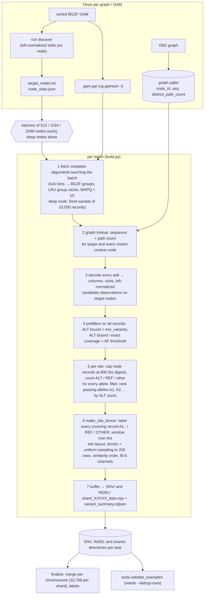

# indexed_gam_pipeline_v3

Candidate-centered pileup tensors built directly from a sorted, indexed GAM and a GBZ pangenome
graph. One tensor per candidate **site** — `(node, position, SNV|INDEL)`, all passing alleles
listed in its summary record — shape `(8, 200, 101)`, `int8`, tensor format
`indexed-gam-candidate-v6` (section 8).

v3 is the maintained pipeline. v2 (`indexed_gam_pipeline_v2`) was retired on 2026-09-26 and removed
from the repository in `9d61016`; v1 earlier. v3 began as v2 made smaller by subtraction (same
tensor bytes for the same inputs and options) and has since gained deep-node sampling, a faster GAM
reader, normalized-only discovery, a parallel merge and the truth-labels-v2 rule (section 10).

```
runtime  4,790 lines of Python in 17 files + fastdecode.cpp (659 lines); frozen per run: 21 files, ~2.5 MB
         (2.2 MB of it the compiled decoder)
tools    916 lines in 6 files (not frozen)
tests    4,644 lines in 13 files, 145 tests, ~50 s on a quiet node
```

---

## 1. Quick start

```bash
cd /scratch/jshen/Github/Pansoma            # run everything from the repository root
PY=/wanglab/jshen/anaconda3/bin/python      # numpy, scipy, protobuf, pysam; pybind11 + a C++17 compiler for the decoder
P=indexed_gam_pipeline_v3
G=/scratch/jshen/data/pansoma_v2_tensors/graph_index   # HPRC v1.1 d9: graph index, reference path, chr table

# (once per checkout and Python version) the native C++ record decoder: ~28x faster decoding,
# identical output. The .so is gitignored; compile before `orchestrate prepare`, which freezes it.
$PY -m $P.native compile                   # prints the build info
$PY -m $P.native check                     # will the builder use it? if not, why

# (once per sample) target nodes: > 5 % of the MAPQ>5 mappings carry an edit after the builder's
# indel left-normalization. Parallel over GAM segments: one core per worker, 10-16 GB in total.
$PY -m $P.run discover --gam sample.sorted.gam --output discovery/ \
    --graph-index $G/hprc-v1.1-mc-grch38.d9.graph_index.sqlite --processes 48

# (whole genome, one Slurm node) prepare a run root, then submit it
$PY -m $P.orchestrate prepare --root /path/to/v3_run --tensors /path/to/v3_tensors \
    --gam sample.sorted.gam --nodes discovery/target_nodes.txt --node-stats discovery/node_stats.json \
    --graph-index $G/hprc-v1.1-mc-grch38.d9.graph_index.sqlite --tasks 1200 --processes 48 --gam-cache-mb 8192 \
    --snv-min-af 0.06 --indel-min-af 0.08 \
    --chromosomes autosome --chr-index $G/hprc-v1.1-mc-grch38.d9.chr_node_ranges.tsv \
    --merge-shard-size 32768 --keep-sources --reference-path $G/hprc-v1.1-mc-grch38.d9.grch38_path \
    --somatic-vcf ... --somatic-bed ... --germline-vcf ... --germline-bed ... \
    --reference-fasta GRCh38.fasta --truth-dir /path/to/truth
sbatch -p general --cpus-per-task=48 --mem=420G --time=14-00:00:00 \
       --output=/path/to/v3_run/slurm-%j.out /path/to/v3_run/run.sh
sbatch ... /path/to/v3_run/run.sh --resume               # after a failure: redo only unfinished tasks
$PY -m $P.orchestrate finalize --root /path/to/v3_run    # only the merge + labels (idempotent)

# (one task by hand, e.g. an audit) exactly what every task runs
$PY -m $P.run build --gam sample.sorted.gam --nodes nodes.txt --graph-index $G/hprc-v1.1-mc-grch38.d9.graph_index.sqlite \
    --output out/shared --snv-output out/SNV --indel-output out/INDEL --snv-min-af 0.06 --indel-min-af 0.08
```

The graph index, the reference-path directory and the chromosome block table are made once per
graph with `tools` (section 4); for HPRC v1.1 d9 they exist under `$G`. The GAM must be sorted
with a GAI from `vg gamsort -i`. Section 5 has the settings used for PacBio HiFi, ONT-UL and
Illumina and what they cost.

---

## 2. Pipeline overview



Key invariants:

* **One GAM pass per batch.** SNP and INS/DEL site tensors are written to separate
  directories (`--snv-output`, `--indel-output`) from the *same* decoded reads.
* **Only decoded reads of the current batch are alive.** Protobufs are dropped as
  soon as they are decoded; the batch is cleared before the next fetch.
* **Counts use every eligible record** (up to the 800-record per-node cap), before the
  200-row cap. Nodes shallower than 800 records are never subsampled for counting.
* **Prefilters never change an accepted output** without a read cap: both are proven
  upper bounds computed over all records.
* **Discovery and builder agree on indel placement.** Discovery counts an indel on the node the
  builder's left-normalization moves it to (same C++ code), so every node the builder would see an
  indel on is a target.
* **Deterministic.** Candidate order, row ranking, sampling and batching do not depend on fetch
  order or process count; two builds of the same input are byte-identical.

---

## 3. Modules: runtime, tools, tests

**Runtime** — frozen into `<root>/source/` by `orchestrate prepare` and run from there:

| File | Purpose |
|---|---|
| `common.py` | `write_json` (atomic, `indent=2` plus newline), `read_json`, `stamp`, `sha256_file`, `new_output`, `load_nodes`, `batches` |
| `vg_pb2.py` | generated protobuf bindings for `vg.proto` (do not edit or regenerate; its deterministic serialization defines record digests and the read cap) |
| `gam_reader.py` | protobuf stream framing (incl. the giraffe `PARAMS_JSON` / foreign-group skip), `scan_gam`, `IndexedGam`: GAI v1 bins (tested all at once as arrays), merged virtual-offset runs, BGZF group seek, bounded LRU group cache without records under `--min-mapq`, `fetch` (file order, each record once; `sample=N`: the N records with the smallest `sample_key`) |
| `graph_index.py` | read-only `GraphIndex` over the graph SQLite (sequence + distinct path count per node) |
| `candidates.py` | the data path from GAM record to site tensor: `decode_alignment` (+ `left_align_indels`, `indel_runs`, `indel_observations`: the part `fastdecode.cpp` ports), `NodeReads`/`VisitView` support counting (with the scan fallback), `alt_support_bounds`, `exact_coverage`, `SiteLayout`, `make_site_tensor`, `average_linkage`, format constants |
| `native.py`, `fastdecode.cpp` | optional C++ decoder: `compile`/`check`, load-time SHA + 300-record self-test, `select_decoder` (`--decoder`, `PANSOMA_DECODER`), `NativeDecoder` with per-record Python fallback, `ColumnArray` with its per-read block cache; `Discovery` counters and `group_nodes` for `run discover` |
| `build.py` | the per-task builder: batch planning (`auto` sizes, deep nodes), prefilters, `capped_reads`, `candidate_units` (sites), `count_support`, `evaluate_unit`, `OutputDir`; always shared + SNV + INDEL |
| `discovery.py` | `run discover`: GAM segments cut at GAI group starts, native normalized per-node counts merged in first-appearance order, streamed `node_stats.json` |
| `run.py` | builder CLI: `discover`, `build` |
| `orchestrate.py` | whole-genome controller: `prepare` / `run [--resume]` / `task` / `finalize`, `node_costs`, deep-node table, `execute_queue`, `validate_shards`, `verify`, `read_config` (package guard), `MemoryRecorder` |
| `tensor_postprocessing/` | node → chromosome blocks (also `--chromosomes`), parallel per-chromosome merge, truth labels; CLI `merge`/`label` (own [README](tensor_postprocessing/README.md)) |

Import order is top-down: `common` ← `gam_reader`/`graph_index` ← `candidates` ← `native` ←
`build` ← `run` ← `orchestrate`; `tensor_postprocessing` uses only `common`/`graph_index` and is
used by `build` (`--chromosomes`) and `orchestrate` (`finalize`).

**Tools** (`tools/`) — offline, run from the checkout, never imported by a runtime module and not
frozen (a static test enforces both):

| File | Purpose |
|---|---|
| `tools/graph_index_build.py`, `tools/gbz_graph_index.cpp` | compile the native GBZ → SQLite builder, build the graph index (once per graph) |
| `tools/graph_prep.py` | `ref-path-scan`, `ref-path-check`, `chr-index` (once per graph) |
| `tools/validate_examples.py` | independent audit of a `--debug-rows` output against the GAM and graph |
| `tools/binary_requirements.py` | newest GLIBC/GLIBCXX/CXXABI symbol versions and AVX/AVX-512/BMI use of a binary |
| `tools/compare_runs.py` | byte and normalized comparison of two run roots, task or build directories (stdlib only) |

**Tests** (`tests/`, a subpackage) — section 9.

---

## 4. Commands and every option

All entry points are `python -m indexed_gam_pipeline_v3.<module>`, run from the repository root
(or, for a run, from `<root>/source`, which `run.sh` does). Invalid input exits 1 with `Error: ...`.

### `run discover`

```
--gam GAM --output DIR --graph-index SQLITE     (required; DIR new or empty)
--index GAI            default GAM.gai; used to cut the GAM into segments
--processes N          scan workers (default $SLURM_CPUS_PER_TASK, else all CPUs)
--min-mapq 5           exclusive: mappings with MAPQ <= 5 are not counted
--node-alt 0.05        select a node when imperfect / (perfect + imperfect) > this (and imperfect >= 1)
--max-indel-len 50     indels longer than this are not moved (use the builder's --max-indel-len)
```

Writes `target_nodes.txt` (sorted), `node_stats.json` (per node `perfect`, `not_perfect`,
`max_read_length`; `prepare --node-stats` reads it) and `discovery_report.json` (`gam`,
`alignments_scanned`, `alignments_passing_mapq`, `nodes_observed`, `nodes_selected`, `min_mapq`,
`node_alt`, `rule: "normalized"`, `max_indel_len`, `graph_index`, `processes`, `segments`,
`normalization_fallbacks`).

* **Rule.** Each record is decoded and its indels left-normalized exactly as the builder does
  (same C++ code, `--max-indel-len`); a mapping is imperfect when its columns contain any
  non-match after that, so an indel counts on the node the builder will see it on. vg places a
  repeat indel at one end in read orientation, and the older raw rule (vg's edits as written)
  missed the nodes normalization moves indels onto; those needed extra "supplement" builds
  (section 10). A record the normalization cannot decode is counted with the raw rule
  (`normalization_fallbacks`; 0 on HG008).
* **Parallel scan.** The GAM is cut at group starts taken from its GAI into 4 × `--processes`
  contiguous segments; each worker reads its segment once with pysam and counts in C++ (node
  sequences per group from the graph index); counts are merged in order of first appearance, so
  the outputs do not depend on `--processes` (tests/test_discovery.py). Requires the native module.

### `run build`

```
required:
  --gam GAM --nodes NODES --graph-index SQLITE
  --output SHARED_DIR --snv-output DIR --indel-output DIR      new or empty directories
  --snv-min-af F --indel-min-af F                              AF thresholds of the two outputs
  --index GAI                default GAM.gai

target nodes:
  --chromosomes all          all | autosome | chr1,chr2,... (chromosome blocks of the node IDs)
  --chr-index TSV            node ID -> block table (tools.graph_prep chr-index); needed unless all

batching / memory:
  --batch-nodes auto         auto = 512/1024/2048 per position (below); or a fixed N
  --max-node-span 10000      node-ID span of a batch (auto: of a 512-node batch, scaled with the size)
  --max-batch-alignments 200000   MAPQ-passing records of one batch (below)
  --gam-cache-mb 1024        GAM group cache in MiB (at least 1; prepare's default is 8192)
  --downsample-nodes TSV     deep nodes (first column; prepare writes downsample_nodes.tsv)
  --downsample-reads 10000   a deep node is built alone from this many MAPQ-passing records

candidate filters:
  --min-mapq 10              exclusive: records with MAPQ <= 10 are dropped
  --min-variants 3           minimum ALT-supporting records
  --min-allele-bq 10         minimum base quality of an ALT observation
  --max-indel-len 50         longer indels (total over mappings) are logged, not candidates
  --min-af 0.05              recorded in the manifests' parameters only (the filters use the two AFs)

speed (outputs unchanged unless stated):
  --max-node-reads 800       per target node count support and select rows from at most 800 records
                             (smallest record SHA-256), after the prefilters; 0 = no cap (changes outputs)
  --early-af-filter          AF upper-bound prefilter (default on; exact without a read cap);
                             --no-early-af-filter disables it
  --decoder auto             native C++ decoder if built and self-tested, else Python (identical output);
                             native = fail if unavailable; python = never; PANSOMA_DECODER=native|python overrides auto

tensor / output:
  --rows 200  --width 101  --shard-size 2048  --debug-rows (per-row hashes and per-column coordinates
                                                           for tools.validate_examples)
```

Some option help texts still name old places: `graph_index.py build` is now
`tools.graph_index_build`, `tensor_postprocessing chr-index` is `tools.graph_prep chr-index`, and
"single-output mode" for `--min-af` means "recorded only". `--min-allele-bq` is a float option with
the int default 10: a standalone build records `"min_allele_bq": 10`, an orchestrated task `10.0`.

**`--batch-nodes auto`.** At each position the builder prices the next 512, 1024 and 2048 target
nodes by the compressed GAM bytes their fetch reads (from the GAI alone) and takes a larger batch
only when it reads ≥ 20 % fewer bytes per target node. With long reads neighbouring batches read the
same GAM groups: on the HG008 ONT-UL GAM (≈ 100 MiB groups) 2048-node batches cut the time per node
4.9x against 512. A multi-node batch over `--max-batch-alignments` is split in halves and retried
(with a fixed `--batch-nodes` it fails instead). Tensors and summaries do not depend on the
grouping; audit-stream order and `batch_timing` rows do (each row records its `batch_plan`).

**Deep nodes.** A node with far more reads than the rest of the sample (collapsed satellites, rDNA:
on HG008 Illumina WGS the median target has 220 MAPQ>5 mappings, 683 have more than 10,000 and one
5.4 million) is built alone in its batch from a fixed sample: the `--downsample-reads` MAPQ-passing
records with the smallest BLAKE2b key of their bytes — the same records whatever the batching or
process count, uniform with respect to the alleles they carry (AF unbiased), read once. Its sites
get `downsampled_from` (the number of records sampled from) in their summary; the shared directory
lists every sampled node in `downsampled_nodes.tsv` (node, records, kept, reason), and the manifests
record `downsample` (table, SHA-256, sample size). Deep nodes come from `--downsample-nodes`
(`prepare --node-stats` writes the table: discovery `perfect + not_perfect` > `--downsample-reads`);
a single node that alone exceeds `--max-batch-alignments` is sampled the same way (reason
`max_batch_alignments`), so one node never fails a run. HG008 PacBio and ONT have no node over
10,000 (maxima 7,023 and 3,181).

**`--chromosomes`** filters the **target nodes** by the chromosome block of their node ID
(Minigraph-Cactus numbers each chromosome's graph as one contiguous ID interval, including the
off-GRCh38 insertion and branch nodes; see `tensor_postprocessing/README.md`). Reads are not
filtered: a read on a chr1 target keeps its columns on neighbouring nodes of any block.
`autosome` removes chrX/Y/M/EBV and the unplaced contigs up front (on HG008 PacBio 4.4 % of the
targets, including 24,258 unplaced nodes behind one task's 5.8 h tail). The selection (and the
chr-index SHA-256) is recorded in every manifest as `chromosome_selection`.

Outputs (section 8 "Files"):

```
SNV/ and INDEL/   shard_XXXXX_data.npy (n, 8, rows, width) int8, variant_summary.ndjson, filtered_candidates.ndjson,
                  unsupported_events.ndjson, manifest.json
shared/           manifest.json (+ output_layout, variant_outputs, tensors_by_type), every audit record
                  (filtered_candidates / unsupported_events), batch_timing.ndjson, target_nodes.txt,
                  downsampled_nodes.tsv (only if a node was sampled); no shards
```

### `native compile | check`

The optional native record decoder (`fastdecode.cpp`, a line-by-line C++ port of
`decode_alignment`, `left_align_indels`, the joined `indel_runs` and `indel_observations`, plus the
discovery counters). `compile [--cxx CXX]` (default `$CXX`, else `g++`) builds
`_fastdecode<EXT_SUFFIX>` into the package (C++17 + pybind11, `-O3`, no `-march` or fast-math;
libstdc++/libgcc linked statically when the toolchain allows, else dynamically) in a temporary
directory, compares it with the Python decoder on 5,000 synthetic records in a fresh interpreter,
only then moves it into place, and prints its build info. `check` says whether the builder will use
it and why not.

The builder (`--decoder auto`) uses it only if it imports, was compiled from the `fastdecode.cpp`
next to it (the source SHA-256 is compiled in) and reproduces the Python decoder on 300 synthetic
records at load time; otherwise it decodes in Python. A record the native code raises on is decoded
again in Python, so a task completes whenever it would in pure Python. The manifest's `decoder`
records the choice, the reason and `native_record_fallbacks`; every task log has a
`Decoder: native|python` line. Columns stay in the C++ struct array (`ColumnArray`, ~24 bytes per
column instead of a ~120-byte `Column` object) and are converted to `Column` objects only where
downstream code reads them, per block of 128 columns; each read keeps its 16 most recently used
converted blocks (`CACHED_BLOCKS`), which bounds the memory of dense long-read batches (HG008
ONT-UL, one 2048-node batch: 41 GiB unbounded, 12.6 GiB bounded, same output). Compiled modules are
per Python version and platform; `prepare` freezes the package, compiled module included, so
compile *before* `prepare`. Portability report of the module:
`python -m indexed_gam_pipeline_v3.tools.binary_requirements indexed_gam_pipeline_v3/_fastdecode*.so`.

### `orchestrate prepare | run | task | finalize`

```
prepare
  --root DIR                 new run directory (config, frozen source, partitions, logs, status)
  --tensors DIR              tensor output directory (default <root>/tensors)
  --gam GAM [--index GAI]  --nodes target_nodes.txt  --graph-index SQLITE     (required, except --index)
  --node-stats JSON          discovery node_stats.json: task costs (expensive first) and the deep-node table
  --tasks 512                contiguous near-equal node lists; use ~15,500 target nodes per task
  --processes 32             tasks at once (= builder processes); the job needs as many CPUs
  every `run build` option except the outputs and --debug-rows (same defaults, but --gam-cache-mb 8192)
  finalize (merge per chromosome, then labels):
  --merge-shard-size 32768   tensors per merged <chrom>_shard_* file; 0 = keep the task layout, no merge, no labels
  --keep-sources             keep the task_* directories after the verified merge (default: delete them)
  --reference-path DIR       tools.graph_prep ref-path-scan directory: GRCh38 coordinates; needed for labels
  --somatic-vcf --somatic-bed --germline-vcf --germline-bed --reference-fasta --truth-dir     labels: all or none

run --root R [--resume]      execute the tasks, then finalize (section 6)
task --root R --index I      one task (spawned by run)
finalize --root R            merge + labels as frozen at prepare; skips finished steps
```

### `tensor_postprocessing merge | label`

Manual re-merge or re-label (`orchestrate finalize` runs both as frozen at prepare):

```
merge --root R --chr-index TSV [--shard-size 32768] [--keep-sources] [--workers 8] [--spots 200] [--reference-path DIR]
label --tensors T --reference-path DIR --fasta FA --somatic-vcf --somatic-bed --germline-vcf --germline-bed
      --truth-dir DIR [--kinds SNV INDEL] [--recall-dir DIR (default T)]
```

Details, rules and the HG008 commands: [tensor_postprocessing/README.md](tensor_postprocessing/README.md).

### Tools

```bash
# graph index (once per graph): nodes(node_id, seq, distinct_path_count) + graph_metadata
$PY -m $P.tools.graph_index_build compile --deps /scratch/jshen/Github/gbz-tool/dependency \
    --output bin/gbz_graph_index [--cxx CXX] [--no-portable]
$PY -m $P.tools.graph_index_build build --gbz /scratch/jshen/data/AF-Filtered_VG_Indexes/hprc-v1.1-mc-grch38.d9.gbz \
    --builder bin/gbz_graph_index --output /path/to/new.graph.sqlite
# reference path and chromosome blocks (once per graph; tensor_postprocessing/README.md)
$PY -m $P.tools.graph_prep ref-path-scan --gfa G.gfa --output DIR [--reference-sample GRCh38]
$PY -m $P.tools.graph_prep ref-path-check --path DIR --graph-index DB --fasta FA [--samples 100000]
$PY -m $P.tools.graph_prep chr-index --components-dir D --reference-path DIR --output PREFIX [--graph-index DB]
# audit of a --debug-rows build (one typed directory)
$PY -m $P.tools.validate_examples out/SNV --gam G [--index GAI] --graph-index DB --output report.json
# compare two run roots, task directories or build directories; exit 1 on any difference
$PY -m $P.tools.compare_runs A B [--mask DOTTED.KEY ...] [--report FILE]
```

* **Graph index.** The count is the number of distinct logical GBWT paths that visit the node in
  either orientation (reference paths included, revisits counted once). Publication is atomic; an
  existing output is never overwritten. The metadata (source path/size/mtime/SHA-256, node and
  path totals, timings) is stored in the index and copied into every tensor manifest. `compile`
  writes `<output>.build.json` next to the binary with the compiler, flags, glibc symbol versions
  and CPU extensions; it warns on AVX/BMI instructions, which come from the gbwtgraph dependencies
  (sdsl-lite's `-march=native`). Our build (`gbz-tool/dependency`) needs glibc ≥ 2.34 and an
  AVX/BMI CPU; the finished SQLite is needed only once per graph.
* **validate_examples** requires `--debug-rows`. It recounts every site allele's (and the site's)
  coverage from raw mapping intervals, re-applies the read cap from the record digests, re-derives
  the site layout, the allele blocks and the uniform sampling from the recorded audit, and checks
  every selected column's graph base, path count, site-allele code, strand and padding.
* **compare_runs** compares raw bytes for data files (shards, labels, summaries, audit streams,
  node lists, validation reports, truth tables) and normalized JSON for the rest: manifests whole
  and order-sensitive minus timing, `graph_index_performance`, `decoder`, `created`,
  `arguments.decoder` and `gam_group_cache`; `batch_timing.ndjson` minus elapsed times and
  `gam_query`; `outputs.json`, `status.json` and `config.json` reduced to their content keys; paths
  under the compared root replaced by `<ROOT>`. `source/`, `logs/`, `incomplete/`,
  `memory.ndjson`, `queue_status*.json`, `run.sh` are ignored. A file present in only one tree is a
  difference. The module docstring lists every rule.

Tensor PNGs: `scripts/visualize_tensor.py` renders v5/v6 tensors as eight panels from a shard plus
the `manifest.json`/`variant_summary.ndjson` beside it, with the allele blocks. The base
environment's matplotlib has a NumPy ABI conflict; use `MPLBACKEND=Agg
MPLCONFIGDIR=/tmp/pansoma_matplotlib /wanglab/jshen/anaconda3/envs/hunyuanvideo15/bin/python
scripts/visualize_tensor.py SHARD -i 0 -o figure.png`.

---

## 5. Settings by platform (HG008, HPRC v1.1 d9)

All runs: one Slurm node, `-p general`, `--mem=420G`, `--chromosomes autosome`, `--snv-min-af
0.06 --indel-min-af 0.08`, other builder options at their defaults, `--merge-shard-size 32768
--keep-sources`, labels in finalize. Discovery: `--processes 48`, defaults otherwise.

| | PacBio HiFi (Revio) | ONT-UL | Illumina WGS |
|---|---|---|---|
| GAM | 116×, reads ~16 kb | reads up to Mb, ~100 MiB BGZF groups | 2×150 bp, many short records |
| discovery wall time / MaxRSS (Slurm, all workers) | 18.6 min / 10.5 GB | 31 min / 16 GB | 2 h 25 min / 15 GB |
| target nodes (normalized discovery: all / autosomes) | 16.52 M / 15.80 M | 22.25 M / 21.33 M | 18.61 M / 17.83 M |
| `--tasks` (~15,500 targets each) | 1,415¹ | 1,436 | 1,201 |
| `--processes` | 48 | **36** (48 ran out of memory) | 48 |
| `--gam-cache-mb` | 6144¹ | 8192 | 8192 |
| deep nodes (> 10,000 mappings) | 0 | 0 | 683 |
| task wall time | 9.5 h¹ | 8.5 h | 3.6 h |
| peak RSS of the whole run (sampled) | 418 GiB¹ | 348 GiB | 239 GiB |
| tensors (SNV + INDEL, autosomes) | 3,097,029¹ | 4,883,519 | 5,152,353 |

¹ The PacBio run figures are the v6 run (made with v2: fixed `--batch-nodes 512`, raw-rule targets
plus 391 supplement tasks, no per-read block cache); a whole v3 PacBio run has not been measured.

* **Memory is set by `--processes`.** Slurm kills the job when the summed RSS of all its processes
  exceeds `--mem` (`OverMemoryKill`). The ONT run at 48 processes reached 446 GB after 22 min; at 36
  processes it peaked at 348 GiB. Long reads cost memory per process through the reads of one batch
  (section 7), short reads through the record count; the deep-node sample and the 200,000-record
  limit keep Illumina tasks at 2.6–6.4 GiB.
* **Discovery** needs one core per worker and little memory; ask ~20 % over the last MaxRSS (16 GB →
  20G). Its target lists differ from the raw rule's on few nodes: on PacBio 269,569 autosomal nodes
  are v3 targets only and 700,805 were built by v6 (main or supplement tasks) but are no v3 target.
* **A fallback job** is cheap insurance for a multi-day run: submit it with
  `--dependency=afternotok:<run job> --kill-on-invalid-dep=yes`; it lowers `processes` in
  `config.json` (e.g. 48 → 36) and runs `run.sh --resume`, or repeats `finalize` when the merge was
  already done. The HG008 run directories keep such scripts (`fallback_job.sh`,
  `prepare_and_submit.sh`, `common.env`, `discovery_job.sh`).
* **Illumina** before the deep-node sampling: the 20,000-record batch limit (v2's default) split
  every batch and failed every fixed batch size down to 256; a single rDNA node of 5.4 M records
  cannot be built whole.

---

## 6. Whole-genome runs (`orchestrate`): lifecycle and recovery

**prepare**:
1. before creating the root, checks the finalize options and the native decoder of this checkout:
   `--decoder native` with an unusable module is refused; under `auto` it warns on stderr that the
   tasks will decode in Python (much slower); `--decoder python` is not checked;
2. freezes a copy of the package into `<root>/source/` (without `tests/`, `tools/`, `__pycache__`,
   `*.pyc`, `.fastdecode-build-*`; the compiled decoder is included) and records every file's
   SHA-256;
3. applies `--chromosomes` to the node list (`<root>/nodes_selected.txt`), splits it into `--tasks`
   contiguous, near-equal node lists (`parts/nodes_NNNN.txt`) and, with `--node-stats`, records
   each task's `predicted_cost` (Σ discovery `not_perfect` over its nodes; reading a 6 GB
   node_stats.json takes ~1 min and ~7 GB) and writes `downsample_nodes.tsv` (node, mappings);
4. fingerprints every input (GAM, GAI, graph index, node list, chr index, reference path, truth
   files) and writes `config.json` and `run.sh` (`cd <root>/source && exec <python> -m
   indexed_gam_pipeline_v3.orchestrate run --root <root> "$@"`). It prints a summary including
   `native_decoder`.

`config.json` holds `package` (the guard below), `python`, `tensors`, `inputs`,
`chromosome_selection`, `source_sha256`, `tasks`, `processes`, `schedule`, `parts`, `builder`
(every builder option, passed explicitly to each task, so a run never depends on the CLI defaults of
the code that executes it), `native_decoder` (`available`, `reason`), `downsample` (`reads`,
`nodes`, `rule`, and with deep nodes `mappings`, `nodes_file`, `sha256`), `variant_outputs`
({SNV: AF, INDEL: AF}) and `postprocess`.

**run** (`sbatch <root>/run.sh`, or `bash <root>/run.sh [--resume]`):
1. refuses a merged root, fewer allocated CPUs (`SLURM_CPUS_PER_TASK`) than `processes`, and any
   changed input, frozen file, partition or deep-node table (`verify`);
2. runs the tasks, at most `processes` at once, **most expensive predicted first** (LPT order; on
   the v5 wall times this replays 12.2 h as 7.2 h), else in index order. Each task is a fresh
   `run build` process under `/usr/bin/time -v` in `<root>/source`, so all its memory is returned
   when it exits; then `validate_shards` checks every output (shape, dtype, shard lengths and
   sizes, summary/manifest agreement, site rows and allele lists) and writes
   `validation_report.json`. Any failure stops the queue and terminates the running tasks (TERM,
   then KILL after 10 s);
3. `verify` again (nothing the tasks depend on changed while they ran), then `outputs.json` (every
   task directory with its tensor count; deep nodes of all tasks gathered into
   `<root>/downsampled_nodes.tsv`) and `status.json` `complete`;
4. **finalize**: with `--merge-shard-size N` the task outputs are merged into
   `<tensors>/<kind>/<chrom>_shard_*` (chr1–22; other blocks under `<tensors>/non_autosomal/`) by
   `min(8, processes)` workers, byte-verified, the task directories deleted unless
   `--keep-sources`, and with the truth options every merged tensor labelled (somatic 1,
   germline 2, non 0, ignore −1).

**Resume and recovery.**
* `run --resume` re-validates every task directory with `validate_shards` (serially: ~24 min for a
  genome run), skips the complete ones, moves partial outputs to `incomplete/<timestamp>/` and
  reruns only the rest. A plain `run` refuses existing task outputs; a merged root refuses
  `run`/`--resume`.
* If the job died during the merge or labels: `orchestrate finalize --root R` (from the checkout or
  from `R/source`). It skips steps already done (`outputs.json` has `merge`; every
  `labels.manifest.json` exists), so it can be repeated; it prints what it did (`{}` when nothing
  was left). To re-label, delete `<tensors>/{SNV,INDEL}/labels.manifest.json` and run it again (or
  use `tensor_postprocessing label`).
* **Hand edits of `config.json`** (e.g. after running out of memory): every task re-reads it when it
  starts, so `builder.gam_cache_mb` (memory only; recorded in the manifests' arguments, tensor bytes
  unchanged) applies to tasks started later; `processes` is read when `run` starts, so set it before
  `--resume`. Edit only while no `run` is active, and never edit builder options that change tensors
  (thresholds, rows, width, ...) in a started run.
* **Fixing a bug in a started run.** The frozen source is checked file by file against
  `config.source_sha256`. A fix that does not change the bytes of completed tasks (e.g. the ONT
  per-read block cache, the scipy linkage fallback) can go into the run: copy the fixed file into
  `<root>/source/indexed_gam_pipeline_v3/`, keep the original next to the run, write the new
  SHA-256 into `config.source_sha256["source/indexed_gam_pipeline_v3/<file>"]`, then `--resume`.
  The ONT run's `blockfix_job.sh` does exactly this and refuses a file that is neither the recorded
  original nor the patch. A change to `fastdecode.cpp` needs a recompiled `.so` as well (its source
  SHA is compiled in).
* **Package guard**: `run`, `task` and `finalize` refuse a root whose `config.package` is not this
  package (`<root> was prepared by ..., not indexed_gam_pipeline_v3`). Roots prepared by v2 (the
  PacBio v6 run) have no `package` key; they are finished and must not be re-finalized.
* The queue ledger (`queue_status.json`: per-task state, PIDs, wall times) is written at start,
  whenever a task starts or ends, and at the end.

Layout — bookkeeping under `--root`, tensors under `--tensors` (default `<root>/tensors`):

```
<root>/
  config.json              inputs, fingerprints, builder options, partition table, deep-node table
  run.sh                   sbatch-able entry point (forwards extra args, e.g. --resume)
  source/                  frozen copy of indexed_gam_pipeline_v3 (hashes in config.json)
  nodes_selected.txt       node list after --chromosomes (when not all)
  downsample_nodes.tsv     deep nodes from --node-stats (when any)
  parts/nodes_NNNN.txt     node list of each task
  logs/task_NNNN.log       builder output; task_NNNN.resources.txt from /usr/bin/time -v
  queue_status.json        per-task state, PIDs, wall times
  status.json              status, tensors, tensors_by_type, merged, merge_layout, labeled, peak sampled RSS
  memory.ndjson            process-tree RSS every 30 s
  outputs.json             catalog of every task directory with its tensor count (outputs.pre_merge.json after a merge)
  downsampled_nodes.tsv    every sampled deep node, with its task
  batch_timing.ndjson      every task's batch timings (after the merge)
<tensors>/
  shared/task_NNNN/        shared manifest, batch_timing.ndjson, complete audit streams, target nodes
  SNV/task_NNNN/           SNV shards + summary + audit + manifest + validation_report.json
  INDEL/task_NNNN/         INDEL shards + summary + audit + manifest + validation_report.json
  SNV/, INDEL/             after the merge: <chrom>_shard_NNNNN_data.npy, <chrom>_variant_summary.ndjson,
                           labels (<chrom>_shard_NNNNN_labels.npy, <chrom>_labels.ndjson, labels.manifest.json),
                           merged audit streams, manifest.json, validation_report.json
  non_autosomal/<kind>/    chrX, chrY, chrM, chrEBV, unplaced (not training data)
  <set>.recall.tsv, truth_recall.json
```

Downstream code should read `<tensors>/<kind>/manifest.json` after a merge (per-chromosome shard
lists) and the files it names; without a merge, `<root>/outputs.json` and the
`<tensors>/SNV/task_*/shard_*_data.npy` files with the matching `variant_summary.ndjson`.

---

## 7. Memory: what to expect and which knobs matter

Per builder process, the peak is roughly

```
GAM group cache (≤ --gam-cache-mb)
+ decoded reads of one batch      ← dominant for long reads
+ graph records for the batch's context nodes
+ shard buffer (--shard-size × 161,600 B per output)
```

The native decoder keeps a record's columns in C++ arrays (~24 B per column) and converts at most
16 blocks of 128 columns per read to Python objects at a time, so decoded reads cost ~0.5 MiB per
PacBio record instead of ~2 MiB with the Python decoder (the heaviest PacBio batch, 512 nodes and
3,441 reads, reached ~20 GiB per process decoded in Python). Peak per process scales with
`reads per batch × read length`, not with the number of target nodes.

Knobs, in order of effect:

1. `--processes`: total ≈ processes × per-process peak. On 420 GB nodes: 48 for PacBio and
   Illumina, 36 for ONT-UL (section 5).
2. `--batch-nodes` / `--max-node-span`: fewer target nodes per batch → fewer reads decoded at once
   (long reads still bring their full length). `auto` takes larger batches only where they read
   fewer GAM bytes per node.
3. `--gam-cache-mb`: trades re-decoding of BGZF groups for memory; 8 GiB is plenty, 1 GiB costs
   little time on PacBio data.
4. `--max-batch-alignments` (200,000 MAPQ-passing records): a hard stop, not a limiter — with a
   fixed `--batch-nodes` a multi-node batch over it fails, with `auto` it is split; a single node
   over it is built from a sample (`--downsample-reads`). It counts records, so it binds short
   reads: HG008 Illumina 1024-node batches hold 25–92 k records at 2.6–6.4 GiB, while no PacBio
   or ONT batch ever held more than 7,359 / 3,352.

Other jobs, measured (Slurm MaxRSS): `prepare` with a 6 GB node_stats.json 3.6–5.6 GB; relabelling a
genome 13–14 GB; the parallel merge of the HG008 Illumina chr22 tasks with 8 workers 5.6 GB.

---

## 8. Tensor format v6 (what the numbers mean)

**Candidate identity** is `(node, forward start, REF, ALT, kind)` with `kind ∈ {SNP, INS, DEL}`
in zero-based forward-node coordinates, plus the further nodes of a deletion over several nodes
(`path`, see below). Reverse-strand mappings are converted. Adjacent I (or D) edits, also over
consecutive mappings, are merged before the `--max-indel-len` check. Candidates
containing `N`, and insertions anchored on `N`, are context only. Indels longer
than the limit and complex replacements are logged to `unsupported_events.ndjson`.

**Indel left-normalization** (`candidates.left_align_indels`, applied while decoding). vg
places a gap at one end of a repeat in *read* orientation, so in forward node coordinates
forward- and reverse-strand reads put the same repeat indel at opposite ends — often on
different nodes of a repeat chopped into short nodes — and format v5 kept them as two candidates,
each supported by one strand only (14 of 33 reviewed v5 INS examples had every ALT row
on one strand). Now every indel of at most `--max-indel-len` bases without
`N` is shifted one base at a time to lower forward coordinates while the matched base it
passes equals its last forward base (the VCF / `bcftools norm` convention; an insertion
rotates, e.g. +AT at the right end of `CATATG` becomes +AT after the `C`). It crosses node
boundaries within a run of same-orientation mappings, deletions of any length included
(a deletion that ends up over several nodes is one candidate, see "Deletions over several
nodes" below); a mismatch, another indel of a different kind,
an orientation change or `N` stops it; an adjacent indel of the same kind merges with it,
and inserted bases continuing across a mapping boundary are one insertion. Every insertion
is finally attached to the graph base that follows it on the forward strand, so an
insertion between nodes is always `(next node, its first offset)`. Read bases, qualities,
graph positions and visit intervals are unchanged — only which columns are I/D vs M moves
— so both strands' reports of one molecule give identical candidates and columns
(`tests/test_left_align.py`). Flank insertions still take their own columns (unchanged).

**Candidates, prefilters and sites.** Every allele is an exact candidate as above; what a tensor
stands for and how much work each candidate costs:

1. *ALT prefilter* — ALT support upper bound (one vote per record with a qualifying
   observation) `< --min-variants` → rejected with `coverage_not_evaluated`.
2. *AF prefilter* (`--early-af-filter`, default) — ALT bound / exact coverage `<` the AF
   threshold → rejected with `reasons: [min_af]`, `af_upper_bound`, `coverage`,
   `support_not_evaluated`. Coverage comes from visit intervals alone, with exactly the
   covering rule of support counting (`NodeReads.classify`), so it equals the eligible-record
   count. Both prefilters use **all** records of the node, before the read cap; without a cap
   neither can change an accepted output. Why it matters: in a collapsed repeat with ~1,890 reads
   per node, 3 supporting reads is an AF of 0.16 %, so the ALT prefilter alone lets through almost
   every sequencing-error allele (HG008 node 57658580: 1,506 of 2,547 candidates reached
   full support counting, AF median 0.6 %); with the AF prefilter 79 do.
3. *Read cap* (`--max-node-reads 800`, default; 0 disables) — after the prefilters, each
   target node's records are ordered by the SHA-256 of the serialized GAM record and the
   first 800 are used for support counting and row selection of every candidate on that
   node. Deterministic and order-free. Only nodes deeper than 800 records are affected;
   their AF and counts become estimates on those 800 (normal 116× HiFi sites have a
   median coverage of ~40, p90 < 200). Comparable tools cap too (DeepVariant 1,500 per
   partition, ClairS 64 + 64 rows, Mutect2 ~1,000 per active region).
4. *Sites* — surviving alleles are grouped by
   `(node, start, SNV|INDEL)`; INS and DEL at one start share an INDEL site, SNV and
   INDEL sites stay separate outputs. Every allele is filtered exactly as on its own;
   the passing alleles are ranked by ALT count (ties: candidate order) as `A1`, `A2`, ...
   and **all of them are in the site's one tensor**: every record covering any passing
   allele is a row, labeled with the allele it carries (the first by rank), `REF` when it
   matches the reference for every allele it covers, else `OTHER`. The top-level counts/AF
   are A1's (the *representative*). Reason: the tensor carries the reads, not the allele,
   so same-position SNV tensors were identical (620/620 checked in v1 HG008 output) and
   could receive contradictory labels. **Label by `site_id`** and `alleles[]`; the truth ALT
   need not be A1. With left-normalization, STR alleles of one repeat share a start and hence a
   site.

**Deletions over several nodes.** vg writes an indel that spans nodes as one edit per
mapping. A run of deleted (or inserted) columns that continues across mapping boundaries in
one orientation is **one** event: `--max-indel-len` applies to its total length (a longer
one is logged as `indel_exceeds_limit_across_mappings` and is no candidate — before format v6, its
pieces became many small "indels"; on one HG008 batch a single ~80-bp event across 54 short
nodes gave 54 DEL sites), left-normalization moves it across nodes, and a deletion is one
candidate on its forward-first node with `path` = `[[node, start, end], ...]` of the further
nodes (`candidate_id` `node:start:DEL:REF>@n2+n3`; `ref` spans all nodes). vg never split an
insertion over mappings in the HG008 data, but the same rule applies.

**Support.** For each candidate, every record whose mapping covers it counts once:
`alt` if it has an exact observation with base quality ≥ `--min-allele-bq`; `ref` if it has a
plain match (M/X, read base = graph base, no inserted base) at every graph base of REF — over
every node of a multi-node deletion — **and aligned neighbours**: the bases right before and
after are M/X graph neighbours (no indel, no read end next to the site); for INS, no
inserted base at the boundary and M/X bases on both sides; otherwise `other`. Repeated visits:
ALT > REF > other, earliest mapping wins. `coverage = alt + ref + other`, `AF = alt / coverage`.
Filters: `alt ≥ --min-variants`, `AF ≥` the output's threshold (`--snv-min-af` for SNP,
`--indel-min-af` for INS/DEL).

**Indel base quality, strand-symmetric.** HiFi base qualities in a homopolymer depend on
the sequencing direction, and after left-normalization forward and reverse reads carry the same
indel at opposite ends of their own run, so "the inserted bases" or "the bases next to the
deletion" would be different read bases per strand (forward 40 vs reverse 5 on the test pattern
— a one-strand ALT loss). An insertion's quality is the mean over the read bases of all its
equivalent placements (its bases plus the repeat bases it could shift across); a deletion's is
the lower of the nearest read bases outside that span (inside it when the span reaches both
read ends). Outside repeats both reduce to the simple rule (inserted-base mean, flanking minimum).

**Site layout** (`site-layout-columns-v1`). A site occupies the columns from 50 on:
`insertion_slots` = the longest INS allele's length, then `span` = the graph bases of the
longest DEL allele (or the SNV base); `site_layout` and `candidate_columns` in the summary.
Every row uses the same layout: a record's own inserted bases at the boundary fill the slots
(padded with "no insertion" gaps, op 6, when it is aligned across the boundary — M/X on
both sides, or a deletion starting there — else left empty; bases beyond the slots are
cropped and counted in `omitted_context[].cropped_inserted_bases`), then its columns over
the span, then the right flank. So rows carrying alleles of different lengths stay aligned
after the site. Without insertion slots an insertion at the boundary stays in the left flank.

**Rows** (`site-allele-blocks-uniform-similarity-v1`). Rows come in blocks `A1, A2, ..., REF,
OTHER`. The records are ordered by block, then record SHA-256, and uniformly sampled to 200
rows over that order (each block keeps its share; `selected_ranks` are the sampled ranks).
Inside each block the sampled rows are ordered by similarity: a record's *events* are every
non-match column of its window (mismatch base, inserted base, deletion, complex), keyed by
graph position and read base, plus every node transition of its visible path; the distance
of two records counts the events one has and the other lacks although it covers that column
(both ways; uncovered columns are unknown, not different). Average-linkage clustering orders
the rows along the tree's leaves (larger subtree first), so e.g. records sharing a flank
insertion or a nearby heterozygous SNP are adjacent — without a threshold: an event only one
record has shifts its distance to all others equally and so decides nothing. The tree is
scipy's `linkage(method="average")`; when scipy returns an invalid tree (1.16.1 merged a cluster
with itself on a 105-row block of tied distances) a deterministic UPGMA
(`candidates.average_linkage`, equal to scipy's tree on tie-free distances) is used. Runs of rows
with identical events are ordered forward strand first, then by record hash. `row_groups`
gives the blocks (`start_row, end_row, allele`). Deterministic and independent of record order.

**Channels** (`indexed-gam-candidate-v6`, all `int8`; a cell without evidence is 0 in every channel):

| # | Channel | Encoding |
|---|---|---|
| 0 | read base | A=1 C=2 G=3 T=4 N=5 gap=6 |
| 1 | base quality | clip(q, −1, 127); −1 = no read base / no quality |
| 2 | site allele | per row, over the site columns only: the allele this record carries (encoding of channel 0, gaps = 6) — an INS allele's bases in the slots (gap-padded) then the span's graph bases; a DEL allele's gaps over its deleted bases then the rest of the span; an SNV's ALT base; REF = slot gaps + the span's graph bases; `OTHER` rows 0 |
| 3 | MAPQ | clip(MAPQ, −1, 127) |
| 4 | operation | M=1 X=2 I=3 D=4 complex=5 aligned-no-insertion gap=6 |
| 5 | graph base | the graph reference base under that row/column, encoding as channel 0 |
| 6 | path count | distinct GBWT paths of the column's node: the count itself up to 100, then `100 + ceil(log2(count − 99))` (331 → 108), max 127 (`int8-count-linear100-log2-v1`); insertion/gap columns use the anchor node |
| 7 | strand | 1 = read sequenced on the candidate node's forward strand, 2 = reverse; one value per row |

Reading the channels: **row matches REF** ⇔ channel 0 == channel 5; channel 2 is the
pipeline's call of which site allele each record carries (blank for OTHER), so blocks and
their strand mix (channel 7) can be read directly. The REF allele of an SNP/DEL is
channel 5 at the site columns; an INS has an empty REF. Path counts are exact up to 100:
on HPRC v1.1 d9 99.29 % of the 60.1 M nodes have ≤ 100 paths and 57 % have 85–90, which
v5's `floor(14·log2(count+1)+0.5)` collapsed (88, 89, 90 and 91 all → 91, i.e. "missing
from one or two haplotypes" looked like "in every haplotype"); above 100 (repeat nodes
revisited by one haplotype) 101→101, 102–103→102, 104–107→103, …, 331→108; a value k > 100
means a count in (99 + 2^(k−101), 99 + 2^(k−100)]. Every real node has ≥1 path, so 0 is
unambiguously "no evidence". (A graph with more than ~100 haplotypes, e.g. HPRC v2, would
put most nodes in the log range again — revisit the encoding, or store counts as int16, then.)
Strand is the anchor mapping's `is_reverse` relative to the candidate node's forward strand — the
same frame as channels 2 and 5, so an allele/strand imbalance is consistent no matter how the node
is oriented against the linear reference. Insertions and gap slots take their **anchor** node's
count; deletions keep their mapped node's count.

**Files.** `variant_summary.ndjson` has one record per tensor: `candidate_id`,
`node_id`, `start`, `end`, `ref`, `alt`, `event_type`, `coverage`, `alt_count`,
`ref_count`, `other_count`, `af` (all of the representative allele A1),
`site_coverage`, `site_counts` (records per block), `selected_alignments`, `selected_counts`,
`row_groups`, `selected_ranks`, `site_layout`, `allele_labels` (`A1` → candidate id, ...),
`candidate_columns`, `omitted_context`,
versions, `parameters` (incl. `max_node_reads`, `candidate_unit` (always `site`), `early_af_filter`),
`shard_index`, `index_within_shard`, `sample_unit: "site-v2"`,
`site_id` (`"node:start:SNV|INDEL"`), `alleles[]` (every passing allele by ALT count:
`label, candidate_id, start, end, ref, alt, event_type, event_length, coverage, alt_count,
ref_count, other_count, af`), `allele_count`, `second_allele_af` (0 when single;
two high-AF alleles at one site usually indicate a mapping artifact) and, for sampled deep nodes,
`downsampled_from`. `filtered_candidates.ndjson` holds every rejected allele (with `site_id`);
each allele appears exactly once, either in some site's `alleles[]` or there.
`manifest.json` carries the format/encoding versions, channel list, parameters, CLI
arguments (31 keys in a fixed order; three retired options keep fixed values: `max_tensors` null,
`variant_type` all/snp/indel, `candidate_unit` site), `sample_unit`/`site_definition`, `read_cap`,
`downsample`, `decoder` (requested, used, reason, `native_record_fallbacks`), graph-index
provenance, cache statistics, stage timings and counters (`tensors`, `shards`,
`filtered_candidates`, `early_rejected`, `early_af_rejected`, `unsupported_events`).

What keeps the bytes stable: `parameters` and `arguments` are rendered from explicit key tables
(`build.PARAMETERS`, `build.ARGUMENTS`, `build.LEGACY_ARGUMENTS`); emission goes only through
sorted candidates and sorted site keys, never through a set, so outputs do not depend on
`PYTHONHASHSEED` (asserted); a build closes every audit stream before any manifest says
`complete`.

---

## 9. Testing and goldens

```bash
cd /scratch/jshen/Github/Pansoma
PY=/wanglab/jshen/anaconda3/bin/python
$PY -m unittest discover -s indexed_gam_pipeline_v3/tests -t .                          # ~50 s (quiet node), goldens included
PANSOMA_DECODER=python $PY -m unittest discover -s indexed_gam_pipeline_v3/tests -t .   # ~40 s, Python decoder
GBZ_TOOL=/scratch/jshen/Github/gbz-tool/gbztool GBZ_GRAPH_INDEX=tmp/native_check/gbz_graph_index \
    $PY -m unittest discover -s indexed_gam_pipeline_v3/tests -t .                      # + the native graph-index builder
```

Run from the repository root with `-t .` (the tests are the subpackage
`indexed_gam_pipeline_v3.tests`). Only one `_fastdecode` module can load per process, and
`tests/__init__.py` refuses to load next to another pipeline package (e.g. a frozen run source).
Compile the decoder first: without a `_fastdecode*.so` the native cases are skipped with the reason
printed; with one present, a module that does not load (stale build, another package's) fails the
suite instead of silently decoding in Python. With the decoder built, the only skip of the first
pass is the native graph-index builder test, which needs the two environment variables of the
third line.

145 tests in 13 files cover: GAI reading, cache/scan equivalence (limits 1, 2048 and 64 MiB),
refusal of cache 0 and GAI v0/v99, bin arrays against the per-bin scan, the MAPQ-filtered cache,
the sampled fetch; deep-node builds (alone, fixed sample, other nodes unchanged, single-node limit)
and the prepare table; discovery (native counts against a Python reference for 1–3 processes,
segment tiling, outputs independent of the process count, an indel counted on the node it is
normalized to); decoding, N filter, limits, unsupported events, left-normalization (strand
symmetry, idempotence, cross-node insertions and deletions); support rules, windows, blocks and
sampling, similarity order and the UPGMA fallback, stripes/strand, storage encodings;
`NodeReads`/`VisitView` against per-record classification on random records at widths 1–101, the
forced scan fallback and the narrow-view rebuild (`test_views.py`); the split output contract with
the independent audit and a corrupted channel caught, one fetch and decode per record, SNV bytes
independent of the INDEL threshold, streams closed before `complete`; read cap and cap-aware audit,
early-AF exactness, multi-allelic sites and allele accounting; `parameters`/`arguments` bytes; the
30,000-record native == Python decoder equivalence, decoder selection and fallbacks; the task
queue, cost scan, partition, `prepare → run → resume`, the parallel merge and labels, the package
guard, the native refusal at prepare, a subprocess import of the frozen source, a standalone
`finalize` after an interrupted one, and static checks (no runtime import of `tools`/`tests`, no
module-search-path edits).

**Goldens** (`tests/golden.py`, `tests/golden_hashes.json`). Nine production-shaped fixture builds
and one orchestrated run, each in a subprocess, under both decoders; `golden_hashes.json` holds
their `compare_runs` fingerprints, the output constants (format/schema/storage versions, channels,
encodings, `PARAMETERS`, `ALLELE_FIELDS`, `SITE_DEFINITION`, `READ_CAP_RULE`, merge and label
constants, `BUILDER_OPTIONS`), the fixture input hashes and the recording environment (commit,
source SHA-256s, python/numpy/protobuf/pysam/pybind11 versions). `test_golden.py` rebuilds every
case — G1–G8 with `--decoder python` and `native`, G8 also under `PYTHONHASHSEED` 1 and 2, O1 under
`auto` with and without `PANSOMA_DECODER=python` — and requires identical fingerprints and
constants (24 jobs). It is skipped when `PANSOMA_DECODER` is set (it runs both decoders itself). A
mismatch prints the differing files and any environment difference from the recording.

```bash
$PY -m indexed_gam_pipeline_v3.tests.golden check [--decoder python|native] [--case G1 O1 ...] [--keep DIR]   # ~5 s
$PY -m indexed_gam_pipeline_v3.tests.golden record    # only after a deliberate output change (below)
```

| case | input | options |
|---|---|---|
| G1 | tiny GAM | default (int) `--min-allele-bq`, `--min-variants 1`, batch 2, shard 2, cache 1 MiB |
| G2 | AF fixture | `--min-allele-bq 10`, `--debug-rows`, shard 1, AF 0.06/0.08 |
| G3 | multi-allelic sites | `--debug-rows`, rows 7, AF 0.2/0.1, `--min-variants 2` |
| G4a/b | mixed-AF sites | `--no-early-af-filter` / `--early-af-filter`, `--max-node-reads 0`, AF 0.3/0.3, rows 4 |
| G5 | 12 records on one node | `--max-node-reads 5`, `--debug-rows`, rows 4 |
| G6 | repeat insertion | built on node [3] (vg's placement) and on node [2] (where it is normalized to), width 11 |
| G7 | multi-node deletion | `--debug-rows` |
| G8 | random 40-node world, ~400 records | both strands, N, complex/long indels, MAPQ 0–60, `--chromosomes autosome` |
| O1 | mini world | 3 tasks, 2 processes, node stats, every node a target, autosome selection, merge, labels |

The hashes were recorded from v3 itself at `f8e2437` (before that, from v2; v3 reproduced v2's
recordings through every trimming step). Record again only after a deliberate change of the
outputs (or of the `compare_runs` masks), after checking that the difference is the intended one:
the recorder needs a committed package with the decoder compiled, runs it only in subprocesses and
refuses unless python == native. A change of a fixture generator fails the input-hash check with the
same hint. The harness pins `--batch-nodes 512` and `--max-batch-alignments 20000` where a case
leaves them out.

---

## 10. History

* **v1** (`indexed_gam_pipeline`): the first GAM-direct builder; the candidate prefilters and the
  site unit were designed on it (session `d969188c`) and ported to v2. Removed 2026-09-24.
* **v2** (`indexed_gam_pipeline_v2`, last `5e82150`): made format v6 (left-normalization, site
  alleles, multi-node deletions, exact path counts, strand-symmetric indel quality) and the
  orchestrator. Its production roots: HG008 PacBio v5 (deleted) and v6 (kept, finished; never
  re-finalize it). Discovery used vg's raw indel placement, so every run needed **supplement
  rounds**: after the main tasks, the nodes that a normalized indel had moved onto but no task
  covered were built as extra tasks (HG008 PacBio v6: 392 k nodes in 391 extra tasks over three
  rounds, 6.1 % of the tensors but 40 % of all builder time, 2.16 s per node against 0.08 s in main
  tasks).
  Retired 2026-09-26, removed in `9d61016`.
* **v3** (from v2 `d0d25d6`, `01f0986` 2026-09-24): v2 made smaller by subtraction with byte-identical
  outputs (verified against goldens recorded from v2 after every step): single-output mode,
  allele-unit mode, `--variant-type`, `--max-tensors`, `run index`/`validate`, GAI v0, the
  uncached fetch path, v2-compatibility shims and dead code removed; graph and diagnostic tooling
  moved to `tools/`; `prepare` freezes 21 files instead of 224. Then, all with unchanged tensors
  for nodes that were built before:
  * normalized parallel discovery and `--batch-nodes auto` (512/1024/2048 by GAM bytes per node)
    (`ecca332`); since `f8e2437` normalized is the only discovery rule, and supplement rounds,
    `displaced_nodes.tsv` and `discover --raw`/`--max-alignments` are gone;
  * the per-read block cache of the native decoder (`36f15ae`, after the ONT run ran out of memory);
  * deep-node sampling, `--max-batch-alignments` 20,000 → 200,000 and the MAPQ-aware GAM reader
    (`6ef7c69`, for Illumina);
  * the UPGMA fallback for invalid scipy trees (`12c29d3`, HG008 Illumina task 206);
  * the parallel merge (`8367f73`; the single-process copy of HG008 Illumina, 833 GB of tensors plus
    258 GB of audit streams, ran at ~150 MB/s; chr22: 227 → 101 s with 8 workers);
  * truth-labels-v2 (`ba1dec2`: labels 1/2 need a PASS truth allele, the BEDs only bound the
    confident region).

Runs made with v3: HG008 ONT-UL and Illumina WGS (`/scratch/jshen/data/pansoma_v2_tensors/<sample>/v3_run`,
`v3_tensors`).
