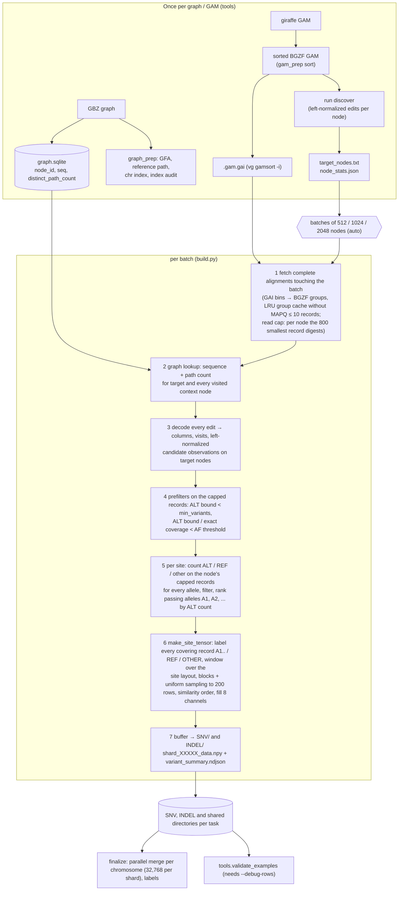

# indexed_gam_pipeline_v4

Candidate-centered pileup tensors built directly from a sorted, indexed GAM and a GBZ pangenome
graph. One tensor per candidate **site** — `(node, position, SNV|INDEL)`, all passing alleles
listed in its summary record — shape `(8, 200, 101)`, `int8`, tensor format
`indexed-gam-candidate` (section 8).

`run discover` selects the target nodes in one parallel scan of the GAM, counting every indel where
the builder's left-normalization puts it; `run build` builds the SNV and INDEL tensors of a node list
batch by batch (one GAM pass per batch, the read cap applied while the GAM is read, a native C++
record decoder); `orchestrate` runs a whole genome on one Slurm node as many small tasks and ends
with a byte-verified per-chromosome merge and truth labels (`tensor_postprocessing`).

```
runtime  5,010 lines of Python in 17 files + fastdecode.cpp (659 lines); frozen per run: 21 files (those 18,
         the compiled decoder and the two READMEs), 2.55 MB, 2.15 MB of it the compiled decoder
tools    1,201 lines of Python in 7 files + gbz_graph_index.cpp (75 lines); not frozen
tests    5,110 lines of Python in 17 files (+ golden_hashes.json), 162 tests, ~55 s on a quiet node
```

---

## 1. Quick start

```bash
cd /scratch/jshen/Github/Pansoma            # run everything from the repository root
PY=/wanglab/jshen/anaconda3/bin/python      # numpy, scipy, protobuf, pysam; pybind11 + a C++17 compiler for the decoder
P=indexed_gam_pipeline_v4
G=/scratch/jshen/data/pansoma_v2_tensors/graph_index   # HPRC v1.1 d9: graph index, reference path, chr table

# (once per checkout and Python version) the native C++ record decoder: ~28x faster decoding,
# identical output. The .so is gitignored; compile before `orchestrate prepare`, which freezes it.
$PY -m $P.native compile                   # prints the build info
$PY -m $P.native check                     # will the builder use it? if not, why

# (once per graph) GFA with the GBZ node IDs, graph index, reference path, chromosome blocks, index audit;
# a step whose output exists is skipped. For HPRC v1.1 d9 the outputs exist under $G.
sbatch -J graph_prep -o LOG $P/tools/jobs/graph_prep.sh graph.gbz OUTDIR [FASTA]
# (once per GAM) sort the giraffe GAM and write its GAI (vg gamsort -i), checked before publication
sbatch -J gam_sort -o LOG $P/tools/jobs/gam_sort.sh sample.gam     # -> sample.sorted.gam + .gai

# (once per sample) target nodes: > 5 % of the MAPQ>5 mappings carry an edit after the builder's
# indel left-normalization. Parallel over GAM segments: one core per worker, 10-16 GB in total.
$PY -m $P.run discover --gam sample.sorted.gam --output discovery/ \
    --graph-index $G/hprc-v1.1-mc-grch38.d9.graph_index.sqlite --processes 48

# (whole genome, one Slurm node) prepare a run root, then submit it
$PY -m $P.orchestrate prepare --root /path/to/run --tensors /path/to/tensors \
    --gam sample.sorted.gam --nodes discovery/target_nodes.txt --node-stats discovery/node_stats.json \
    --graph-index $G/hprc-v1.1-mc-grch38.d9.graph_index.sqlite --tasks 1200 --processes 48 --gam-cache-mb 8192 \
    --snv-min-af 0.06 --indel-min-af 0.08 \
    --chromosomes autosome --chr-index $G/hprc-v1.1-mc-grch38.d9.chr_node_ranges.tsv \
    --merge-shard-size 32768 --keep-sources --reference-path $G/hprc-v1.1-mc-grch38.d9.grch38_path \
    --somatic-vcf ... --somatic-bed ... --germline-vcf ... --germline-bed ... \
    --reference-fasta GRCh38.fasta --truth-dir /path/to/truth    # short-read sets: + --label-snv-min-af 0.07
sbatch -p general --cpus-per-task=48 --mem=420G --time=14-00:00:00 \
       --output=/path/to/run/slurm-%j.out /path/to/run/run.sh
sbatch ... /path/to/run/run.sh --resume               # after a failure: redo only unfinished tasks
$PY -m $P.orchestrate finalize --root /path/to/run    # only the merge + labels (idempotent)

# (re-label by hand, e.g. other AF floors) as finalize does with prepare's --label-snv-min-af / --label-indel-min-af
$PY -m $P.tensor_postprocessing label --tensors /path/to/tensors --reference-path $G/hprc-v1.1-mc-grch38.d9.grch38_path \
    --fasta GRCh38.fasta --somatic-vcf ... --somatic-bed ... --germline-vcf ... --germline-bed ... \
    --truth-dir /path/to/truth [--snv-min-af 0.07] [--indel-min-af F]

# (one task by hand, e.g. an audit) exactly what every task runs
$PY -m $P.run build --gam sample.sorted.gam --nodes nodes.txt --graph-index $G/hprc-v1.1-mc-grch38.d9.graph_index.sqlite \
    --output out/shared --snv-output out/SNV --indel-output out/INDEL --snv-min-af 0.06 --indel-min-af 0.08
```

The graph files (graph index, reference-path directory, chromosome block table) are made once per
graph and the sorted GAM with its GAI once per GAM, both with `tools` (section 4); for HPRC v1.1 d9
the graph files exist under `$G`. Section 5 has the settings used for PacBio HiFi, ONT-UL,
Illumina and fiberseq and what they cost.

---

## 2. Pipeline overview



Key invariants:

* **One GAM pass per batch.** SNP and INS/DEL site tensors are written to separate
  directories (`--snv-output`, `--indel-output`) from the *same* decoded reads.
* **Only decoded reads of the current batch are alive.** Protobufs are dropped as
  soon as they are decoded; the batch is cleared before the next fetch.
* **Every node sees at most 800 records** (the read cap, applied while reading the GAM): the
  prefilters, counts and rows use the same records, before the 200-row cap. Nodes shallower
  than 800 records use all of them; a record no node of the batch keeps is not decoded.
* **Prefilters never change an accepted output**: both are proven upper bounds computed over
  the records support counting uses.
* **Discovery and builder agree on indel placement.** Discovery counts an indel on the node the
  builder's left-normalization moves it to (same C++ code), so every node the builder would see an
  indel on is a target.
* **Deterministic.** Candidate order, row ranking, sampling and batching do not depend on fetch
  order or process count; two builds of the same input are byte-identical.

---

## 3. Modules: runtime, tools, tests

**Runtime** — frozen into `<root>/source/` by `orchestrate prepare` and run from there:

| File | Purpose |
|---|---|
| `common.py` | `write_json` (atomic, `indent=2` plus newline), `read_json`, `stamp`, `sha256_file`, `new_output`, `load_nodes`, `batches`; `EARLIER_FORMAT_NAMES` / `format_name` (section 8, "Format names") |
| `vg_pb2.py` | generated protobuf bindings for `vg.proto` (do not edit or regenerate; its deterministic serialization defines record digests and the read cap) |
| `gam_reader.py` | protobuf stream framing (incl. the giraffe `PARAMS_JSON` / foreign-group skip), `scan_gam`, `IndexedGam`: GAI bins (the format with the `'GAI!'` magic, format number 1; bins tested all at once as arrays), merged virtual-offset runs, BGZF group seek, bounded LRU group cache that keeps no record with MAPQ ≤ `--min-mapq`, `fetch` (file order, each record once), `fetch_capped` (the read cap while reading: per node the records with the smallest `record_key`) |
| `graph_index.py` | read-only `GraphIndex` over the graph SQLite (sequence + distinct path count per node) |
| `candidates.py` | the data path from GAM record to site tensor: `decode_alignment` (+ `left_align_indels`, `indel_runs`, `indel_observations`: the part `fastdecode.cpp` ports), `NodeReads`/`VisitView` support counting (with the scan fallback), `alt_support_bounds`, `exact_coverage`, `SiteLayout`, `make_site_tensor`, `average_linkage`, format constants |
| `native.py`, `fastdecode.cpp` | optional C++ decoder: `compile`/`check`, load-time SHA + 300-record self-test, `select_decoder` (`--decoder`, `PANSOMA_DECODER`), `NativeDecoder` with per-record Python fallback, `ColumnArray` with its per-read block cache; `Discovery` counters and `group_nodes` for `run discover` |
| `build.py` | the per-task builder: batch planning (`auto` sizes, halving over the record limit), the capped fetch, prefilters, `candidate_units` (sites), `count_support`, `evaluate_unit`, `OutputDir`; always shared + SNV + INDEL |
| `discovery.py` | `run discover`: GAM segments cut at GAI group starts, native normalized per-node counts merged in first-appearance order, streamed `node_stats.json` |
| `run.py` | builder CLI: `discover`, `build` |
| `orchestrate.py` | whole-genome controller: `prepare` / `run [--resume]` / `task` / `finalize`, `node_costs`, `execute_queue`, `validate_shards`, `verify`, `read_config` (package guard), `MemoryRecorder` |
| `tensor_postprocessing/` | node → chromosome blocks (also `--chromosomes`), the GRCh38 reference-path reader, parallel per-chromosome merge, truth labels; CLI `merge`/`label` (own [README](tensor_postprocessing/README.md)) |

Import order is top-down: `common` ← `gam_reader`/`graph_index` ← `candidates` ← `native` ←
`build` ← `run` ← `orchestrate`; `tensor_postprocessing` uses only `common`/`graph_index` and is
used by `build` (`--chromosomes`) and `orchestrate` (`finalize`).

**Tools** (`tools/`) — offline, run from the checkout (the job scripts also from a `git archive`
copy such as `pipeline_code/`, section 6), never imported by a runtime module and not frozen (a
static test enforces both):

| File | Purpose |
|---|---|
| `tools/graph_index_build.py`, `tools/gbz_graph_index.cpp` | compile the native GBZ → SQLite builder, build the graph index (once per graph) |
| `tools/graph_prep.py` | `gfa`, `ref-path-scan`, `ref-path-check`, `components`, `chr-index`, `audit` (once per graph) |
| `tools/gam_prep.py` | `sort` (`vg gamsort -i`, checked, then published) and `check` (once per GAM) |
| `tools/validate_examples.py` | independent audit of a `--debug-rows` output against the GAM and graph |
| `tools/binary_requirements.py` | newest GLIBC/GLIBCXX/CXXABI symbol versions and AVX/AVX-512/BMI use of a binary |
| `tools/compare_runs.py` | byte and normalized comparison of two run roots, task or build directories (stdlib only) |
| `tools/jobs/graph_prep.sh`, `tools/jobs/gam_sort.sh`, `tools/jobs/relabel.sh` | Slurm job scripts (shell) that run the package they are in: every once-per-graph step for one GBZ; the sort of one GAM; `tensor_postprocessing label` of one merged set |

**Tests** (`tests/`, a subpackage) — section 9.

---

## 4. Commands and every option

All entry points are `python -m indexed_gam_pipeline_v4.<module>`, run from the repository root
(or, for a run, from `<root>/source`, which `run.sh` does). Invalid input exits 1 with `Error: ...`.

### `run discover`

```
--gam GAM --output DIR --graph-index SQLITE     (required; DIR new or empty)
--index GAI            default GAM.gai; used to cut the GAM into segments
--processes N          scan workers (default $SLURM_CPUS_PER_TASK, else all CPUs)
--min-mapq 5           exclusive: mappings with MAPQ <= 5 are not counted
--node-alt 0.05        select a node when imperfect / (perfect + imperfect) > this (and imperfect >= 1)
--max-indel-len 50     indels longer than this are not moved (use the builder's --max-indel-len)
```

Writes `target_nodes.txt` (sorted), `node_stats.json` (per node `perfect`, `not_perfect`,
`max_read_length`; `prepare --node-stats` reads it) and `discovery_report.json` (`gam`,
`alignments_scanned`, `nodes_observed`, `nodes_selected`, `min_mapq`, `node_alt`,
`rule: "normalized"`, `processes`, `segments`, `alignments_passing_mapq`, `max_indel_len`,
`graph_index`, `normalization_fallbacks`).

* **Rule.** Each record is decoded and its indels left-normalized exactly as the builder does
  (same C++ code, `--max-indel-len`); a mapping is imperfect when its columns contain any
  non-match after that, so an indel counts on the node the builder will see it on. vg places a
  repeat indel at one end in read orientation, so a target list from vg's edits as written misses
  the nodes normalization moves indels onto: on HG008 PacBio such a list left 392 k nodes for 391
  extra tasks, 6.1 % of the tensors but 40 % of all builder time (2.16 s per node against 0.08 s).
  A record the normalization cannot decode is counted with vg's edits as written
  (`normalization_fallbacks`; 0 on HG008).
* **Parallel scan.** The GAM is cut at group starts taken from its GAI into 4 × `--processes`
  contiguous segments; each worker reads its segment once with pysam and counts in C++ (node
  sequences per group from the graph index); counts are merged in order of first appearance, so
  the outputs do not depend on `--processes` (tests/test_discovery.py). Requires the native module.

### `run build`

```
required:
  --gam GAM --nodes NODES --graph-index SQLITE
  --output SHARED_DIR --snv-output DIR --indel-output DIR      new or empty, distinct, non-nested directories
  --snv-min-af F --indel-min-af F                              AF thresholds of the two outputs
  --index GAI                default GAM.gai

target nodes:
  --chromosomes all          all | autosome | chr1,chr2,... (chromosome blocks of the node IDs)
  --chr-index TSV            node ID -> block table (tools.graph_prep chr-index); needed unless all

batching / memory:
  --batch-nodes auto         auto = 512/1024/2048 per position (below); or a fixed N
  --max-node-span 10000      node-ID span of a batch (auto: of a 512-node batch, scaled with the size)
  --max-batch-alignments 200000   MAPQ-passing records one batch decodes after the read cap (below)
  --gam-cache-mb 1024        GAM group cache in MiB (at least 1; prepare's default is 8192)

candidate filters:
  --min-mapq 10              exclusive: records with MAPQ <= 10 are dropped
  --min-variants 3           minimum ALT-supporting records
  --min-allele-bq 10         minimum base quality of an ALT observation
  --max-indel-len 50         1-50 and <= --width; longer indels (total over mappings) are logged, not candidates
  --min-af 0.05              recorded in the manifests only; the filters use --snv-min-af/--indel-min-af

speed (outputs unchanged unless stated):
  --max-node-reads 800       the read cap: per target node the 800 records with the smallest record SHA-256,
                             for the prefilters, counts and rows, applied while reading the GAM (below);
                             0 = all records (changes outputs)
  --early-af-filter          AF upper-bound prefilter (default on; exact);
                             --no-early-af-filter disables it
  --decoder auto             native C++ decoder if built and self-tested, else Python (identical output);
                             native = fail if unavailable; python = never; PANSOMA_DECODER=native|python overrides auto

tensor / output:
  --rows 200  --width 101  --shard-size 2048  --debug-rows (per-row hashes and per-column coordinates
                                                           for tools.validate_examples)
```

`--min-allele-bq` is a float option with the int default 10: a standalone build records
`"min_allele_bq": 10`, an orchestrated task `10.0`.

**`--batch-nodes auto`.** At each position the builder prices the next 512, 1024 and 2048 target
nodes by the compressed GAM bytes their fetch reads (from the GAI alone) and takes a larger batch
only when it reads ≥ 20 % fewer bytes per target node. With long reads neighbouring batches read the
same GAM groups: on the HG008 ONT-UL GAM (≈ 100 MiB groups) 2048-node batches cut the time per node
4.9x against 512. Tensors and summaries do not depend on the grouping; audit-stream order and
`batch_timing` rows do (each row records its `batch_plan`).

**`--max-batch-alignments`** bounds the MAPQ-passing records one batch decodes after the read cap.
Under `auto` a multi-node batch over it is split in halves and retried (`batch_plan.split`); with a
fixed `--batch-nodes`, or for a single node, the build fails. The GAM reader drops records with
MAPQ ≤ `--min-mapq` when it first reads a group (they are neither cached nor returned), so the
low-MAPQ records of a short-read GAM fill neither the group cache nor the limit. The limit binds
short reads only (section 7).

**The read cap and deep nodes.** Each target node uses at most `--max-node-reads` records: those
with the smallest record digest (SHA-256 of the deterministic serialization of the GAM record,
`Read.digest`), deterministic and uniform with respect to the alleles they carry. The cap is applied
while the GAM is read (`IndexedGam.fetch_capped`): the reader counts every node's MAPQ-passing
records from its group index, ranks the records of the nodes over the cap by `record_key` (the first
8 bytes of that digest; it parses them but decodes no edits) and returns each record with the nodes
whose cap leaves it out; a record no node of the batch keeps is not decoded at all. The prefilters,
support counting and rows of a node then use exactly its capped records, so a node's tensors do not
depend on the batching and equal those of a GAM holding only its capped records (tested). Nodes of
a collapsed repeat (satellites, rDNA: on HG008 Illumina WGS the median target has 220 MAPQ>5
mappings, 683 more than 10,000 and one 5.4 million; one COLO829T ONT task holds 2,034 such nodes,
one fiberseq task 3,377) share their reads, so their capped records are the same ones and an
ordinary batch there decodes about 800 records however deep the region is. Applied after decoding,
the cap would save neither the fetch nor the decode: one such COLO829T ONT node built alone from a
10,000-record sample took 436 s (fetch 207, decode 224, tensors 5), about 10 days for the task
holding 2,034 of them; with the cap in the reader that task took 3 h 16 min and the fiberseq task
with 3,377 deep nodes 26 min. Sites of a capped node carry `downsampled_from` (the records the cap
chose from); the shared directory lists capped nodes in `downsampled_nodes.tsv` (node, records,
kept, reason `max_node_reads`).

**`--chromosomes`** filters the **target nodes** by the chromosome block of their node ID
(Minigraph-Cactus numbers each chromosome's graph as one contiguous ID interval, including the
off-GRCh38 insertion and branch nodes; see `tensor_postprocessing/README.md`). Reads are not
filtered: a read on a chr1 target keeps its columns on neighbouring nodes of any block.
`autosome` removes chrX/Y/M/EBV and the unplaced contigs up front (on HG008 PacBio 4.4 % of the
targets, including 24,258 unplaced nodes behind one task's 5.8 h tail). The selection (and the
chr-index SHA-256) is recorded in every manifest as `chromosome_selection`.

Outputs (section 8 "Files"):

```
SNV/ and INDEL/   shard_XXXXX_data.npy (n, 8, rows, width) int8, variant_summary.ndjson, filtered_candidates.ndjson,
                  unsupported_events.ndjson, manifest.json
shared/           manifest.json (+ output_layout, variant_outputs, tensors_by_type), every audit record
                  (filtered_candidates / unsupported_events), batch_timing.ndjson, target_nodes.txt,
                  downsampled_nodes.tsv (nodes over the read cap, if any); no shards
```

### `native compile | check`

The optional native record decoder (`fastdecode.cpp`, a line-by-line C++ port of
`decode_alignment`, `left_align_indels`, the joined `indel_runs` and `indel_observations`, plus the
discovery counters). `compile [--cxx CXX]` (default `$CXX`, else `g++`) builds
`_fastdecode<EXT_SUFFIX>` into the package (C++17 + pybind11, `-O3`, no `-march` or fast-math;
libstdc++/libgcc linked statically when the toolchain allows, else dynamically) in a temporary
directory, compares it with the Python decoder on 5,000 synthetic records in a fresh interpreter,
only then moves it into place, and prints its build info. `check` says whether the builder will use
it and why not.

The builder (`--decoder auto`) uses it only if it imports, was compiled from the `fastdecode.cpp`
next to it (the source SHA-256 is compiled in) and reproduces the Python decoder on 300 synthetic
records at load time; otherwise it decodes in Python. A record the native code raises on is decoded
again in Python, so a task completes whenever it would in pure Python. The manifest's `decoder`
records the choice, the reason and `native_record_fallbacks`; every task log has a
`Decoder: native|python` line. Columns stay in the C++ struct array (`ColumnArray`, ~24 bytes per
column instead of a ~120-byte `Column` object) and are converted to `Column` objects only where
downstream code reads them, per block of 128 columns; each read keeps its 16 most recently used
converted blocks (`CACHED_BLOCKS`; sites are visited in node order, so older windows are not read
again), which bounds the memory of dense long-read batches (HG008 ONT-UL, one 2048-node batch: 174
of 179 million columns converted, 41 GiB, without the bound; 12.6 GiB with it, same output).
Compiled modules are per Python version and platform; `prepare` freezes the package, compiled
module included, so compile *before* `prepare`. Portability report of the module:
`python -m indexed_gam_pipeline_v4.tools.binary_requirements indexed_gam_pipeline_v4/_fastdecode*.so`.

### `orchestrate prepare | run | task | finalize`

```
prepare
  --root DIR                 new run directory (config, frozen source, partitions, logs, status)
  --tensors DIR              tensor output directory, new or empty (default <root>/tensors)
  --gam GAM [--index GAI]  --nodes target_nodes.txt  --graph-index SQLITE     (required, except --index)
  --node-stats JSON          discovery node_stats.json: task costs (expensive tasks first)
  --tasks 512                contiguous near-equal node lists; use ~15,500 target nodes per task
  --processes 32             tasks at once (= builder processes; 1 <= processes <= tasks); the job needs as many CPUs
  every `run build` option except --output, --snv-output, --indel-output and --debug-rows
                             (same defaults, but --gam-cache-mb 8192; --snv-min-af, --indel-min-af required)
  finalize (merge per chromosome, then labels):
  --merge-shard-size 32768   tensors per merged <chrom>_shard_* file; 0 = keep the task layout, no merge, no labels
  --keep-sources             keep the task_* directories after the verified merge (default: delete them)
  --reference-path DIR       tools.graph_prep ref-path-scan directory: GRCh38 coordinates; needed for labels
  --somatic-vcf --somatic-bed --germline-vcf --germline-bed --reference-fasta --truth-dir     labels: all or none
  --label-snv-min-af F       lower-AF SNV tensors are labelled -1 (short-read sets: 0.07); in [0, 1], needs the labels
  --label-indel-min-af F     lower-AF INDEL tensors are labelled -1; in [0, 1], needs the labels

run --root R [--resume]      execute the tasks, then finalize (section 6)
task --root R --index I      one task (spawned by run)
finalize --root R            merge + labels as frozen at prepare; skips finished steps
```

`--chr-index` is required for the merge and for `--chromosomes` other than `all`; labels need the
merge, `--reference-path` and `--truth-dir`. The label AF floors are frozen as
`config.postprocess.labels.snv_min_af` / `indel_min_af` (null when unset); finalize labels with
them as `tensor_postprocessing label --snv-min-af` / `--indel-min-af` does. They are unrelated to
the build's `--snv-min-af` / `--indel-min-af`, which decide which alleles become tensors.

### `tensor_postprocessing merge | label`

Manual re-merge or re-label (`orchestrate finalize` runs both as frozen at prepare):

```
merge --root R --chr-index TSV [--shard-size 32768] [--keep-sources] [--workers 8] [--spots 200] [--reference-path DIR]
label --tensors T --reference-path DIR --fasta FA --somatic-vcf --somatic-bed --germline-vcf --germline-bed
      --truth-dir DIR [--kinds SNV INDEL] [--recall-dir DIR (default T)] [--snv-min-af F] [--indel-min-af F]
```

* **Merge.** Every task directory of `outputs.json` must be complete and agree with the first on
  `merge_shards.SHARED_KEYS` (`tensor_format`, `tensor_storage`, `shape`, `dtype`, `channels`,
  `encodings`, `row_selection`, `row_order`, `window_encoding`, `parameters`, `sample_unit`,
  `site_definition`, `read_cap`, `debug_rows`), so a merged set follows one build rule. Every (kind,
  chromosome) group is one parallel job that reads its records' rows with plain sequential reads,
  and the audit streams are copied in slices straight to their offsets in the concatenated file; the
  bytes are those of a sequential copy (`--workers` does not change them, tested). A single-process
  copy runs at ~150 MB/s, ~2 h for HG008 Illumina (833 GB of tensors plus 258 GB of audit streams);
  its chr22 takes 227 s in one process and 101 s with 8 workers. Everything is verified before it is
  published (data SHA-256 re-read from disk, summary records, totals, random tensors reloaded from
  the sources); a second merge of a run, and a directory that already holds a merged layout, are
  refused.
* **Labels**, one per tensor from its representative allele A1 (`candidate_id`): **1** somatic —
  A1 is a somatic truth allele with FILTER PASS/`.` or overlaps one by more than 45 %
  (`MIN_OVERLAP`, "partial"); **2** germline — A1 is a germline truth allele with FILTER PASS/`.`
  or only `GAP1`/`GAP2`, or overlaps one by more than 45 % (1 and 2 inside or outside the BEDs when
  the truth is an allele of the site, else inside only);
  **0** non — another allele of the site is the truth and A1 does not overlap it enough, and every
  other tensor on a GRCh38 node inside somatic BED ∩ germline BED (no truth allele, a truth allele
  within 10 bp that A1 does not match, a germline allele with another FILTER such as
  `HET1`/`HET2`); **−1** ignore — a filtered somatic truth allele, outside the BEDs, no position
  (no GRCh38 coordinate and no anchor), an off-reference node without a partial somatic match, and
  with `--snv-min-af` / `--indel-min-af` every SNV / INDEL (A1 an INS or DEL) of lower AF, whatever
  its truth (short-read sets: SNV 0.07; these two rules are checked first). Indels are
  matched at every equivalent placement in their repeat; an off-reference node is placed between the
  reference nodes around it by node ID (within 200 IDs, at most 1024 GRCh38 bases apart), and
  somatic truths written differently by the graph alignment are matched by the haplotype overlap of
  the A1 reads. `labels.manifest.json` records `format` `truth-labels`, `rules_sha256` (the SHA-256
  of `truth_labels.py`, which identifies the rules), the rule constants (`labels`, `near_bp`,
  `min_overlap`, `anchor_reach`, `anchor_gap`), `snv_min_af`, `indel_min_af` (null when not given),
  counts per chromosome and reason, and the truth/BED SHA-256s. −1 marks tensors a tumor-only caller
  can leave out at test time as well (outside the BEDs, no position) and tensors that are no
  reliable negative (off-reference nodes, which mostly carry no truth at all; tensors below an AF
  floor, e.g. short-read SNVs); every other tensor without truth is 0, so the negatives stay in the
  training data.

Details, rules and the HG008 commands: [tensor_postprocessing/README.md](tensor_postprocessing/README.md).

### Tools

```bash
# graph index (once per graph): nodes(node_id, seq, distinct_path_count) + graph_metadata
$PY -m $P.tools.graph_index_build compile --deps /scratch/jshen/Github/gbz-tool/dependency \
    --output bin/gbz_graph_index [--cxx CXX] [--no-portable]
$PY -m $P.tools.graph_index_build build --gbz /scratch/jshen/data/AF-Filtered_VG_Indexes/hprc-v1.1-mc-grch38.d9.gbz \
    --builder bin/gbz_graph_index --output /path/to/new.graph.sqlite
# GFA, reference path, chromosome blocks, index audit (once per graph; tensor_postprocessing/README.md)
$PY -m $P.tools.graph_prep gfa --gbz G.gbz --output G.gfa [--threads 16] [--vg VG]
$PY -m $P.tools.graph_prep ref-path-scan --gfa G.gfa --output DIR [--reference-sample GRCh38]
$PY -m $P.tools.graph_prep ref-path-check --path DIR --graph-index DB --fasta FA [--samples 100000]
$PY -m $P.tools.graph_prep components --gbz G.gbz --reference-path DIR --output DIR [--threads 4] [--vg VG]
$PY -m $P.tools.graph_prep chr-index --components-dir D --reference-path DIR --output PREFIX [--graph-index DB]
$PY -m $P.tools.graph_prep audit --graph-index DB --gfa G.gfa --chr-index TSV --output graph_audit.json
# every graph step above (graph index included) as one Slurm job; steps whose output exists are skipped
sbatch -J graph_prep -o LOG $P/tools/jobs/graph_prep.sh GBZ OUTDIR [FASTA]
# sorted GAM + GAI (once per GAM)
$PY -m $P.tools.gam_prep sort --gam IN.gam --output IN.sorted.gam [--threads 8] [--tmp-dir DIR] [--vg VG]
$PY -m $P.tools.gam_prep check --gam IN.sorted.gam [--index GAI] [--input IN.gam] [--threads 8]
sbatch -J gam_sort -o LOG $P/tools/jobs/gam_sort.sh GAM [OUTPUT]      # VERIFY=1: also check --input
# labels of one merged set as a Slurm job
sbatch -J NAME -o LOG $P/tools/jobs/relabel.sh TENSORS SOMATIC_VCF SOMATIC_BED GERMLINE_VCF GERMLINE_BED TRUTH_DIR \
    [SNV_MIN_AF [INDEL_MIN_AF]]    # '' skips one: ... '' 0.10; REFERENCE_PATH=DIR: another graph's
# audit of a --debug-rows build (one typed directory)
$PY -m $P.tools.validate_examples out/SNV --gam G [--index GAI] --graph-index DB --output report.json
# compare two run roots, task directories or build directories; exit 1 on any difference
$PY -m $P.tools.compare_runs A B [--mask DOTTED.KEY ...] [--report FILE]
```

* **Graph index.** The count is the number of distinct logical GBWT paths that visit the node in
  either orientation (reference paths included, revisits counted once). Publication is atomic; an
  existing output is never overwritten. The metadata (`schema` `gbz-all-nodes`, `metric`
  `distinct-gbwt-paths`, `count_algorithm`, source path/size/mtime/SHA-256, node and path totals,
  timings) is stored in the index and copied into every tensor manifest; `GraphIndex` also opens an
  index whose metadata spells the schema and metric with a `-v1` suffix (section 8, "Format names"),
  as the HPRC v1.1 d9 index under `$G` does. `compile` writes `<output>.build.json` next to the
  binary with the compiler, flags, glibc symbol versions and CPU extensions; it warns on AVX/BMI
  instructions, which come from the gbwtgraph dependencies (sdsl-lite's `-march=native`). Our build
  (`gbz-tool/dependency`) needs glibc ≥ 2.34 and an AVX/BMI CPU; the finished SQLite is needed only
  once per graph.
* **GFA, components, audit.** `gfa` runs `vg convert -f --no-translation`, so the segment names are
  the GBZ node IDs (the IDs in GAM alignments and in the graph index), not the original segment names
  a translation would restore; `ref-path-check` then finds any disagreement with the graph index.
  `components` writes `DIR/chrN/chrN.component.nodes.raw.txt` for chr1–22 (`vg chunk -C -p
  <sample>#<hap>#chrN`, the path names from the reference-path directory) and `DIR/summary.json`
  (nodes, ID range, nodes on and off the reference path). `audit` compares, on the first node of every
  chr-index block and 24 random nodes, the graph index's sequence with the GFA's S line and its
  `distinct_path_count` with the number of GFA W/P lines visiting the node; it writes its JSON only
  when every node agrees (else `<output>.failed`, and it fails). `gfa`, `components` and `gam_prep`
  run vg from `--vg`, else `$PANSOMA_VG` (`scripts/use_vg.sh`: vg 1.77), else `vg` on PATH.
* **Sorted GAM.** `gam_prep sort` runs `vg gamsort -t N -p -i` (temporary files in `--tmp-dir`, else
  `$TMPDIR`) into `<output>.tmp` and `<output>.gai.tmp`, checks them and then renames them; it never
  overwrites. `check` opens the GAI with `IndexedGam` (the `'GAI!'` magic, format number 1, offsets
  inside the GAM) and reads the first 10,000 records: GAM records whose smallest node IDs never
  decrease. `--input` also compares `vg stats -a` of the two GAMs: alignments, primary, secondary,
  aligned, perfect and matched bases must be equal.
* **Reference path, chr index.** `ref-path-scan` writes a directory with `meta.json` (`format`
  `gfa-reference-path`) that `tensor_postprocessing.reference_path.ReferencePath` reads (also a
  `meta.json` that records the format under `version`, in its earlier spelling, as under `$G`);
  `chr-index` writes `<prefix>.tsv` plus `<prefix>.json` (`format` `chr-node-ranges`, `tsv_sha256`,
  which `ChrIndex` checks).
* **Job scripts** (`tools/jobs/`, plain shell with `#SBATCH` defaults for `-p general`). Each runs
  the package it lives in: started with `bash`, the one around its own path; under `sbatch`, which
  runs a copy of the script, the one around the submitted path (job record, `scontrol show job`:
  `Command=`). So the checkout's scripts run the checkout, and
  `pipeline_code/indexed_gam_pipeline_v4/tools/jobs/` runs `pipeline_code/`. A script prints
  `package: <dir>`, makes relative path arguments absolute and runs `python -m <package>...` from
  the package's parent directory.
  * `graph_prep.sh GBZ OUTDIR [FASTA]`, with `<name>` the GBZ file name without `.gbz`: the builder
    `OUTDIR/gbz_graph_index` (compiled once from `$GBZ_DEPS`), `<GBZ dir>/<name>.gfa` (or `$GFA`)
    and `OUTDIR/<name>.graph_index.sqlite` + `OUTDIR/graph_index_report.json` side by side, then
    `OUTDIR/<name>.grch38_path/` (scan, check), `OUTDIR/<name>.components/`,
    `OUTDIR/<name>.chr_node_ranges.{tsv,json}` and `OUTDIR/graph_audit.json`. A step whose output
    exists is skipped (ref-path-check always runs), so a resubmission resumes; the `.tmp` of a failed
    scan or components step stops it. 16 CPUs, `--mem=96G`, 2 days.
  * `gam_sort.sh GAM [OUTPUT]` (OUTPUT default `<GAM without .gam>.sorted.gam`): `gam_prep sort` with
    `$SLURM_CPUS_PER_TASK − 2` gamsort threads and `$GAMSORT_TMP` (default `/scratch/jshen/tmp_gamsort`),
    with `VERIFY=1` also `gam_prep check --input`. 10 CPUs, `--mem=64G`, 6 days.
  * `relabel.sh`: section 6; the reference path is `$REFERENCE_PATH`, else the one the set's current
    labels used (`reference_path` of `TENSORS/SNV/labels.manifest.json`); 1 CPU, `--mem=19G` (label
    peak 15.7 GiB, COLO829T), 6 h.
* **validate_examples** requires `--debug-rows`. It recounts every site allele's (and the site's)
  coverage from raw mapping intervals, re-applies the read cap from the record digests, re-derives
  the site layout, the allele blocks and the uniform sampling from the recorded audit, and checks
  every selected column's graph base, path count, site-allele code, strand and padding.
* **compare_runs** compares raw bytes for data files (shards, labels, summaries, audit streams,
  node lists, validation reports, truth tables, recall reports) and normalized JSON for the rest:
  manifests and `labels.manifest.json` whole and order-sensitive minus `timing`,
  `graph_index_performance`, `decoder`, `created`, `arguments.decoder`,
  `sources.outputs_json_sha256` and `gam_group_cache`; `batch_timing.ndjson` minus elapsed times and
  `gam_query`; `outputs.json`, `status.json` and `config.json` reduced to their content keys; paths
  under the compared root replaced by `<ROOT>`. `source/`, `logs/`, `incomplete/`,
  `memory.ndjson`, `queue_status*.json`, `finalize_report.json`, `run.sh` and `*.tmp` are ignored. A
  file present in only one tree is a difference. The module docstring lists every rule.

Tensor PNGs: `scripts/visualize_tensor.py` renders `indexed-gam-candidate` tensors as eight panels
with the allele blocks, from a shard plus the metadata beside it: `manifest.json` +
`variant_summary.ndjson` for a task shard (`task_NNNN/shard_NNNNN_data.npy`), `manifest.json` +
`<chrom>_variant_summary.ndjson` for a merged shard (`<tensors>/<kind>/<chrom>_shard_NNNNN_data.npy`).
`-i` is the position within that shard (the record with the shard's `shard_index` and
`index_within_shard`), not a line number of the chromosome summary. The finished datasets' merged
shards (older `-v6`/`-v1` names) render the same way. Reading a whole-chromosome summary takes up to
~25 s (chr1 SNV, 1.45 GB). The base environment's matplotlib has a NumPy ABI conflict; use
`MPLBACKEND=Agg MPLCONFIGDIR=/tmp/pansoma_matplotlib
/wanglab/jshen/anaconda3/envs/hunyuanvideo15/bin/python scripts/visualize_tensor.py SHARD -i 0 -o
figure.png`.

---

## 5. Settings by platform (HPRC v1.1 d9)

**Where the numbers come from.** The runs below were prepared by the package
`indexed_gam_pipeline_v3`; each root keeps the code it ran in `<root>/source` (patched in place
where a fix was brought into the started run, section 6). That code applied the read cap after the
two prefilters (and, where a run had nodes over 10,000 mappings, built them alone from a
10,000-record sample), except in 1 of the 1,178 COLO829T fiberseq tasks and 884 of the 1,921
COLO829T ONT tasks, which read with the cap as described here (merged manifests, `read_cap_rules`);
tensors of nodes over the cap can therefore differ from what this package builds. Each sample
directory `/scratch/jshen/data/pansoma_v2_tensors/<sample>` (HG008: `HG008T_PacBio`, `HG008T_ONT`,
`HG008T_Illumina`; COLO829T: `COLO829T_{Illumina,fiberseq,ONT}`) holds `discovery/`, the run root
`run/`, the merged and labelled `tensors/` (the only copy of the tensors: the task outputs were
deleted after the merge), `truth/` (the truth tables of the labels) and a `README.txt` with the
sample's inputs, settings, counts and relabel command. HG008 PacBio differs: its `tensors/` merges
`run/`, built by an earlier package, with `run_extra/`, and `merge/` holds that merge's bookkeeping
(footnote ¹). The label counts are those of this package's rules (`tensor_postprocessing label` over
the merged sets; data side `tools/jobs/relabel.sh`, section 6), the Illumina sets with
`--snv-min-af 0.07`.

All runs: one Slurm node, `-p general`, `--mem=420G`, `--chromosomes autosome`, `--snv-min-af
0.06 --indel-min-af 0.08`, other builder options at their defaults (except as noted),
`--merge-shard-size 32768 --keep-sources`. Discovery: `--processes 48`, defaults otherwise.

**HG008**

| | PacBio HiFi (Revio) | ONT-UL | Illumina WGS |
|---|---|---|---|
| GAM | 116×, reads ~16 kb | reads up to Mb, ~100 MiB BGZF groups | 2×150 bp, many short records |
| discovery wall time / MaxRSS (Slurm, all workers) | 18.6 min / 10.5 GB | 31 min / 16 GB | 2 h 25 min / 15 GB |
| target nodes (all / autosomes) | 16.52 M / 15.80 M | 22.25 M / 21.33 M | 18.61 M / 17.83 M |
| `--tasks` (~15,500 targets each, PacBio¹ aside) | 1,415 / 144¹ | 1,436 | 1,201 |
| `--processes` | 48 / 36¹ | **36**² | 48 |
| `--gam-cache-mb` | 6144 / 8192¹ | 8192 | 8192 |
| nodes over 10,000 mappings | 0 | 0 | 683 |
| run wall time (tasks) | 13.6 h / 48 min¹ | 5.7 h² | 3.6 h |
| peak RSS of the whole run (sampled) | 418 / 312 GiB¹ | 348 GiB² | 239 GiB |
| tensors SNV / INDEL | 1,180,343 / 1,923,744 | 2,372,506 / 2,511,013 | 5,000,888 / 151,465 |
| SNV labels 1 / 2 / 0 / −1 | 8,836 / 350,827 / 86,677 / 734,003 | 8,848 / 370,175 / 313,784 / 1,679,699 | 10,626 / 315,438 / 2,635,897 / 2,038,927 |
| INDEL labels 1 / 2 / 0 / −1 | 6,840 / 191,424 / 1,518,657 / 206,823 | 6,383 / 220,763 / 1,976,637 / 307,230 | 5,239 / 70,550 / 31,392 / 44,284 |
| label job (1 CPU) / MaxRSS | 23 min / 12.4 GiB | 50 min / 12.9 GiB | 55 min / 13.2 GiB |

¹ PacBio `tensors/` = `run/` + `run_extra/` (cells with two values: `run/` / `run_extra/`).
`run/` (1,415 tasks at 48 processes: 1,024 in 7.6 h, then the 391 extra tasks of section 4's
discovery rule in 6.0 h of a second job; peak 418 GiB sampled; 3,097,029 tensors) was built by an
earlier package with fixed `--batch-nodes 512`, `--max-batch-alignments 20000`, `--gam-cache-mb 6144`
and no per-read block cache, over a target list that is not this discovery's; `run_extra/` (144
tasks at 36 processes, 48 min, peak 312 GiB, 7,058 tensors) built the 269,569 autosomal targets of
this discovery that `run/` had not. The set also holds the tensors of 700,805 autosomal nodes that
this discovery does not select. A whole PacBio run of this code has not been measured.
² The HG008 ONT-UL run kept every converted column block of a read (no `CACHED_BLOCKS` bound) and ran
with `--max-batch-alignments 20000` (no ONT batch came near it): at 48 processes it was killed under
`--mem=420G` after 22 min and 35 tasks (MaxRSS 425 GiB; one of its 2048-node batches peaks at 41 GiB
without the bound); at 36 it ran the other 1,401 tasks in 5.7 h and peaked at 348 GiB. With the
bound, COLO829T ONT ran at 48 processes (below).

* **Memory is set by `--processes`.** Slurm kills the job when the summed RSS of all its processes
  exceeds `--mem` (`OverMemoryKill`). Long reads cost memory per process through the reads of one
  batch (section 7), short reads through the record count; the read cap and the 200,000-record
  limit keep Illumina tasks at 2.6–6.4 GiB.
* **Discovery** needs one core per worker and little memory; ask ~20 % over the last MaxRSS (16 GB →
  20G).
* **A fallback job** is cheap insurance for a multi-day run: submit it with
  `--dependency=afternotok:<run job> --kill-on-invalid-dep=yes`; it lowers `processes` in
  `config.json` (e.g. 48 → 36) and runs `run.sh --resume`, or repeats `finalize` when the merge was
  already done. The HG008 run directories keep such scripts (`fallback_job.sh`,
  `prepare_and_submit.sh`, `common.env`, `discovery_job.sh`).
* **Illumina** needs both the read cap and the 200,000-record limit: without the cap a single rDNA
  node of 5.4 M records cannot be built whole, and with a 20,000-record limit and the cap applied
  after decoding every batch was split and every fixed batch size down to 256 failed; HG008 Illumina
  1024-node batches held 25–92 k records (section 7).
* **Labels.** `--snv-min-af 0.07` makes 1,312,554 HG008 Illumina SNV tensors −1 (`below_snv_min_af`);
  a short-read run prepared with `--label-snv-min-af 0.07` gets this floor from finalize (no relabel).
  Outside the confident region (−1, `outside_confident_region`) lie 55 % of the PacBio, 67 % of the
  ONT-UL and 12 % of the Illumina SNV tensors.

**COLO829T** (`/scratch/jshen/data/pansoma_v2_tensors/COLO829T_<platform>/`, same graph and settings
except `--processes`). Labels: somatic truth = the validated union SNV + INDEL VCFs
(`COLO829T_truth/COLO829T_somatic_snv_indel.vcf.gz`, 44,005 SNV + 2,059 INDEL, all PASS), somatic BED
= union of `SMaHT_{easy,difficult,extreme}_v2.bed` (they tile the genome, so their intersection is
empty), germline = COLO829BL dipcall `dip.vcf.gz` + `dip.bed`.

| | Illumina | fiberseq | ONT |
|---|---|---|---|
| discovery wall time / MaxRSS (three at once on one node) | 3 h 25 min / 15.9 GB | 3 h 25 min / 11.6 GB | 3 h 23 min / 14.1 GB |
| target nodes (all / autosomes) | 16.73 M / 16.05 M | 18.25 M / 17.49 M | 29.77 M / 28.60 M |
| nodes over 10,000 mappings | 859 | 4,015 | 2,398 |
| `--tasks` | 1,080 | 1,178 | 1,921 |
| `--processes` (peak RSS) | 48 (201 GiB) | 15 (210 GiB), 36 (318 GiB) | 15 (215 GiB), 36 (360 GiB), 48 (418 GiB, `--mem=480G`) |
| run jobs, wall time in total | 3 h 18 min | 14 h 35 min³ | 20 h 50 min³ |
| tensors SNV / INDEL | 2,505,600 / 146,252 | 1,715,829 / 1,782,557 | 3,164,304 / 4,493,737 |
| SNV labels 1 / 2 / 0 / −1 | 38,727 / 337,496 / 1,234,872 / 894,505 | 38,796 / 394,030 / 141,670 / 1,141,333 | 38,647 / 431,962 / 834,571 / 1,859,124 |
| INDEL labels 1 / 2 / 0 / −1 | 1,349 / 75,488 / 34,595 / 34,820 | 1,639 / 208,154 / 1,310,682 / 262,082 | 1,755 / 253,857 / 3,822,960 / 415,165 |
| label job (1 CPU) / MaxRSS | 33 min / 14.9 GiB | 34 min / 14.6 GiB | 2 h 26 min / 14.7 GiB |

³ The long-read runs were stopped and resumed several times (other process counts, fixes brought
into their frozen source), so their wall times are not a clean measurement.

* ONT at 48 processes peaked at 418 GiB (largest process 66 GiB) under `--mem=480G`.
* `--snv-min-af 0.07` makes 480,878 Illumina SNV tensors −1 (`below_snv_min_af`).
* 60 % (fiberseq) and 54 % (ONT) of the SNV tensors are outside the confident region (−1), mostly in
  centromeric satellite arrays (chr1 120–125 Mb, chr10 38–42 Mb); Illumina 13 %.

---

## 6. Whole-genome runs (`orchestrate`): lifecycle and recovery

**prepare**:
1. before creating the root, checks the finalize options and the native decoder of this checkout:
   `--decoder native` with an unusable module is refused; under `auto` it warns on stderr that the
   tasks will decode in Python (much slower); `--decoder python` is not checked;
2. freezes a copy of the package into `<root>/source/` (without `tests/`, `tools/`, `__pycache__`,
   `*.pyc`, `.fastdecode-build-*`; the compiled decoder is included) and records every file's
   SHA-256;
3. applies `--chromosomes` to the node list (`<root>/nodes_selected.txt`), splits it into `--tasks`
   contiguous, near-equal node lists (`parts/nodes_NNNN.txt`) and, with `--node-stats`, records
   each task's `predicted_cost` (Σ discovery `not_perfect` over its nodes; reading a 6 GB
   node_stats.json takes ~1 min and ~7 GB);
4. fingerprints every input (GAM, GAI, graph index, node list, chr index, reference path, truth
   files) and writes `config.json` and `run.sh` (`cd <root>/source && exec <python> -m
   indexed_gam_pipeline_v4.orchestrate run --root <root> "$@"`). It prints a summary including
   `native_decoder`.

`config.json` holds `created`, `package` (the guard below), `python`, `tensors`, `inputs`,
`chromosome_selection`, `source_sha256`, `tasks`, `processes`, `schedule`, `parts`, `builder`
(every builder option, passed explicitly to each task, so a run never depends on the CLI defaults of
the code that executes it), `native_decoder` (`available`, `reason`), `variant_outputs`
({SNV: AF, INDEL: AF}) and `postprocess` (`merge_shard_size`, `keep_sources`, `reference_path`,
`labels`: the label inputs, `truth_dir` and the label AF floors `snv_min_af` / `indel_min_af`).

**run** (`sbatch <root>/run.sh`, or `bash <root>/run.sh [--resume]`):
1. refuses a merged root, fewer allocated CPUs (`SLURM_CPUS_PER_TASK`) than `processes`, and any
   changed input, frozen file or partition (`verify`);
2. runs the tasks, at most `processes` at once, **most expensive predicted first** (LPT order; on
   the task wall times of an HG008 PacBio run this replays 12.2 h as 7.2 h), else in index
   order. Each task is a fresh `run build` process under `/usr/bin/time -v` in `<root>/source`, so
   all its memory is returned when it exits; then `validate_shards` checks every output (shape,
   dtype, shard lengths and sizes, summary/manifest agreement, site rows and allele lists) and
   writes `validation_report.json`. Any failure stops the queue and terminates the running tasks
   (TERM, then KILL after 10 s);
3. `verify` again (nothing the tasks depend on changed while they ran), then `outputs.json` (every
   task directory with its tensor count; the capped nodes of all tasks gathered into
   `<root>/downsampled_nodes.tsv`) and `status.json` `complete`;
4. **finalize**: with `--merge-shard-size N` the task outputs are merged into
   `<tensors>/<kind>/<chrom>_shard_*` (chr1–22; other blocks under `<tensors>/non_autosomal/`) by
   `min(8, processes)` workers, byte-verified, the task directories deleted unless
   `--keep-sources`, and with the truth options every merged tensor labelled (somatic 1,
   germline 2, non 0, ignore −1; below `--label-snv-min-af` / `--label-indel-min-af` −1).

**Resume and recovery.**
* `run --resume` re-validates every task directory with `validate_shards` (serially: ~24 min for a
  genome run), skips the complete ones, moves partial outputs to `incomplete/<timestamp>/` and
  reruns only the rest. A plain `run` refuses existing task outputs; a merged root refuses
  `run`/`--resume`.
* If the job died during the merge or labels: `orchestrate finalize --root R` (from the checkout or
  from `R/source`). It skips steps already done (`outputs.json` has `merge`; every
  `labels.manifest.json` exists), so it can be repeated; it prints what it did (`{}` when nothing
  was left). To re-label, delete `<tensors>/{SNV,INDEL}/labels.manifest.json` and run it again (with
  the AF floors frozen at prepare), or use `tensor_postprocessing label` (e.g. with other floors).
* **Hand edits of `config.json`** (e.g. after running out of memory): every task re-reads it when it
  starts, so `builder.gam_cache_mb` (memory only; recorded in the manifests' arguments, tensor bytes
  unchanged) applies to tasks started later; `processes` is read when `run` starts, so set it before
  `--resume`. Edit only while no `run` is active, and never edit builder options that change tensors
  (thresholds, rows, width, ...) in a started run.
* **Fixing a bug in a started run.** The frozen source is checked file by file against
  `config.source_sha256`. A fix that does not change the bytes of completed tasks (e.g. a bound on a
  cache, a fallback that acts only where the code failed) can go into the run: copy the fixed file
  into `<root>/source/indexed_gam_pipeline_v4/`, keep the original next to the run, write the new
  SHA-256 into `config.source_sha256["source/indexed_gam_pipeline_v4/<file>"]`, then `--resume`.
  HG008 ONT-UL's `blockfix_job.sh` is such a script; it refuses a file that is neither the recorded
  original nor the patch. A change to `fastdecode.cpp` needs a recompiled `.so` as well (its source
  SHA is compiled in).
* **Package guard**: `run`, `task` and `finalize` refuse a root whose `config.package` is not this
  package (`<root> was prepared by ..., not indexed_gam_pipeline_v4`), and a root without
  `config.package`. The `run/` roots of section 5 (and PacBio `run_extra/`) were prepared by
  `indexed_gam_pipeline_v3`: resume or finalize them only with their frozen `<root>/source` (`bash
  <root>/run.sh --resume`; `cd <root>/source && python -m indexed_gam_pipeline_v3.orchestrate
  finalize --root <root>`); PacBio `run/` has no `package` key, is finished and must not be
  re-finalized. The merged sets of section 5 are relabelled by this package's
  `tensor_postprocessing label`, which reads their merged layout under
  its earlier name (section 8, "Format names"). On the data side this runs from
  `/scratch/jshen/data/pansoma_v2_tensors/pipeline_code/` (a `git archive` of this package plus the
  compiled `.so`; the commit in `pipeline_code/git_head.txt`) through its `tools/jobs/relabel.sh`,
  which runs the package it is in (section 4, "Tools"): `sbatch -J NAME -o LOG
  pipeline_code/indexed_gam_pipeline_v4/tools/jobs/relabel.sh TENSORS SOMATIC_VCF SOMATIC_BED
  GERMLINE_VCF GERMLINE_BED TRUTH_DIR [SNV_MIN_AF [INDEL_MIN_AF]]` (`''` skips one); no backup is
  kept (`label` replaces a kind's label files only when all are written). Each sample's `README.txt` has its
  relabel command. A run prepared with the label AF floors (`--label-snv-min-af 0.07` for short
  reads) needs no relabel: its finalize applies them.
* The queue ledger (`queue_status.json`: per-task state, PIDs, wall times) is written at start,
  whenever a task starts or ends, and at the end.

Layout — bookkeeping under `--root`, tensors under `--tensors` (default `<root>/tensors`):

```
<root>/
  config.json              inputs, fingerprints, builder options, partition table
  run.sh                   sbatch-able entry point (forwards extra args, e.g. --resume)
  source/                  frozen copy of indexed_gam_pipeline_v4 (hashes in config.json)
  nodes_selected.txt       node list after --chromosomes (when not all)
  parts/nodes_NNNN.txt     node list of each task
  logs/task_NNNN.log       builder output; task_NNNN.resources.txt from /usr/bin/time -v
  queue_status.json        per-task state, PIDs, wall times
  status.json              status, tensors, tensors_by_type, merged, merge_layout, labeled, peak sampled RSS
  memory.ndjson            process-tree RSS every 30 s
  outputs.json             catalog of every task directory with its tensor count (outputs.pre_merge.json after a merge)
  downsampled_nodes.tsv    every node over the read cap, with its task
  batch_timing.ndjson      every task's batch timings (after the merge)
<tensors>/
  shared/task_NNNN/        shared manifest, batch_timing.ndjson, complete audit streams, target nodes
  SNV/task_NNNN/           SNV shards + summary + audit + manifest + validation_report.json
  INDEL/task_NNNN/         INDEL shards + summary + audit + manifest + validation_report.json
  SNV/, INDEL/             after the merge: <chrom>_shard_NNNNN_data.npy, <chrom>_variant_summary.ndjson,
                           labels (<chrom>_shard_NNNNN_labels.npy, <chrom>_labels.ndjson, labels.manifest.json),
                           merged audit streams, manifest.json (layout chromosome-shards), validation_report.json
  non_autosomal/<kind>/    chrX, chrY, chrM, chrEBV, unplaced (not training data)
  <set>.recall.tsv, truth_recall.json
```

Downstream code should read `<tensors>/<kind>/manifest.json` after a merge (per-chromosome shard
lists) and the files it names; without a merge, `<root>/outputs.json` and the
`<tensors>/SNV/task_*/shard_*_data.npy` files with the matching `variant_summary.ndjson`.

---

## 7. Memory: what to expect and which knobs matter

Per builder process, the peak is roughly

```
GAM group cache (≤ --gam-cache-mb)
+ decoded reads of one batch      ← dominant for long reads
+ graph records for the batch's context nodes
+ shard buffer (--shard-size × 161,600 B per output)
```

The native decoder keeps a record's columns in C++ arrays (~24 B per column) and converts at most
16 blocks of 128 columns per read to Python objects at a time, so decoded reads cost ~0.5 MiB per
PacBio record instead of ~2 MiB with the Python decoder (the heaviest PacBio batch, 512 nodes and
3,441 reads, reached ~20 GiB per process decoded in Python). Peak per process scales with
`reads per batch × read length`, not with the number of target nodes.

Knobs, in order of effect:

1. `--processes`: total ≈ processes × per-process peak. On 420 GB nodes: 48 for PacBio and
   Illumina, 36 for ONT-UL (COLO829T ONT at 48 peaked at 418 GiB under `--mem=480G`; section 5).
2. `--batch-nodes` / `--max-node-span`: fewer target nodes per batch → fewer reads decoded at once
   (long reads still bring their full length). `auto` takes larger batches only where they read
   fewer GAM bytes per node.
3. `--gam-cache-mb`: trades re-decoding of BGZF groups for memory; 8 GiB is plenty, 1 GiB costs
   little time on PacBio data.
4. `--max-batch-alignments` (200,000 records): a hard stop, not a limiter, on the records a batch
   decodes after the read cap — with a fixed `--batch-nodes` a multi-node batch over it fails, with
   `auto` it is split. It counts records, so it binds short reads: HG008 Illumina 1024-node batches
   hold 25–92 k records at 2.6–6.4 GiB, while no PacBio or ONT batch ever held more than 7,359 /
   3,352.

Other jobs, measured (Slurm MaxRSS): `prepare` with a 6 GB node_stats.json 3.6–5.6 GB; labelling a
genome 12.4–15.7 GiB on 1 CPU (section 5); the parallel merge of the HG008 Illumina chr22 tasks with
8 workers 5.6 GB.

---

## 8. Tensor format (what the numbers mean)

**Candidate identity** is `(node, forward start, REF, ALT, kind)` with `kind ∈ {SNP, INS, DEL}`
in zero-based forward-node coordinates, plus the further nodes of a deletion over several nodes
(`path`, see below). Reverse-strand mappings are converted. Adjacent I (or D) edits, also over
consecutive mappings, are merged before the `--max-indel-len` check. Candidates
containing `N`, and insertions anchored on `N`, are context only. Indels longer
than the limit and complex replacements are logged to `unsupported_events.ndjson`.

**Indel left-normalization** (`candidates.left_align_indels`, applied while decoding). vg
places a gap at one end of a repeat in *read* orientation, so in forward node coordinates
forward- and reverse-strand reads put the same repeat indel at opposite ends — often on
different nodes of a repeat chopped into short nodes. Kept where vg writes them, they are two
candidates, each supported by one strand only (in a build without normalization 14 of 33 reviewed
INS examples had every ALT row on one strand). So every indel of at most `--max-indel-len` bases
without `N` is shifted one base at a time to lower forward coordinates while the matched base it
passes equals its last forward base (the VCF / `bcftools norm` convention; an insertion
rotates, e.g. +AT at the right end of `CATATG` becomes +AT after the `C`). It crosses node
boundaries within a run of same-orientation mappings, deletions of any length included
(a deletion that ends up over several nodes is one candidate, see "Deletions over several
nodes" below); a mismatch, another indel of a different kind,
an orientation change or `N` stops it; an adjacent indel of the same kind merges with it,
and inserted bases continuing across a mapping boundary are one insertion. Every insertion
is finally attached to the graph base that follows it on the forward strand, so an
insertion between nodes is always `(next node, its first offset)`. Read bases, qualities,
graph positions and visit intervals are unchanged — only which columns are I/D vs M moves
— so both strands' reports of one molecule give identical candidates and columns
(`tests/test_left_align.py`). Flank insertions still take their own columns (unchanged).

**Candidates, prefilters and sites.** Every allele is an exact candidate as above; what a tensor
stands for and how much work each candidate costs:

1. *ALT prefilter* — ALT support upper bound (one vote per record with a qualifying
   observation) `< --min-variants` → rejected with `coverage_not_evaluated`.
2. *AF prefilter* (`--early-af-filter`, default) — ALT bound / exact coverage `<` the AF
   threshold → rejected with `reasons: [min_af]`, `af_upper_bound`, `coverage`,
   `support_not_evaluated`. Coverage comes from visit intervals alone, with exactly the
   covering rule of support counting (`NodeReads.classify`), so it equals the eligible-record
   count. Both prefilters use the node's records after the read cap, the records support counting
   uses, so neither can change an accepted output. Why it matters: in a collapsed repeat with ~1,890
   reads per node (800 after the cap), 3 supporting reads is an AF of 0.16 % (0.4 %), so the ALT
   prefilter alone lets through almost
   every sequencing-error allele (HG008 node 57658580: 1,506 of 2,547 candidates reached
   full support counting, AF median 0.6 %); with the AF prefilter 79 do.
3. *Read cap* (`--max-node-reads 800`, default; 0 disables) — each target node's records are ordered
   by the SHA-256 of the serialized GAM record and the first 800 are used for the prefilters,
   support counting and row selection of every candidate on that node, applied while the GAM is read
   (section 4, "The read cap and deep nodes"). Deterministic and order-free. Only nodes deeper than
   800 records are affected; their AF and counts become estimates on those 800 (normal 116× HiFi
   sites have a median coverage of ~40, p90 < 200). Comparable tools cap too (DeepVariant 1,500 per
   partition, ClairS 64 + 64 rows, Mutect2 ~1,000 per active region).
4. *Sites* — surviving alleles are grouped by
   `(node, start, SNV|INDEL)`; INS and DEL at one start share an INDEL site, SNV and
   INDEL sites stay separate outputs. Every allele is filtered exactly as on its own;
   the passing alleles are ranked by ALT count (ties: candidate order) as `A1`, `A2`, ...
   and **all of them are in the site's one tensor**: every record covering any passing
   allele is a row, labeled with the allele it carries (the first by rank), `REF` when it
   matches the reference for every allele it covers, else `OTHER`. The top-level counts/AF
   are A1's (the *representative*). Reason: the tensor carries the reads, not the allele, so
   one tensor per allele repeats the same rows (620 of 620 same-position SNV tensors checked on
   HG008 were identical) and could receive contradictory labels. **Label by `site_id`** and
   `alleles[]`; the truth ALT need not be A1. With left-normalization, STR alleles of one repeat
   share a start and hence a site.

**Deletions over several nodes.** vg writes an indel that spans nodes as one edit per
mapping. A run of deleted (or inserted) columns that continues across mapping boundaries in
one orientation is **one** event: `--max-indel-len` applies to its total length (a longer
one is logged as `indel_exceeds_limit_across_mappings` and is no candidate; taken per mapping, its
pieces would be many small "indels": on one HG008 batch a single ~80-bp event across 54 short
nodes gave 54 DEL sites), left-normalization moves it across nodes, and a deletion is one
candidate on its forward-first node with `path` = `[[node, start, end], ...]` of the further
nodes (`candidate_id` `node:start:DEL:REF>@n2+n3`; `ref` spans all nodes). vg never split an
insertion over mappings in the HG008 data, but the same rule applies.

**Support.** For each candidate, every record whose mapping covers it counts once:
`alt` if it has an exact observation with base quality ≥ `--min-allele-bq`; `ref` if it has a
plain match (M/X, read base = graph base, no inserted base) at every graph base of REF — over
every node of a multi-node deletion — **and aligned neighbours**: the bases right before and
after are M/X graph neighbours (no indel, no read end next to the site); for INS, no
inserted base at the boundary and M/X bases on both sides; otherwise `other`. Repeated visits:
ALT > REF > other, earliest mapping wins. `coverage = alt + ref + other`, `AF = alt / coverage`.
Filters: `alt ≥ --min-variants`, `AF ≥` the output's threshold (`--snv-min-af` for SNP,
`--indel-min-af` for INS/DEL).

**Indel base quality, strand-symmetric.** HiFi base qualities in a homopolymer depend on
the sequencing direction, and after left-normalization forward and reverse reads carry the same
indel at opposite ends of their own run, so "the inserted bases" or "the bases next to the
deletion" would be different read bases per strand (forward 40 vs reverse 5 on the test pattern
— a one-strand ALT loss). An insertion's quality is the mean over the read bases of all its
equivalent placements (its bases plus the repeat bases it could shift across); a deletion's is
the lower of the nearest read bases outside that span (inside it when the span reaches both
read ends). Outside repeats both reduce to the simple rule (inserted-base mean, flanking minimum).

**Site layout** (`window_encoding` `site-layout-columns`). A site occupies the columns from 50 on:
`insertion_slots` = the longest INS allele's length, then `span` = the graph bases of the
longest DEL allele (or the SNV base); `site_layout` and `candidate_columns` in the summary.
Every row uses the same layout: a record's own inserted bases at the boundary fill the slots
(padded with "no insertion" gaps, op 6, when it is aligned across the boundary — M/X on
both sides, or a deletion starting there — else left empty; bases beyond the slots are
cropped and counted in `omitted_context[].cropped_inserted_bases`), then its columns over
the span, then the right flank. So rows carrying alleles of different lengths stay aligned
after the site. Without insertion slots an insertion at the boundary stays in the left flank.

**Rows** (`row_selection` `site-allele-blocks-uniform-similarity`). Rows come in blocks `A1, A2, ...,
REF, OTHER`. The records are ordered by block, then record SHA-256, and uniformly sampled to 200
rows over that order (each block keeps its share; `selected_ranks` are the sampled ranks).
Inside each block the sampled rows are ordered by similarity: a record's *events* are every
non-match column of its window (mismatch base, inserted base, deletion, complex), keyed by
graph position and read base, plus every node transition of its visible path; the distance
of two records counts the events one has and the other lacks although it covers that column
(both ways; uncovered columns are unknown, not different). Average-linkage clustering orders
the rows along the tree's leaves (larger subtree first), so e.g. records sharing a flank
insertion or a nearby heterozygous SNP are adjacent — without a threshold: an event only one
record has shifts its distance to all others equally and so decides nothing. The tree is
scipy's `linkage(method="average")`; when scipy returns an invalid tree (scipy 1.16.1 merged a
cluster with itself on a 105-row block of tied distances, HG008 Illumina) a deterministic UPGMA
(`candidates.average_linkage`, equal to scipy's tree on tie-free distances) is used. Runs of rows
with identical events are ordered forward strand first, then by record hash. `row_groups`
gives the blocks (`start_row, end_row, allele`). Deterministic and independent of record order.

**Channels** (`tensor_format` `indexed-gam-candidate`, all `int8`; a cell without evidence is 0 in every channel):

| # | Channel | Encoding |
|---|---|---|
| 0 | read base | A=1 C=2 G=3 T=4 N=5 gap=6 |
| 1 | base quality | clip(q, −1, 127); −1 = no read base / no quality |
| 2 | site allele | per row, over the site columns only: the allele this record carries (encoding of channel 0, gaps = 6) — an INS allele's bases in the slots (gap-padded) then the span's graph bases; a DEL allele's gaps over its deleted bases then the rest of the span; an SNV's ALT base; REF = slot gaps + the span's graph bases; `OTHER` rows 0 |
| 3 | MAPQ | clip(MAPQ, −1, 127) |
| 4 | operation | M=1 X=2 I=3 D=4 complex=5 aligned-no-insertion gap=6 |
| 5 | graph base | the graph reference base under that row/column, encoding as channel 0 |
| 6 | path count | distinct GBWT paths of the column's node: the count itself up to 100, then `100 + ceil(log2(count − 99))` (331 → 108), max 127 (`tensor_storage` `int8-count-linear100-log2`); insertion/gap columns use the anchor node |
| 7 | strand | 1 = read sequenced on the candidate node's forward strand, 2 = reverse; one value per row |

Reading the channels: **row matches REF** ⇔ channel 0 == channel 5; channel 2 is the
pipeline's call of which site allele each record carries (blank for OTHER), so blocks and
their strand mix (channel 7) can be read directly. The REF allele of an SNP/DEL is
channel 5 at the site columns; an INS has an empty REF. Path counts are exact up to 100:
on HPRC v1.1 d9 99.29 % of the 60.1 M nodes have ≤ 100 paths and 57 % have 85–90, which a
log encoding such as `floor(14·log2(count+1)+0.5)` would collapse (88, 89, 90 and 91 all → 91,
i.e. "missing from one or two haplotypes" would look like "in every haplotype"); above 100 (repeat
nodes revisited by one haplotype) 101→101, 102–103→102, 104–107→103, …, 331→108; a value k > 100
means a count in (99 + 2^(k−101), 99 + 2^(k−100)]. Every real node has ≥1 path, so 0 is
unambiguously "no evidence". (A graph with more than ~100 haplotypes, e.g. HPRC release 2, would
put most nodes in the log range again — revisit the encoding, or store counts as int16, then.)
Strand is the anchor mapping's `is_reverse` relative to the candidate node's forward strand — the
same frame as channels 2 and 5, so an allele/strand imbalance is consistent no matter how the node
is oriented against the linear reference. Insertions and gap slots take their **anchor** node's
count; deletions keep their mapped node's count.

**Files.** `variant_summary.ndjson` has one record per tensor: `candidate_id`, `node_id`,
`start`, `end`, `orientation`, `ref`, `alt`, `event_type`, `event_length`, `path`, the format
names (`tensor_storage`, `tensor_format`, `row_selection`, `window_encoding`) with `row_order`,
`row_groups`, `selected_ranks`, `window_mismatch_bp`, `anchor_column`, `candidate_columns`,
`site_layout`, `allele_labels` (`A1` → candidate id, ...), `coverage`, `alt_count`, `ref_count`,
`other_count`, `af` (all of the representative allele A1), `site_coverage`, `site_counts` (records
per block), `selected_alignments`, `omitted_context`, `selected_counts`, with `--debug-rows` also
`rows` and `selection_audit`, then `sample_unit: "site"`, `site_id` (`"node:start:SNV|INDEL"`),
`alleles[]` (every passing allele by ALT count: `label, candidate_id, start, end, ref, alt,
event_type, event_length, path, coverage, alt_count, ref_count, other_count, af`), `allele_count`,
`second_allele_af` (0 when single; two high-AF alleles at one site usually indicate a mapping
artifact), `channels`, `parameters` (the output's manifest parameters), `shard_index`,
`index_within_shard` and, for nodes over the read cap, `downsampled_from` (the records the cap chose
from). The merge adds `chrom`, `shard_file`, `source_task`, `source_shard_index`,
`source_index_within_shard` and `grch38`, and renumbers `shard_index`/`index_within_shard`.
`filtered_candidates.ndjson` holds every rejected allele (with `site_id`); each allele appears
exactly once, either in some site's `alleles[]` or there.

`manifest.json`, in this key order: `status`, `tensor_format` (`indexed-gam-candidate`),
`tensor_storage` (`int8-count-linear100-log2`), `shape`, `dtype`, `channels`, `encodings`,
`row_selection` (`site-allele-blocks-uniform-similarity`), `row_order`, `window_encoding`
(`site-layout-columns`), `parameters`, `arguments`, `gai_version` (vg's GAI format number of the
input, 1), `graph_index` (path and the index's own metadata), `sample_unit` (`site`),
`site_definition`, `read_cap` (`max_node_reads`, `rule`), `decoder` (requested, used, reason,
`native_record_fallbacks`), `nodes`, `chromosome_selection`, the counters (`shards`, `tensors`,
`filtered_candidates`, `early_rejected`, `early_af_rejected`, `unsupported_events`), `debug_rows`,
`timing`, then `shared_output` (typed) or `output_layout: "split"`, `variant_outputs`,
`downsampled_nodes` (if any), `tensors_by_type` (shared), and `gam_group_cache`,
`graph_index_performance`.
`parameters` are `min_mapq`, `min_af`, `min_variants`, `min_allele_bq`, `max_indel_len`, `rows`,
`width`, `max_node_reads`, `early_af_filter`; a typed directory adds `variant_type` (`snp` /
`indel`) and sets `min_af` to its own threshold. `arguments` has 28 keys: `command` and every
`run build` option in the parser's order; a typed directory sets `output` to itself and `min_af`
to its threshold. The merged manifest (`layout` `chromosome-shards`, `kind`, `dataset`,
`shard_size`) copies the shared keys, `graph_index` and `gai_version` from the tasks and adds
`tensors`, `chromosomes` (per-chromosome shard lists with SHA-256), `chr_index`, `created`,
`sources`, the summary fields it added or rewrote and, in the autosome directory, `audit_streams`.

**Format names.** Every name this package writes is plain: the four tensor names above,
`sample_unit` `site`, merged `layout` `chromosome-shards`, graph index `schema` `gbz-all-nodes` and `metric`
`distinct-gbwt-paths`, reference-path `format` `gfa-reference-path`, chr index `format`
`chr-node-ranges`, labels `format` `truth-labels`. Existing files name the same formats with a `-v1`
suffix: the HPRC v1.1 d9 graph index, its reference-path directory (under the key `version`) and the
merged sets of section 5 (`layout`). Readers accept both through the one table `common.EARLIER_FORMAT_NAMES`
(`GraphIndex`, `ReferencePath`, `label`, the merge's check for an existing merged layout); writers
never produce the suffixed names. (The chr-index JSON under `$G` carries its name the same way;
`ChrIndex` reads only its `tsv_sha256`. The tensor manifests and summary records of the section 5
sets also spell the four tensor names and `sample_unit` the earlier way, under keys ending in
`_version`, with a `schema_version`; `label` does not read them.) The graph-index metadata copied
into manifests is the index's own, so tensors built from the HPRC index record its suffixed schema,
metric and `count_algorithm`.

What keeps the bytes stable: `parameters` and `arguments` are rendered from explicit key tables
(`build.PARAMETERS`, `build.ARGUMENTS`); emission goes only through sorted candidates and sorted
site keys, never through a set, so outputs do not depend on `PYTHONHASHSEED` (asserted); a build
closes every audit stream before any manifest says `complete`.

---

## 9. Testing and goldens

```bash
cd /scratch/jshen/Github/Pansoma
PY=/wanglab/jshen/anaconda3/bin/python
$PY -m unittest discover -s indexed_gam_pipeline_v4/tests -t .                          # ~50 s (quiet node), goldens included
PANSOMA_DECODER=python $PY -m unittest discover -s indexed_gam_pipeline_v4/tests -t .   # ~45 s, Python decoder
GBZ_TOOL=/scratch/jshen/Github/gbz-tool/gbztool GBZ_GRAPH_INDEX=tmp/native_check/gbz_graph_index \
PANSOMA_VG=/scratch/jshen/bin/vg_v1.77.0 \
    $PY -m unittest discover -s indexed_gam_pipeline_v4/tests -t .     # + the native graph-index builder and vg
```

Run from the repository root with `-t .` (the tests are the subpackage
`indexed_gam_pipeline_v4.tests`). Only one `_fastdecode` module can load per process, and
`tests/__init__.py` refuses to load next to another pipeline package (e.g. a frozen run source).
Compile the decoder first: without a `_fastdecode*.so` the native cases are skipped with the reason
printed; with one present, a module that does not load (stale build, another package's) fails the
suite instead of silently decoding in Python. With the decoder built, the only skips of the first
pass are the native graph-index builder test and the two vg cases of `test_prep_tools.py`, which
need the environment variables of the third command; the second pass also skips the five golden
tests.

162 tests in 14 test modules cover: GAI reading, cache/scan equivalence (limits 1, 2048 and 64 MiB),
refusal of cache 0, of a GAI without the `'GAI!'` magic and of an unknown GAI format number, bin
arrays against the per-bin scan, the MAPQ-filtered cache, the capped fetch (each node its smallest
record digests whatever else is asked for, the reader's key equal to the builder's digest); capped
builds (nodes within the cap unchanged, a capped node equal to a GAM of its capped records only,
independent of the batching, a collapsed repeat decoding one capped set, the batch limit on capped
records) and capped nodes listed through a whole run; auto batches (the plan, splitting over the
record limit, larger batches only where they save reads); discovery (native counts against a Python
reference for 1–3 processes, segment tiling, outputs independent of the process count, an indel
counted on the node it is normalized to); decoding, N filter, limits, unsupported events,
left-normalization (strand symmetry, idempotence, cross-node insertions and deletions); support
rules, windows, blocks and sampling, similarity order and the UPGMA fallback, stripes/strand,
storage encodings; `NodeReads`/`VisitView` against per-record classification on random records at
widths 1–101, the forced scan fallback and the narrow-view rebuild (`test_views.py`); the split
output contract with the independent audit and a corrupted channel caught, one fetch and decode per
record, SNV bytes independent of the INDEL threshold, streams closed before `complete`; read cap and
cap-aware audit, early-AF exactness, multi-allelic sites and allele accounting;
`parameters`/`arguments` bytes; the 30,000-record native == Python decoder equivalence, decoder
selection and fallbacks; the task queue, cost scan, partition, `prepare → run → resume`, the
parallel merge (bytes independent of the worker count, the read cap a shared key) and labels (every
rule, the AF floors per kind, partial matches, off-reference anchors, the `relabel.sh` arguments),
the package guard, the native refusal at prepare, a subprocess import of the frozen source, a
standalone `finalize` after an interrupted one, finalize labels with the AF floors frozen at prepare
(equal to `label` with the same floors); the earlier format names (a graph index with the suffixed
schema and metric opens, a reference-path directory with `version` opens, `label` and the merge's
refusal work on a merged set with the suffixed layout); `compare_runs` itself; the once-per-graph and once-per-GAM tools (`graph_prep audit` against a GFA,
a wrong count or sequence caught and reported to `.failed`; `gam_prep check` passing a sorted GAM
and refusing an unsorted one or another GAM's GAI; with vg: a GBZ → `gfa` keeping the node IDs,
`components` of three chromosomes with an off-reference node, `gam_prep sort` publishing a checked
GAM with the input's `vg stats -a` counts); and static checks (no
runtime import of `tools`/`tests`, no module-search-path edits, no other package names in the `.py`,
`.cpp` and `.sh` files).

**Goldens** (`tests/golden.py`, `tests/golden_hashes.json`). Nine production-shaped fixture builds
and one orchestrated run, each in a subprocess, under both decoders; `golden_hashes.json` (`format`
`golden-hashes`) holds their `compare_runs` fingerprints, the output constants (the format names,
`ROW_ORDER`, channels, encodings, `PARAMETERS`, `ALLELE_FIELDS`, `SITE_DEFINITION`, `READ_CAP_RULE`,
merge and label constants, `BUILDER_OPTIONS`, `LABEL_INPUTS`), the fixture input hashes and
`recorded_with` (package, commit, source SHA-256s, python/numpy/protobuf/pysam/scipy/pybind11
versions). `test_golden.py` rebuilds every case — G1–G8 with `--decoder python` and `native`, G8
also under `PYTHONHASHSEED` 1 and 2, O1 under `auto` with and without `PANSOMA_DECODER=python` —
and requires identical fingerprints and constants (24 jobs). It is skipped when `PANSOMA_DECODER`
is set (it runs both decoders itself). A mismatch prints the differing files and any environment
difference from the recording.

```bash
$PY -m indexed_gam_pipeline_v4.tests.golden check [--decoder python|native] [--case G1 O1 ...] [--keep DIR] [--workers N]   # ~4 s
$PY -m indexed_gam_pipeline_v4.tests.golden record    # only after a deliberate output change (below)
```

| case | input | options |
|---|---|---|
| G1 | tiny GAM | default (int) `--min-allele-bq`, `--min-variants 1`, batch 2, shard 2, cache 1 MiB |
| G2 | AF fixture | `--min-allele-bq 10`, `--debug-rows`, shard 1, AF 0.06/0.08 |
| G3 | multi-allelic sites | `--debug-rows`, rows 7, AF 0.2/0.1, `--min-variants 2` |
| G4a/b | mixed-AF sites | `--no-early-af-filter` / `--early-af-filter`, `--max-node-reads 0`, AF 0.3/0.3, rows 4, `--debug-rows`, batch 2, shard 2 |
| G5 | 12 records on one node | `--max-node-reads 5`, `--debug-rows`, rows 4 |
| G6 | repeat insertion | built on node [3] (vg's placement) and on node [2] (where it is normalized to), width 11 |
| G7 | multi-node deletion | `--debug-rows`, width 11 |
| G8 | random 40-node world, ~400 records | both strands, N, complex/long indels, MAPQ 0–60, `--chromosomes autosome`, cap 30, batch 7, rows 20, width 21, `--debug-rows` |
| O1 | mini world | 3 tasks, 2 processes, node stats, every node a target, autosome selection, merge (4 per shard), labels |

The hashes are recorded from this package; `recorded_with.commit` names the commit they were
recorded from. Record again only after a deliberate change of the outputs (or of the `compare_runs`
masks), after checking that the difference is the intended one: the recorder needs the package
committed (no uncommitted change under it) with the decoder compiled, runs it only in subprocesses
and refuses unless python == native. A change of a fixture generator fails the input-hash check
with the same hint.
